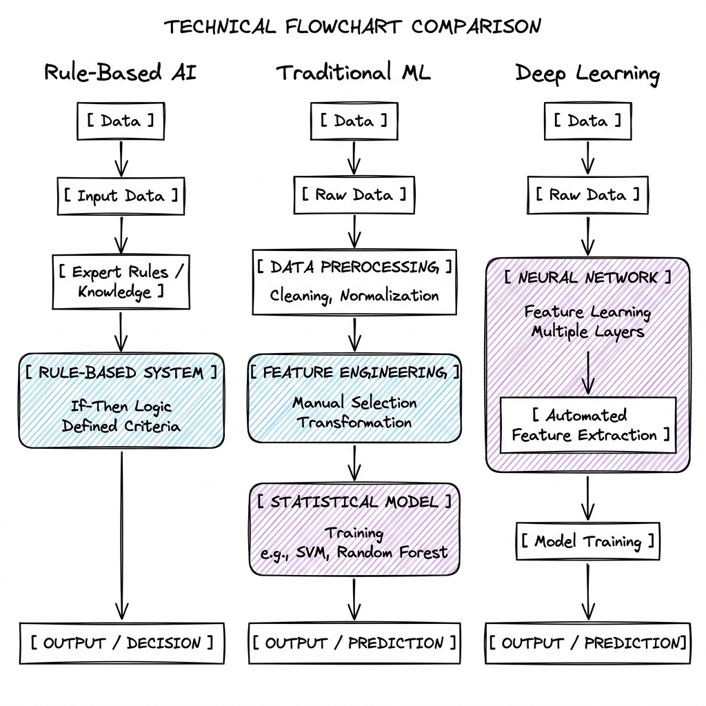

# AI vs. ML vs. DL: Evolutionary Paradigms

## Overview

Artificial Intelligence (AI), Machine Learning (ML), and Deep Learning (DL) represent concentric circles of technological evolution. They define the transition from hard-coded symbolic logic to automated feature extraction and representation learning.

```
┌─────────────────────────────────────────────────────────┐
│ Artificial Intelligence (AI)                            │
│  - Symbolic logic, expert systems, search trees         │
│  ┌───────────────────────────────────────────────────┐  │
│  │ Machine Learning (ML)                             │  │
│  │  - Statistical algorithms, hand-engineered features│  │
│  │  ┌─────────────────────────────────────────────┐  │  │
│  │  │ Deep Learning (DL)                          │  │  │
│  │  │  - Neural networks, representation learning  │  │  │
│  │  └─────────────────────────────────────────────┘  │  │
│  └───────────────────────────────────────────────────┘  │
└─────────────────────────────────────────────────────────┘
```

---

## Problem Statement

Traditional computing operates on **symbolic logic** (If-This-Then-That). For simple tasks, human programmers can easily write explicit rules. However, scaling rule-based systems to handle high-dimensional, unstructured data (such as natural language, audio, or images) fails due to:
* **The Curse of Dimensionality**: As the number of input features grows, the volume of space increases exponentially, making data sparse and rule configurations combinatorially impossible to manage.
* **Feature Representation Limits**: Humans cannot write explicit mathematical formulas to represent abstract concepts like "a friendly tone of voice" or "the face of a cat" under varying lighting, scales, and rotation angles.
* **Knowledge Acquisition Bottleneck**: Standard expert systems require manually querying human specialists to convert cognitive knowledge into hard-coded rules, which does not scale.

The goal of ML and DL is to design systems that can automatically extract patterns and generalize rules directly from raw input data.

---

## Architecture

The fundamental differences in system flow between Rule-Based Systems, Traditional Machine Learning, and Deep Learning:



---

## Components

### 1. Symbolic AI & Expert Systems (Traditional AI)
* **Knowledge Base**: A structured database storing facts and relations about the world (e.g., Ontology Graphs, Semantic Networks).
* **Inference Engine**: Logical execution units that apply formal logic to deduce outputs.
  * **Forward Chaining**: Starts with known facts and applies rules to assert new facts (data-driven).
  * **Backward Chaining**: Starts with a goal state and works backward to see if supporting data exists (goal-driven).
  * **Search Space Algorithms**: Utilizes heuristics to find routes (e.g., $A^*$ Search, Alpha-Beta pruning in game trees).

### 2. Traditional Machine Learning (Statistical Induction)
Instead of hardcoding rules, classical ML trains a statistical model to fit a mapping function $f(X) \approx Y$ using hand-crafted features:
* **Manual Feature Engineering**: Converting raw data into structural inputs:
  * *Image Processing*: Hand-designed edge and texture descriptors (e.g., SIFT, HOG, Sobel filters).
  * *Text Processing*: Term Frequency-Inverse Document Frequency (TF-IDF), Bag of Words (BoW).
  * *Data Transformation*: Normalization ($X_{\text{norm}} = \frac{X - X_{\text{min}}}{X_{\text{max}} - X_{\text{min}}}$), Standardisation ($X_{\text{std}} = \frac{X - \mu}{\sigma}$), Principal Component Analysis (PCA) for dimensionality reduction.
* **Classical Algorithms**:
  * **Linear/Logistic Regression**: Fits a hyper-plane by optimizing ordinary least squares or cross-entropy loss.
  * **Support Vector Machines (SVM)**: Projects data into higher dimensions using kernels (e.g., RBF kernel: $K(x, x') = \exp(-\gamma \|x - x'\|^2)$) to locate maximum-margin separating hyperplanes.
  * **Gradient Boosted Decision Trees (GBDT)**: Sequentially trains weak decision tree estimators, where each tree fits the negative gradient residuals of the loss function (e.g., XGBoost, LightGBM).

### 3. Deep Learning (Neural Representation Learning)
Deep Learning avoids manual feature engineering by learning features and predictions jointly.
* **Input Layer**: Receives raw high-dimensional data (e.g., $C \times H \times W$ pixels).
* **Hidden Layers (Feature Extraction)**: Stacks of mathematical operators that extract abstract representations.
  * *Convolutional Layers (CNNs)*: Apply local weight-sharing filters to extract spatial structures (edges, shapes).
  * *Recurrent Layers (RNNs)*: Pass hidden states sequentially to capture temporal/sequence patterns.
  * *Self-Attention Blocks (Transformers)*: Dynamically route representation information between any two tokens in parallel.
* **Backpropagation (The Optimization Backbone)**: Iterative error calculation using the calculus chain rule. For a loss function $L$, output prediction $\hat{y}$, and weights $W$:
$$\frac{\partial L}{\partial W^{[l]}} = \frac{\partial L}{\partial a^{[l]}} \cdot \frac{\partial a^{[l]}}{\partial z^{[l]}} \cdot \frac{\partial z^{[l]}}{\partial W^{[l]}}$$
The optimizer adjusts weights: $W^{[l]} \leftarrow W^{[l]} - \alpha \frac{\partial L}{\partial W^{[l]}}$ (where $\alpha$ is the learning rate).

---

## Design Decisions

| Metric / Scenario | Symbolic AI | Traditional ML | Deep Learning |
| :--- | :--- | :--- | :--- |
| **Model Interpretability** | **Absolute (100%)**: Clear execution trace of every conditional rule. | **High to Moderate**: Can evaluate feature importance, coefficients, or split splits in GBDTs. | **Low (Black Box)**: Hard to trace decision paths through trillions of float parameters. |
| **Dataset Minimum Size** | None (Expert-configured logic). | Small to Medium ($10^2$ to $10^5$ samples can yield robust results). | Massive ($10^6$ to $10^{12}$ tokens/samples needed to prevent overfitting). |
| **Compute Targets** | CPU (low-cost, low-complexity execution). | CPU (multi-core configurations, simple RAM layouts). | GPU/TPU Clusters (massive tensor parallelism required). |
| **Feature Extraction** | Hand-configured domain rules. | Manually designed math transforms (SIFT, TF-IDF). | Automatically learned from raw inputs via backpropagation. |
| **Training Speed** | No training (immediate deployment). | Fast (minutes to hours). | Slow (days to months of parallel cluster run-time). |

---

## Scaling

### Compute & Storage Bottlenecks
* **CPU vs. GPU Compute Paradigms**:
  * **CPUs** are optimized for sequential control execution (low core count, massive cache, high clock speeds). Ideal for Symbolic AI and classical ML trees.
  * **GPUs** are optimized for parallel floating-point vector arithmetic (thousands of simple cores, high memory bandwidth). Required to parallelize the matrix multiplications ($Y = WX + B$) of Deep Learning.
* **Memory Bandwidth Bottleneck**: 
  * In classical ML, datasets are small enough to sit in host RAM.
  * In Deep Learning, training requires high-bandwidth VRAM (HBM) on the accelerator to prevent compute cores from idling while waiting for weights to load.

### Parallel Data Pipelines
* In classical ML, ETL processes run sequentially or via simple CPU multiprocessing.
* In DL, data loaders must read raw files (images, text chunks), run real-time augmentations (rotation, masking), serialize inputs into dense tensors, and prefetch them onto GPU memory asynchronously using double-buffering.

---

## Failure Handling

### Underfitting vs. Overfitting
* **Underfitting (High Bias)**: The model is too simple to capture patterns.
  * *Symptoms*: Poor performance on both training and test datasets.
  * *Solutions*: Increase parameter capacity (more layers/widths), train longer, or design richer features.
* **Overfitting (High Variance)**: The model memorizes training noise instead of generalizing.
  * *Symptoms*: High accuracy on training data, poor performance on test datasets.
  * *Solutions*: Apply regularization (L1/L2 weight decay: $L_{\text{reg}} = L + \lambda \|W\|^2$), implement Dropout, collect more training data, or perform data augmentation.

### Training Instability (DL Specific)
* **Vanishing Gradients**: Gradients shrink to zero as they propagate backward through deep layers.
  * *Solutions*: Use Residual Connections ($x + F(x)$), Layer Normalization, and non-saturating activations (e.g., ReLU, GELU).
* **Exploding Gradients**: Gradients grow exponentially, causing numerical overflow (NaN).
  * *Solutions*: Implement Gradient Clipping (capping gradients to a max norm threshold) and stable weight initialization (e.g., He/Xavier initialization).

### Data & Concept Drift
* **Covariate Shift**: The distribution of input features $P(X)$ changes over time, but the conditional probability $P(Y \mid X)$ remains the same.
* **Concept Drift**: The actual target relation $P(Y \mid X)$ changes (e.g., shopping habits shift after a macroeconomic event).
  * *Solutions*: Set up drift detection pipelines (e.g., KS-test) and trigger automatic retraining using current data windows.

---

## Security

### Adversarial Evasion Attacks
Attackers apply imperceptible perturbations to input data designed to maximize model prediction error. For instance, using the **Fast Gradient Sign Method (FGSM)**, an attacker calculates:
$$X_{\text{adv}} = X + \epsilon \cdot \text{sign}\left(\nabla_X L(\theta, X, Y)\right)$$
* *Mitigation*: Adversarial training (injecting calculated adversarial examples into training batches) and input denoising.

### Data Poisoning
Injecting malicious data into training pipelines to introduce targeted backdoors.
* *Mitigation*: Maintaining strict data lineage logs, calculating hash checksums of training shards, and running anomaly detection on new data streams.

### Privacy Leakage
* **Model Inversion**: Reconstructing input samples by querying model outputs and calculating gradients.
* **Membership Inference**: Determining whether a specific user's record was used in the training dataset.
  * *Mitigation*: Applying **Differential Privacy (DP-SGD)**, which clips individual gradients and adds controlled noise during optimization.

---

## Cost Optimization

* **Inference Engine Cost Profiling**:
  * For tabular datasets, deploy XGBoost or LightGBM on low-cost CPUs (e.g., AWS Graviton instances), which can process thousands of queries per second for a fraction of a cent.
  * For Deep Learning, scale down models using **Model Distillation** (training a smaller student model to match the probability distribution outputs of a larger teacher model) or **Structured Pruning** (removing low-magnitude weight connections).

---

## Interview Questions

### 1. Why does a Random Forest model not suffer from vanishing or exploding gradients during training?
**Answer**: Random Forests are ensemble models based on Bagging (Bootstrap Aggregating) of independent Decision Trees. Decision Trees are constructed using information gain or Gini impurity splits rather than backpropagation and gradient descent. Since there is no chain rule weight multiplication across layers, gradient instabilities are mathematically impossible.

### 2. Explain the Bias-Variance Tradeoff in the context of model capacity.
**Answer**: 
* **Bias** represents the error from erroneous assumptions in the learning algorithm (underfitting). High bias models have low capacity (e.g., linear models on non-linear data).
* **Variance** represents the error from sensitivity to small fluctuations in the training set (overfitting). High variance models have high capacity (e.g., very deep neural networks).
* As model capacity increases, bias decreases but variance increases. The target is to locate the optimal capacity point that minimizes the total generalization error (the sum of Bias$^2$ + Variance + Irreducible Noise).

---

## References

* [Google Research: Rules of Machine Learning](https://developers.google.com/machine-learning/guides/rules-of-ml)
* [Goodfellow, Bengio, Courville (2016): Deep Learning Book (MIT Press)](https://www.deeplearningbook.org/)
* [AWS Architecture Center: Well-Architected Framework for ML](https://aws.amazon.com/architecture/toolkits/aws-well-architected-framework/machine-learning-lens/)
