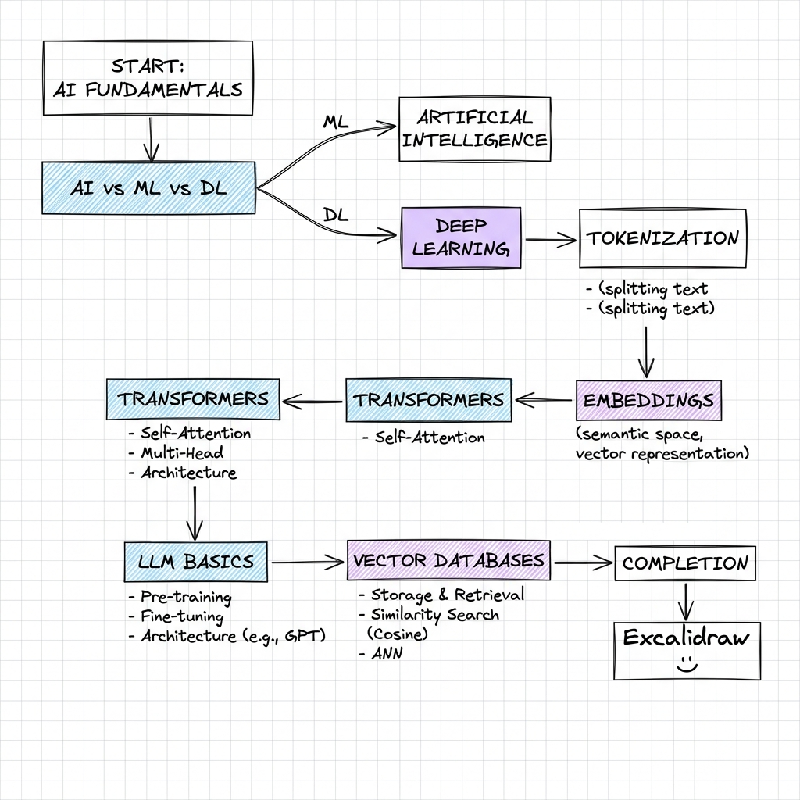

# Module 01: AI System Design Fundamentals

This module establishes the core mathematical, theoretical, and architectural concepts that form the building blocks of modern Artificial Intelligence and Large Language Models. Understanding these concepts is critical before diving into complex distributed systems, multi-agent frameworks, and petabyte-scale retrieval architectures.

---

## 🗺️ Fundamentals Roadmap

---

## 📂 Chapter Directory

| Topic | Description | Core Focus |
| :--- | :--- | :--- |
| 🧠 **[AI vs ML vs DL](./AI_vs_ML_vs_DL.md)** | Paradigm shift from rule-based systems to representation learning. | Expert Systems vs. Neural Nets, Feature Engineering |
| 🔤 **[Tokenization](./Tokenization.md)** | Text preprocessing algorithms that convert raw strings to mathematical integers. | BPE, WordPiece, Vocabulary limits, Out-of-vocab |
| 🔢 **[Embeddings](./Embeddings.md)** | Continuous vector spaces representing semantic and syntactic relationships. | Cosine similarity, high-dimensional spaces, encoder outputs |
| ⚡ **[Transformers](./Transformers.md)** | The foundational sequence-to-sequence attention-based neural network architecture. | Self-Attention, Multi-Head Attention, QKV Matrices |
| 🤖 **[LLM Basics](./LLM_Basics.md)** | Training cycles, autoregressive decoding, and model tuning techniques. | Pretraining, SFT, RLHF, DPO, KV-Cache basics |
| 🔍 **[Vector Databases](./Vector_Databases.md)** | High-dimensional similarity search and spatial indexing engines. | HNSW, IVF-PQ, Approximate Nearest Neighbors (ANN) |

---

## 🎓 Learning Objectives

By the end of this module, you will understand:
1. The mathematical transition of human language from characters and tokens to dense multi-dimensional embeddings.
2. The attention mechanisms that allow model engines to calculate context and relational relevance across infinite lengths.
3. The training lifecycle and computational budget bottlenecks when scaling models from millions to trillions of parameters.
4. How vector databases construct high-performance spatial indices to query billions of vectors under millisecond latency SLAs.
