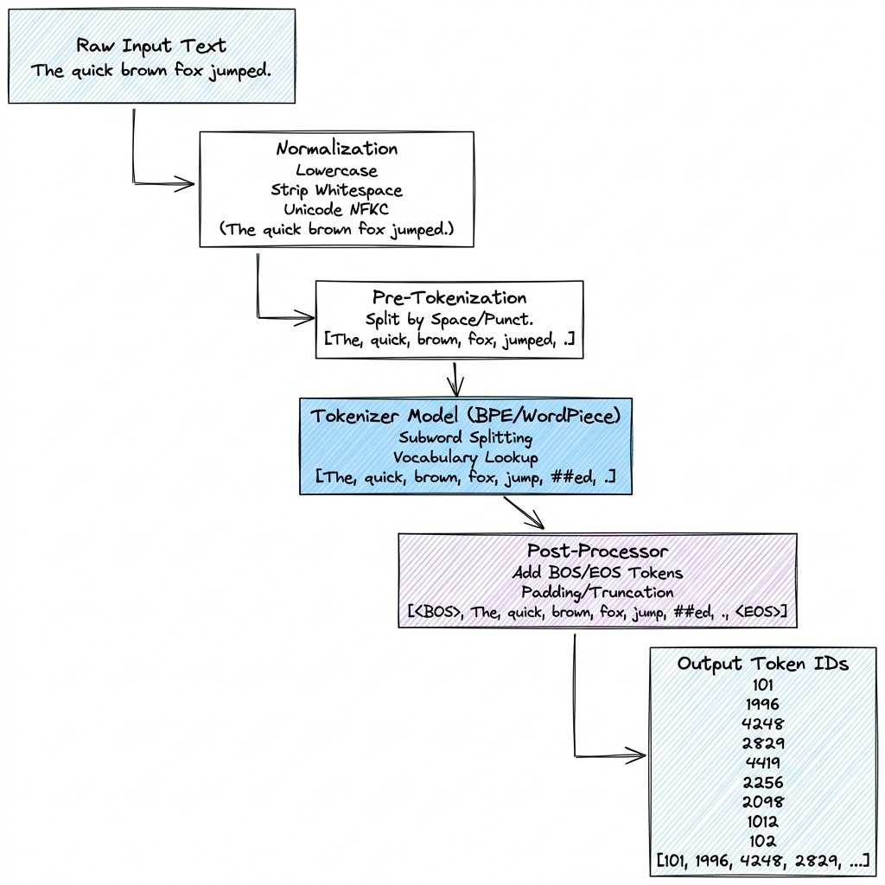

# Tokenization

## Overview

Tokenization is the preprocessing step that converts raw, unstructured natural text strings into discrete numerical identifiers (Token IDs) that neural networks can process. It bridges human language and high-dimensional vector spaces.

---

## Problem Statement

LLMs cannot process variable-length text strings directly. Early NLP attempted two approaches:
1. **Word-Level Tokenization**: Every unique word gets an ID. Leads to **vocabulary explosion** (millions of words) and fails to handle new/misspelled words, resulting in Out-Of-Vocabulary (OOV) errors (`[UNK]` tokens).
2. **Character-Level Tokenization**: Every character gets an ID. Keeps vocabulary small ($\approx 256$) but sequences become extremely long, exceeding the quadratic context window limits of Self-Attention, and individual characters lose semantic information.

Modern LLMs solve this using **Subword Tokenization** algorithms, which split rare words into smaller, meaningful subword units (e.g., "tokenization" $\to$ "token" + "ization").

---

## Architecture

The standard Hugging Face Tokenizer pipeline:

---

## Components

### 1. Byte-Pair Encoding (BPE)
BPE starts with individual characters as the base vocabulary and builds the vocabulary by iteratively merging the most frequent adjacent token pairs.
* **Step-by-Step Algorithm**:
  1. Tokenize the training corpus into characters. Let words end with a special end-of-word marker `</w>`.
  2. Count all adjacent token pairs in the corpus.
  3. Identify the most frequent pair (e.g., `'e'` and `'s'`).
  4. Merge this pair to create a new token `'es'` and add it to the vocabulary.
  5. Repeat steps 2-4 until the vocabulary reaches the target size $|V|$.
* **BPE Trace**:
  * *Training Corpus*: `{"low</w>": 5, "lower</w>": 2, "newest</w>": 6, "widest</w>": 3}`
  * *Step 1 (Base Vocab)*: `{'l', 'o', 'w', 'e', 'r', 'n', 'w', 's', 't', 'i', 'd', '</w>'}`
  * *Step 2 (Most frequent pair)*: `'e'` and `'s'` appear $6 + 3 = 9$ times. Merge `'e'` + `'s'` $\to$ `'es'`.
  * *Step 3 (Next frequent pair)*: `'es'` and `'t'` appear 9 times. Merge `'es'` + `'t'` $\to$ `'est'`.

### 2. WordPiece
Used in models like BERT. Similar to BPE, but instead of merging based on raw pair frequency, it merges pairs that maximize the likelihood of the training data according to a language model probability.
* **Score Calculation**: WordPiece evaluates candidates $A$ and $B$ by checking:
$$\text{Score}(A, B) = \frac{\text{count}(AB)}{\text{count}(A) \times \text{count}(B)}$$
* This score prioritizes merging pairs whose components rarely appear independently outside of the merged token.

### 3. SentencePiece
SentencePiece does not require a language-specific pre-tokenizer. It treats input text as a raw byte stream, treating whitespace as a regular character (represented as `_`).
* **Byte-Fallback**: If a character is not in the vocabulary, it falls back to its UTF-8 raw byte representation.
  * For example, the emoji 🦖 (represented by 4 bytes: `\xf0\x9f\xa6\x96`) is split into four byte tokens from the vocabulary rather than being replaced by an `[UNK]` token.

---

## Design Decisions

### Vocabulary Size Selection ($|V|$)
Choosing the size of the vocabulary ($|V|$) involves a trade-off between model size and context window efficiency:

| Metric | Small Vocabulary (e.g., 32,000 tokens) | Large Vocabulary (e.g., 256,000 tokens) |
| :--- | :--- | :--- |
| **Embedding Memory Footprint** | **Low**: Embedding weight matrix dimensions ($|V| \times d_{\text{model}}$) are small. | **High**: Embedding and output projection layers consume a significant parameter budget. |
| **Token-to-Word Ratio** | **High**: Words are split into many subwords, increasing the sequence length. | **Low**: Words are represented by fewer tokens, saving context window space. |
| **Sequence Length Processing** | Shorter effective context because inputs consume more tokens. | Longer effective context since text is represented in fewer tokens. |
| **Multilingual Efficiency** | Poor: Non-English characters are heavily split into individual bytes. | Excellent: Dedicated tokens are allocated for diverse scripts. |

---

## Scaling

### Multilingual Tokenization Inefficiency (Token Tax)
Because tokenizers are often trained predominantly on English corpora, non-English texts are split into many more tokens for the same semantic meaning. 
* **Compression Comparison (Tokens per Sentence)**:

| Sentence | English | Spanish | Japanese | Hindi |
| :--- | :--- | :--- | :--- | :--- |
| **Original Text** | "System Design Guide" | "Guía de diseño de sistemas" | "システム設計ガイド" | "सिस्टम डिज़ाइन गाइड" |
| **Llama 2 Tokens (Vocab 32k)** | **3 tokens** | **7 tokens** | **15 tokens** | **23 tokens** |
| **Llama 3 Tokens (Vocab 128k)**| **3 tokens** | **5 tokens** | **7 tokens** | **11 tokens** |

* *Impact*: Non-English queries consume more of the context window and incur higher API costs. Upgrading to larger vocabularies (e.g., Llama 3's 128k vocab) significantly reduces this inefficiency.

---

## Security

### Adversarial Glitch Tokens (SolidGoldMagikarp)
Adversarial tokens are strings that exist in the vocabulary list but were excluded from the model's pre-training dataset due to strict filtering (e.g., removing boilerplate code or usernames).
* **The Glitch**: During pre-training, the model never sees these tokens. As a result, their embedding weights remain at their initial random values.
* **The Exploit**: Inputting these tokens (e.g., `SolidGoldMagikarp`, `StreamDirectInterface`) causes the model to retrieve untrained weights, leading to erratic outputs or safety filter bypasses.
  * *Mitigation*: Prune unused tokens from vocabulary lists before starting model training.

---

## Cost Optimization

* **Custom Tokenizer Training**: Before training a domain-specific model (e.g., for code or medical applications), train a custom tokenizer on that domain's data. This reduces the token count per document, lowering training and inference costs.
* **Prefill Token Caching**: In multi-turn chat applications, caching token IDs of system prompts prevents recalculating tokenization on identical text sequences.

---

## Interview Questions

### 1. Explain the difference between BPE and SentencePiece tokenization.
**Answer**:
* **BPE**: Requires a pre-tokenization step to split text into words based on spaces and punctuation rules before applying subword merges. It cannot handle spaces natively and requires language-specific rules.
* **SentencePiece**: Treats the input text as a raw string. It treats spaces as a regular character (`_`), bypassing the need for a language-specific pre-tokenizer. This makes it highly effective for multilingual models.

### 2. How do adversarial "glitch tokens" bypass LLM safety guardrails?
**Answer**: Glitch tokens are present in the tokenizer's vocabulary but were filtered out of the training data. Because the model never sees them during training, their embedding weights are never updated. When a user inputs a glitch token, it projects an out-of-distribution vector into the model's attention space, causing the safety guardrails to fail.

---

## References

* [Sennrich et al. (2015): Neural Machine Translation of Rare Words with Subword Units (BPE)](https://arxiv.org/abs/1508.07909)
* [SentencePiece: A simple and language independent subword tokenizer](https://arxiv.org/abs/1808.06226)
* [Tiktoken: Fast Byte-Pair Encoding Tokenizer](https://github.com/openai/tiktoken)
