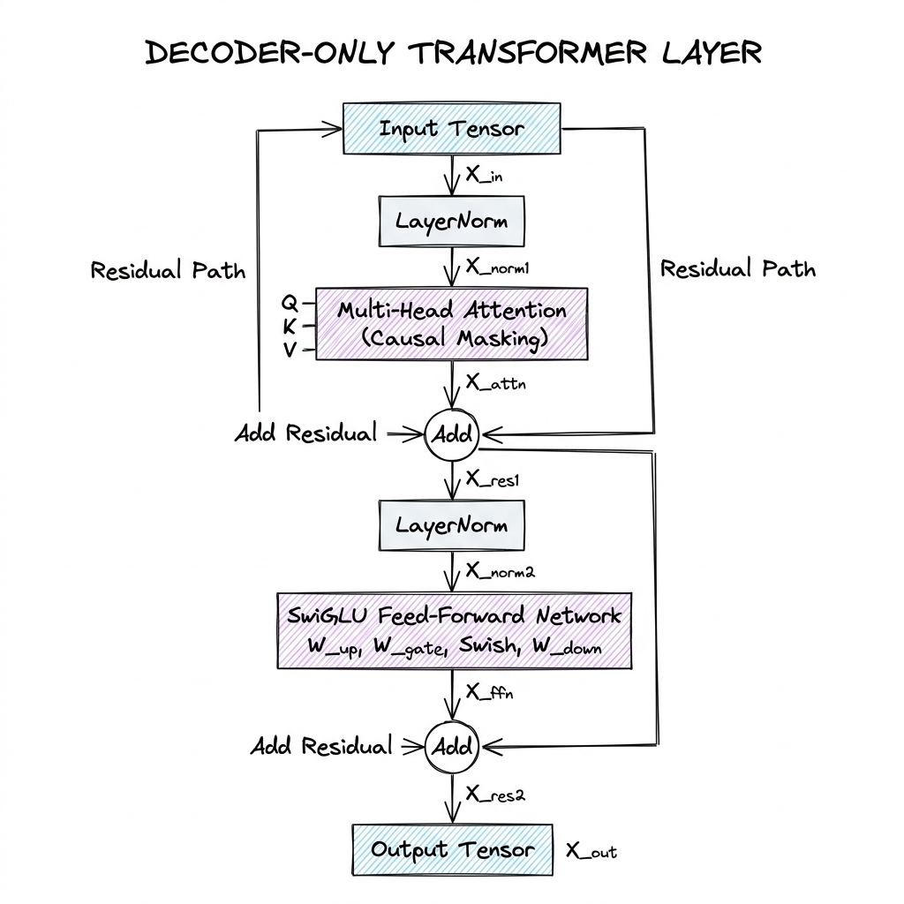

# Transformer Architecture

## Overview

Proposed by Vaswani et al. in 2017, the Transformer architecture replaced recurrent architectures (RNNs, LSTMs) with a purely **attention-based** design. Transformers process entire sequences of data in parallel, drastically speeding up training cycles and allowing models to scale to billions of parameters.

---

## Problem Statement

Recurrent networks process tokens sequentially, creating a training bottleneck because time step $T$ cannot be calculated without calculating step $T-1$. Additionally, LSTMs experience forgetting issues over long sequences due to gradient vanishing/explosion in recursive weight multiplications. 

Transformers solve these problems using **Self-Attention**, enabling direct, parallel connections between any two tokens in a sequence regardless of distance.

---

## Architecture

A standard decoder-only Transformer layer (e.g., Llama, GPT) stacking Residual Connections, Layer Normalization, Multi-Head Attention, and Feed-Forward Networks:



---

## Components

### 1. Scaled Dot-Product Attention (Linear Algebra)
Given an input sequence matrix $X \in \mathbb{R}^{s \times d_{\text{model}}}$, we project it into Query ($Q$), Key ($K$), and Value ($V$) matrices using learned weight projections $W_Q, W_K, W_V \in \mathbb{R}^{d_{\text{model}} \times d_k}$:

$$Q = X W_Q, \quad K = X W_K, \quad V = X W_V$$

The attention score calculates token relationships by computing dot products, scaled to prevent softmax saturation, and multiplying by $V$:

$$\text{Attention}(Q, K, V) = \text{softmax}\left(\frac{QK^T}{\sqrt{d_k}}\right)V$$

* Where $QK^T \in \mathbb{R}^{s \times s}$ is the attention weight matrix, and $\sqrt{d_k}$ is the scaling factor (where $d_k$ is the dimensionality of query/key vectors).

### 2. Multi-Head Attention Variants (MHA, MQA, GQA)
* **MHA (Multi-Head Attention)**: Uses $H$ Query, Key, and Value heads. Each head has its own projection weights. High memory bandwidth consumption during generation.
* **MQA (Multi-Query Attention)**: Uses $H$ Query heads, but only a single Key head and Value head shared by all query heads. Significantly reduces KV Cache size but can degrade reasoning performance.
* **GQA (Grouped-Query Attention)**: Groups Query heads into $G$ groups. Each group shares a single Key and Value head. Provides a middle ground, offering MQA speeds with MHA reasoning quality.

```
MHA: Query Heads (H) ──► [1:1 Projection] ──► Key/Value Heads (H)
MQA: Query Heads (H) ──► [Many:1 Projection] ──► Key/Value Head (1)
GQA: Query Heads (H) ──► [Grouped:1 Projection] ──► Key/Value Heads (G)
```

### 3. Rotary Position Embedding (RoPE)
Instead of adding absolute positional vectors (like Sinusoidal embeddings) to input tokens, RoPE applies a rotation to the Query and Key vectors in complex space. For a 2D vector $x = (x_1, x_2)^T$ at position $m$, it is multiplied by a rotation matrix:

$$R_{\Theta, m}^2 x = \begin{pmatrix} \cos m\theta & -\sin m\theta \\ \sin m\theta & \cos m\theta \end{pmatrix} \begin{pmatrix} x_1 \\ x_2 \end{pmatrix}$$

This rotation preserves relative distance because the dot product of rotated queries and keys depends only on their relative distance $m-n$:

$$(R_{\Theta, m}^d q)^T (R_{\Theta, n}^d k) = q^T R_{\Theta, n-m}^d k$$

### 4. Feed-Forward Networks & SwiGLU Activation
Modern architectures use Gated Linear Units with Swish activations (**SwiGLU**) instead of traditional ReLU MLPs. SwiGLU projects inputs through two parallel linear layers, applies a Swish activation to one, and computes their element-wise product:

$$\text{SwiGLU}(x) = \left(\text{Swish}_{\beta}(x W_1) \otimes x W_2 \right) W_3$$

*Where $W_1, W_2$ are projection matrices, $\otimes$ is element-wise multiplication, and Swish$_\beta(x) = x \cdot \sigma(\beta x)$.*

### 5. Layer Normalization (RMSNorm)
To reduce compute overhead, models like Llama replace standard LayerNorm (which calculates both mean and variance) with **RMSNorm**. RMSNorm scales activations by their root mean square, assuming a mean of zero:

$$\text{RMSNorm}(x)_i = \frac{x_i}{\sqrt{\frac{1}{d} \sum_{j=1}^d x_j^2 + \epsilon}} \gamma_i$$

*Where $\gamma$ is a learnable scaling parameter and $\epsilon$ is a small constant for numerical stability.*

---

## Design Decisions

### Normalization Placement: Pre-LN vs. Post-LN
* **Post-LN (Original Transformer)**: LayerNorm is placed after the residual addition ($x_{l+1} = \text{LN}(x_l + \text{SubLayer}(x_l))$).
  * *Trade-off*: Gradients shrink as they propagate back through the LayerNorm steps of early layers, leading to training instabilities in deep models.
* **Pre-LN (Modern Standard)**: LayerNorm is applied to the input of each sub-layer before operations ($x_{l+1} = x_l + \text{SubLayer}(\text{LN}(x_l))$).
  * *Trade-off*: Keeps an open gradient path through the residual connections, allowing stable training of models with hundreds of layers.

---

## Scaling

### Quadratic Complexity $O(N^2)$ Bottleneck
The self-attention calculation requires computing dot products between all sequence token pairs. As context length $N$ scales, both compute operations and memory size for the attention matrix grow quadratically ($O(N^2)$). For example, doubling context length from 8k to 16k tokens increases attention matrix memory consumption by **4x**.

---

## Failure Handling

* **RoPE Extrapolation Decay**: When query lengths exceed the maximum sequence length seen during training, RoPE rotation angles become out-of-distribution, causing attention focus to decay.
  * *Solutions*: Scale the RoPE base frequency $\theta$ using **NTK-Aware** scaling or **YaRN (Yet another RoPE extensioN)** to interpolate high-frequency dimensions while extrapolating low-frequency ones.

---

## Cost Optimization

### FlashAttention Tiling Mechanics
Standard attention reads and writes intermediate attention matrices ($S = \text{softmax}(QK^T/\sqrt{d_k})$) of size $N \times N$ to slow GPU High Bandwidth Memory (HBM) multiple times.
* **FlashAttention** solves this memory bandwidth bottleneck:
  1. It splits the $Q, K, V$ matrices into smaller blocks.
  2. It loads these blocks into fast, on-chip **SRAM** memory.
  3. It computes attention updates block-by-block, maintaining running softmax normalization scaling factors.
  4. It writes only the final output matrix back to HBM, reducing memory read/write operations by up to **10x** and accelerating training.

```
Standard Attention:
GPU HBM (Q,K,V) ──► SRAM ──► HBM (Compute QK^T) ──► SRAM ──► HBM (Softmax) ──► SRAM ──► HBM (Output)

FlashAttention:
GPU HBM (Blocks of Q,K,V) ──► SRAM (Compute local attention & scale) ──► HBM (Output)
```

---

## Interview Questions

### 1. Why does Grouped-Query Attention (GQA) speed up decoding inference but have little impact on prefill speed?
**Answer**: 
* During **decoding**, inference is memory-bandwidth bound. We load model weights and the KV Cache from HBM to SRAM for every single generated token. GQA reduces Key-Value heads, shrinking the KV Cache size by 4-8x. This significantly reduces HBM read operations, accelerating decoding throughput.
* During **prefill**, the entire prompt is processed in parallel. This phase is compute-bound, saturated by matrix multiplications on Query projections. Reducing KV heads has minimal impact because the total FLOPs count is dominated by Query math, which remains unchanged.

### 2. How does RMSNorm improve compute efficiency compared to standard LayerNorm?
**Answer**: Standard LayerNorm calculates both the mean ($\mu$) and variance ($\sigma^2$) of activations across the hidden dimension, requiring two reduction passes over the data. RMSNorm only calculates the root mean square (RMS), assuming the mean is zero. This requires only a single reduction pass, reducing GPU kernel memory access overhead and speeding up layer computation by 10% to 50%.

---

## References

* [Vaswani et al. (2017): Attention Is All You Need](https://arxiv.org/abs/1706.03762)
* [Dao et al. (2022): FlashAttention: Fast and Memory-Efficient Exact Attention](https://arxiv.org/abs/2205.14135)
* [Ainslie et al. (2023): GQA: Training Generalized Grouped-Query Attention For Ultra-Fast Multi-Decoder Inference](https://arxiv.org/abs/2305.13245)
