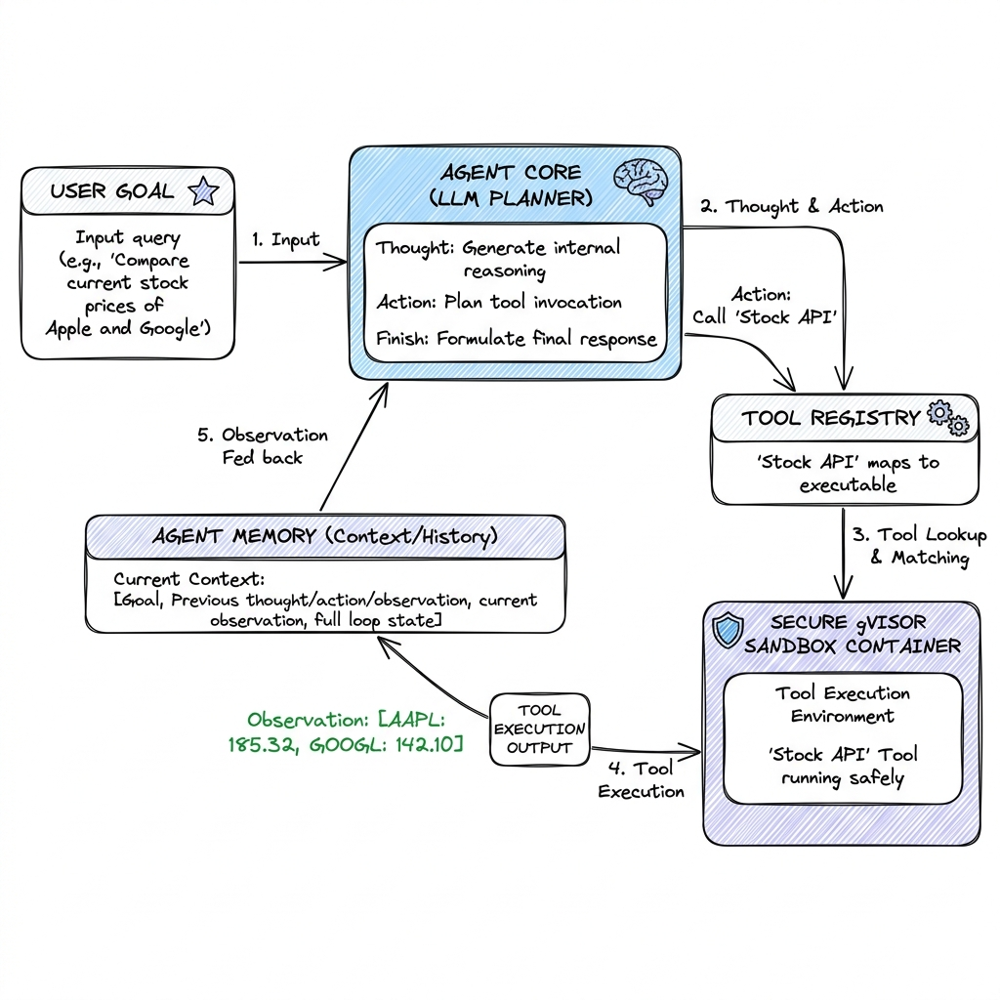

# AI Agent (Single-Agent Systems)

## Overview

An AI Agent is an autonomous system architecture that leverages a Large Language Model as its core planner and decision-making engine. Unlike static LLM pipelines, an agent operates in an interactive loop: it receives a goal, breaks it down into sub-tasks, selects and calls external tools (e.g., databases, APIs, code executors), observes the environment's response, and refines its plan dynamically until the goal is achieved.

---

## Problem Statement

Transitioning from text generation to autonomous agent execution introduces severe production challenges:
1. **The Halting Problem (Infinite Loops)**: Agents can get stuck in repetitive cycles (e.g., repeatedly calling a tool that returns an error) or hallucinate non-existent tools, wasting money and resources.
2. **Reliable Tool Calling**: Base LLMs do not naturally output structured commands. If the LLM generates a malformed JSON payload or wrong parameters, the tool call fails.
3. **Security (Untrusted Code Execution)**: If an agent is granted code execution tools (e.g., running python scripts to analyze CSV data), a malicious user prompt can hijack the tool to run arbitrary terminal commands on the host machine.
4. **State and Planning Drift**: As the agent loop progresses, the context window accumulates tools, thoughts, and logs. This noise degrades the agent's ability to focus on the original goal.

---

## Architecture

A standard production agent architecture operates on the **ReAct (Reason + Act)** loop pattern:



### The ReAct Execution Loop

1. **User Goal**: The orchestrator initializes the agent thread with a high-level goal and binds a list of available tool schemas (formatted as JSON Schema).
2. **Thought Phase**: The LLM analyzes the goal, context history, and tool descriptions, outputting a reasoning step (e.g., "I need to find the latest stock price of Apple. I will use the Yahoo Finance tool").
3. **Action Phase**: The LLM outputs a structured tool call (e.g., `{"name": "fetch_stock", "arguments": {"ticker": "AAPL"}}`).
4. **Tool Execution (Sandbox)**: The orchestrator intercepts the tool call, matches the name in its **Tool Registry**, executes the tool within a secure **Execution Sandbox**, and retrieves the result (e.g., `"$180.25"`).
5. **Observation Phase**: The tool output is appended to the agent's context window as an `Observation`.
6. **Next Iteration**: The LLM reviews the new observation and determines if the task is complete. If yes, it outputs the final answer; if no, it continues to step 2.

---

## Components

1. **Agent Core (Planner)**: An LLM model capable of reasoning and tool schema adherence (e.g., GPT-4o, Claude 3.5 Sonnet).
2. **Tool Registry**: A dictionary mapping tool names and JSON schemas to executable code blocks.
3. **Execution Sandbox**: A secure runtime environment (Docker, WASM, or gVisor sandbox) where tools run isolated from the host.
4. **Agent Memory Manager**: Manages short-term state and compresses old trace observations (using sliding windows or summary mechanisms).

---

## Design Decisions & Trade-offs

### Native Tool Calling API vs. JSON Prompting

- **Native Tool Calling (e.g., OpenAI Function Calling)**: The model is fine-tuned specifically to output structured arguments.
  * *Pros*: Highly reliable output formats, low parsing error rates.
  * *Cons*: Vendor lock-in, hard to port to open-source models lacking native support.
- **JSON Prompting (ReAct text template parsing)**: Instructing the model to write outputs matching a markdown block (e.g., ```` ```json ... ````).
  * *Pros*: Portable to any open-source model (like Llama-3-8B).
  * *Cons*: Higher formatting failure rate, requires complex regex and string parsing code in the orchestrator.

---

## Security

Running agents in production requires robust security sandboxes:
- **Sandbox Architecture**: Tools that execute code, query shell commands, or write to files must run in micro-containers (using systems like AWS Firecracker, gVisor, or Docker containers).
- **Network Isolation**: The sandbox should have outbound internet access disabled by default, only whitelisting specific target domains (e.g., API servers).
- **Prompt Injection Defense**: If an agent reads an external PDF or email, it could contain instructions that hijack the tool loop.
  * *Mitigation*: Restrict tool permissions. An agent reading emails should *never* have permission to call tools that modify databases or send emails without human-in-the-loop validation.

---

## Scaling

- **Concurrency Queues**: Running 10,000 active agent loops in parallel is CPU and network intensive. Implement an event-driven queue system (such as BullMQ or Celery) where each agent step is treated as a job, offloading execution from API servers to background worker clusters.
- **Agent Thread Persistence**: Store the conversation and execution history in a persistent document database (e.g., MongoDB, PostgreSQL) to allow loops to pause and resume across user interactions.

---

## Failure Handling

- **Parsing Errors (Correction Loop)**: If the LLM generates a malformed tool call, send the parser exception error back to the LLM (e.g., "Error: invalid JSON in function AAPL. Please correct the JSON syntax") and request a retry.
- **Max Iterations Barrier**: Implement a hard halting threshold (e.g., limit of 10 loops). If the threshold is reached, stop execution and return a polite error to prevent runaway API billing.

---

## Cost Optimization

- **Prompt Trimming**: Only inject tool schemas that are relevant to the current task stage. If the registry has 100 tools, run a pre-selection step (using semantic keyword matching) to bind only the top 5 relevant tools to the prompt.
- **Model Cascading**: Use smaller, faster models (e.g., Llama-3-8B) to generate thoughts and format arguments, falling back to a larger model (e.g., GPT-4o) only when a tool execution fails.

---

## Interview Questions

### Q1: Design a secure execution sandbox for a data-analyst agent that runs python scripts.
**Answer**:
1. **Container Isolation**: Run code in an ephemeral Docker container using gVisor (a secure runtime that intercepts kernel calls) to prevent host-level system attacks.
2. **Resource Constraints**: Limit CPU (e.g., 0.5 cores), memory (e.g., 256MB), and execution time (e.g., maximum 5 seconds per script run) using Docker run flags.
3. **Network Isolation**: Configure the Docker network to block all outbound connections (`network=none`), preventing data exfiltration from private CSV data.
4. **Lifecycle**: Create the container on demand, execute the code via `docker exec`, parse stdout/stderr, and immediately destroy (terminate) the container instance.

### Q2: What is the "Infinite Loop" problem in agentic AI, and how do you mitigate it?
**Answer**:
The infinite loop problem occurs when an agent repeatedly executes the same failing action (e.g., hitting a rate-limited API or trying to correct a code error but generating the same syntax bug).
**Mitigations**:
1. **Loop Budget**: Impose a strict maximum iteration count (typically 8 to 15 steps).
2. **State Deduplication**: Maintain a hash of past thoughts, actions, and observations. If the exact same action and observation hash occurs twice consecutively, break the loop and trigger a fallback action (such as prompting the user for guidance).
3. **Dynamic Reflection**: Instruct the LLM to analyze the loop if it fails 3 times in a row (e.g., "You have failed 3 times. Reflect on why the tool is failing and try a different method").

---

## References

1. **ReAct**: Yao, S., et al. (2022). *ReAct: Synergizing Reasoning and Acting in Language Models*. ICLR 2023.
2. **AutoGPT & BabyAGI**: *Community open-source agent implementations*. (GitHub source code designs).
3. **gVisor**: *Google Container Sandbox Runtime*. https://gvisor.dev.
