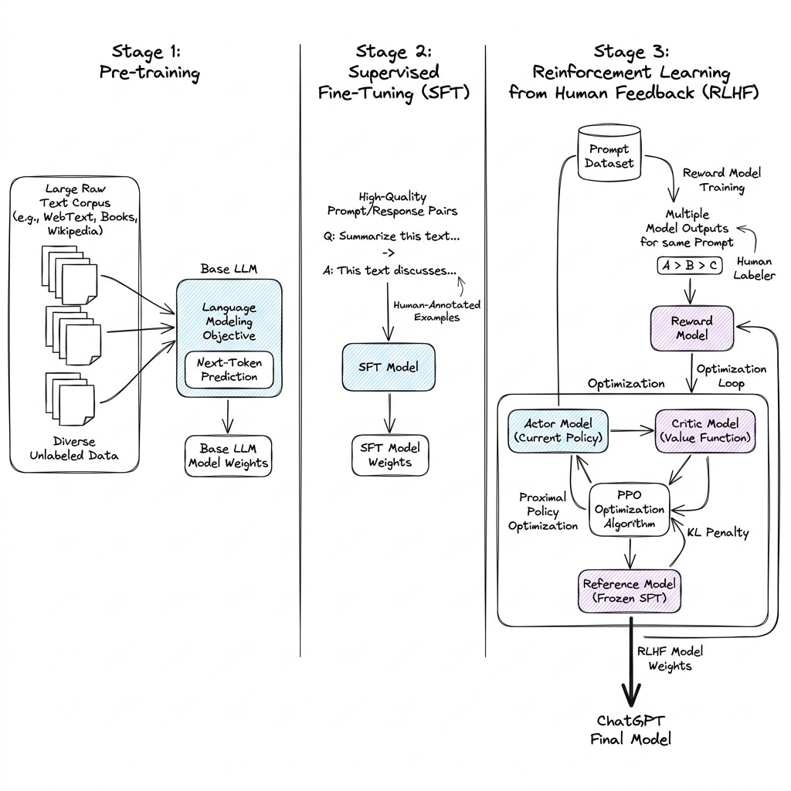
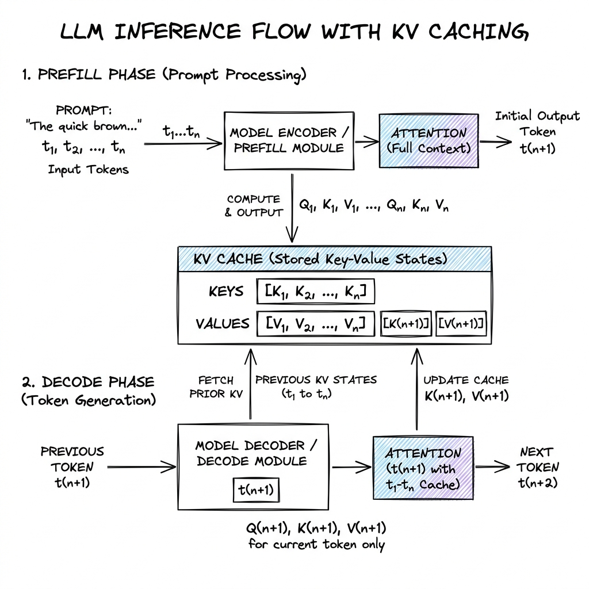

# ChatGPT Architecture

## Overview

ChatGPT represents a paradigm shift in machine learning, moving from raw, next-token prediction models (like base GPT-3) to aligned, instruction-following conversational systems. At its core, the architecture combines a massive pre-trained autoregressive Transformer with Supervised Fine-Tuning (SFT) and Reinforcement Learning from Human Feedback (RLHF) to ensure helpful, honest, and harmless responses.

---

## Problem Statement

Standard autoregressive Large Language Models (LLMs) are trained on massive internet corpora to predict the next token. While they possess vast world knowledge, they exhibit several fundamental limitations when acting as interactive systems:
1. **Misalignment**: The model's objective (minimizing cross-entropy loss on internet text) does not align with the user's objective (receiving accurate, helpful answers). Instead of answering a query, the model might complete it, write a fictional story, or echo toxic biases found on the web.
2. **Hallucination & Sycophancy**: Base models tend to fabricate facts to preserve fluid sentence completions and optimize for user agreement rather than truthfulness.
3. **Safety and Toxicity**: Without alignment, base models can generate harmful advice, hate speech, or private personal data (PII) present in training sets.

---

## Architecture

The system architecture spans two primary phases: the **Off-line Training Pipeline** and the **On-line Inference Infrastructure**.

### 1. The Training Pipeline

The training workflow follows a three-step progression as popularized by OpenAI's InstructGPT:

#### Step 1: Supervised Fine-Tuning (SFT)
The base pre-trained model is fine-tuned on a high-quality dataset of curated prompt-response pairs. Professional labelers write both the prompt (e.g., "Explain recursion to a 5-year-old") and the ideal response.
- **Objective**: Cross-entropy loss (teacher forcing) calculated only on the target response tokens.
- **Result**: The SFT model learns the *format* of a conversation and instructions.

#### Step 2: Reward Model (RM) Training
To automate feedback for reinforcement learning, a Reward Model is trained to evaluate and score output quality.
- **Process**: The SFT model generates multiple candidate responses ($y_1, y_2, \dots, y_K$) for a given prompt $x$. Human labelers rank these candidates from best to worst.
- **Objective**: The Reward Model (typically a initialized SFT model with a scalar output head) is trained using a pairwise ranking loss:
  $$\mathcal{L}(\theta) = - \mathbb{E}_{(x, y_w, y_l) \sim D} \left[ \log \sigma (r_\theta(x, y_w) - r_\theta(x, y_l)) \right]$$
  where $y_w$ is the winning (preferred) response and $y_l$ is the losing response.

#### Step 3: Reinforcement Learning (PPO / DPO)
Using Proximal Policy Optimization (PPO), the SFT model's weights (the "policy" $\pi_\phi^{RL}$) are updated to maximize the reward scores output by the Reward Model.
- **KL Regularization**: To prevent the model from exploiting the Reward Model (reward hacking) and generating gibberish, a KL-divergence penalty is added to penalize deviation from the initial SFT policy $\pi^{SFT}$:
  $$\text{Objective}(\phi) = \mathbb{E}_{(x, y) \sim D_{RL}} \left[ r_\theta(x, y) - \beta D_{KL}(\pi_\phi^{RL}(y|x) \parallel \pi^{SFT}(y|x)) \right] + \gamma \mathbb{E}_{x \sim D_{pretrain}} \left[ \log \pi_\phi^{RL}(x) \right]$$
- **DPO Alternative**: Modern variants often replace the separate RM/PPO step with **Direct Preference Optimization (DPO)**, which mathematically optimizes the policy directly on preference pairs without training a separate reward model or executing a complex actor-critic loop.

---

### 2. On-line Inference & KV Caching

Serving LLMs at scale requires managing memory bandwidth bottlenecks. During autoregressive generation, each new token requires fetching the model weights and the entire context history from high-bandwidth memory (HBM) to the GPU SRAM.

To avoid quadratic re-computation of self-attention matrices, the system implements **KV Caching**:

- **Prefill Phase**: The initial prompt is processed in parallel. All Key ($K$) and Value ($V$) tensors are computed and stored in the GPU HBM memory.
- **Decode Phase**: To generate the next token, the model only computes the Query ($Q$), Key ($K$), and Value ($V$) for the *current* token. It then retrieves all prior $K$ and $V$ tensors from the KV Cache to compute the attention score.

---

## Components

A production-grade conversational system consists of:
1. **API Gateway / Orchestrator**: Handles rate limiting, authentication, session state, and coordinates downstream services.
2. **Safety Moderation API**: An auxiliary classifier (e.g., LlamaGuard) that evaluates input prompts and blocks malicious requests before they hit the generator.
3. **Model Ingestion Pipeline**: Streaming or batch loading of model shards into GPU VRAM (using Tensor Parallelism for intra-node split, and Pipeline Parallelism for inter-node split).
4. **KV Cache Manager**: Dynamically manages memory blocks on the GPU (e.g., vLLM's PagedAttention) to reduce fragmentation.
5. **Streaming Output Parser**: Decodes token IDs to UTF-8 text and streams chunks to the client over Server-Sent Events (SSE).

---

## Design Decisions & Trade-offs

### PPO vs. DPO

| Metric | PPO (RLHF) | DPO (Direct Preference) |
| :--- | :--- | :--- |
| **Infrastructure Complexity** | High (Requires keeping Actor, Critic, Reference, and Reward models in memory simultaneously) | Low (Only requires Actor and Reference models) |
| **Stability** | Low (Sensitive to hyperparameters like learning rate, KL coefficient $\beta$, and advantage normalization) | High (Standard supervised-style optimization) |
| **Exploration Capability** | High (Actor can explore out-of-distribution completions and get rewarded) | Low (Confined to policy behavior on the offline preference dataset) |

### Model Parallelism: Tensor vs. Pipeline Parallelism

- **Tensor Parallelism (Megatron-LM style)**: Splits the weight matrices of Linear layers across GPUs in a single server (e.g., across 8 GPUs on an A100 node). It requires low-latency NVLink interconnects due to frequent `All-Reduce` communication barriers.
- **Pipeline Parallelism (PipeDream style)**: Splits layers sequentially across multiple nodes (e.g., layers 1-20 on node A, layers 21-40 on node B). Communication occurs only at layer boundaries, making it suitable for slower Ethernet connections, but introduces idle bubble states.

---

## Scaling

Serving millions of concurrent chats requires solving memory bandwidth constraints:
- **PagedAttention**: Classic KV caching allocates contiguous memory segments for the maximum context length (e.g., 32k tokens), leading to up to 60-80% memory waste (internal fragmentation). PagedAttention borrows virtual memory paging from operating systems, dividing the KV cache into non-contiguous blocks of fixed sizes (e.g., 16 tokens), scaling batch sizes by $2\times$ to $4\times$.
- **Multi-Query Attention (MQA) & Grouped-Query Attention (GQA)**: Traditional Multi-Head Attention requires separate KV heads for every query head. MQA shares a single KV head across all query heads, while GQA shares a KV head per group (e.g., 1 KV head per 8 query heads). This reduces KV cache size by $8\times$, drastically decreasing memory bandwidth requirements.

---

## Failure Handling & Edge Cases

- **Hallucinations**: Mitigated via retrieval grounding (RAG), temperature tuning (setting temperature closer to 0 for factual tasks), and structured output enforcement (e.g., Outlines, Instructor).
- **Prompt Injection & Jailbreaking**: Dealt with using dual-prompt architectures (separating system instructions from user inputs) and output alignment filtering.
- **Context Window Overflow**: When conversation history exceeds the maximum context length (e.g., 8192 tokens), the system must run a compaction algorithm:
  - **Option A (Sliding Window)**: Evict oldest messages.
  - **Option B (Summarization)**: Summarize the oldest segment and prepend it to the active context window.

---

## Security

- **Data Privacy**: Input logs must be sanitized of Personally Identifiable Information (PII) before storage. Model weights should not be directly exposed.
- **Prompt Isolation**: System instructions must be isolated using special delimiters (e.g., `<|im_start|>system...<|im_end|>`) to prevent user inputs from overriding system logic.

---

## Cost Optimization

1. **Prompt Caching**: If multiple users share a common system prompt or prefix (e.g., in a customer support bot), the KV cache for the system prompt is computed once, cached, and shared across concurrent requests.
2. **Speculative Decoding**: A small, fast draft model (e.g., 1B parameters) generates candidate tokens, which are validated in a single forward pass by the large target model (e.g., 70B parameters). This increases generation speed by $2\times$ without losing accuracy.

---

## Interview Questions

### Q1: How does KV Caching improve inference latency, and what is its memory cost?
**Answer**: KV caching avoids recalculating Keys and Values for preceding tokens in the self-attention layer. Instead of computing attention over $O(N^2)$ tokens at each step, it reduces it to $O(N)$ operations.
The memory size of the KV cache per token generated in FP16 is:
$$\text{Memory (bytes)} = 2 \times (\text{Layers}) \times (\text{Hidden Dimension}) \times 2 \text{ (bytes per FP16)} \times (\text{Batch Size})$$
For a 70B parameter model (80 layers, 8192 hidden dimension) with a batch size of 16, each token consumes:
$$2 \times 80 \times 8192 \times 2 \times 16 = 41.9 \text{ MB per token}$$
If the context length reaches 4096 tokens, the cache size is $171.7 \text{ GB}$, exceeding the VRAM capacity of two A100 (80GB) GPUs.

### Q2: Why is training with PPO in RLHF highly unstable?
**Answer**: 
1. **Reward Hacking**: The agent finds exploits in the Reward Model (e.g., generating long, formal responses or repetitive filler phrases) that score high but are low quality.
2. **Non-stationary Target**: The Policy and the Critic are updated simultaneously, leading to unstable gradient updates.
3. **Data Distribution Shift**: As the policy changes, the distribution of generated tokens shifts away from what the Reward Model was trained on.

---

## References

1. **InstructGPT**: Ouyang, L., et al. (2022). *Training language models to follow instructions with human feedback*. arXiv:2203.02155.
2. **DPO**: Rafailov, R., et al. (2023). *Direct Preference Optimization: Your Language Model is Secretly a Reward Model*. arXiv:2305.18290.
3. **vLLM / PagedAttention**: Kwon, W., et al. (2023). *Efficient Memory Management for Large Language Model Serving with PagedAttention*. SOSP 2023.
