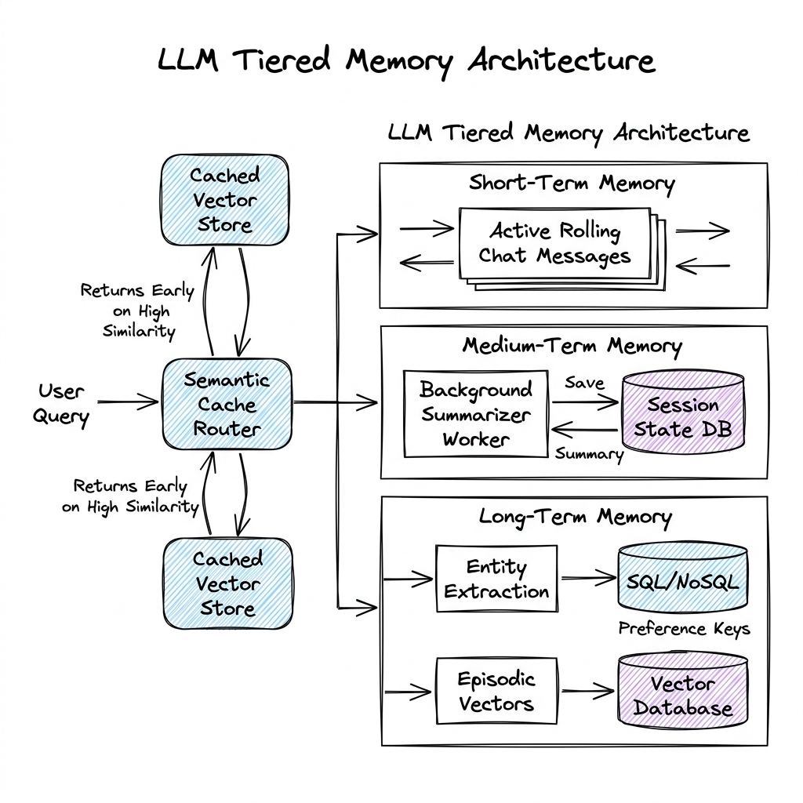

# Memory System

## Overview

A Memory System is the architecture that allows Large Language Models (LLMs) to persist, retrieve, and reference state across multiple turns and sessions. Since standard LLMs are fundamentally stateless, developers must build system-level abstractions to manage conversation history, user preferences, and episodic facts, mimicking human short-term (working) memory and long-term memory systems.

---

## Problem Statement

When building chatbots, customer assistants, or autonomous agents, several challenges arise with memory:
1. **Stateless APIs**: Every request to an LLM API (e.g., GPT-4, Claude) is independent. To maintain context, developers must pass prior conversation logs with every new query, consuming context window tokens.
2. **Context Window Exhaustion**: Long-running conversations will eventually exceed the model's context capacity, leading to model crashes or raw truncation of early context.
3. **Latency and Cost**: Passing massive histories to the model increases input token counts, raising latency (Time-to-First-Token) and overall operational costs.
4. **Retrieval Precision**: As history grows, simple vector-based retrieval can return irrelevant context, distracting the model and leading to hallucinations.

---

## Architecture

A robust LLM memory architecture uses a tiered model to balance immediate recall, structured application variables, and long-term search.

### 1. Tiered Memory Model

- **Short-Term (Working) Memory**: Consists of the active conversation buffer (e.g., the last 3-5 message exchanges). It is passed directly as raw text in the prompt to retain exact conversational phrasing and local referential context.
- **Medium-Term (Episodic Summaries) Memory**: Past dialogue segments are recursively summarized by a background LLM process. The summaries are prepended to the short-term buffer, allowing the model to recall the thematic narrative of a long chat session without consuming excess tokens.
- **Long-Term (Semantic / Episodic) Memory**: Historical facts, entity relationships, and user preferences are indexed as embeddings in a Vector Database. When a query is received, the system queries this database to fetch relevant past facts (e.g., "The user mentioned they own a dog named Max in session 2").
- **Structured Memory (Profile Store)**: Key-value metadata extracted programmatically from the chat (e.g., `user_timezone: PST`, `subscription_tier: premium`) stored in a relational or document database.

---

### 2. Semantic Caching (Query Cache)

To optimize cost and latency, a **Semantic Cache** (like GPTCache) sits in front of the LLM pipeline:
1. When a user asks a question, the system converts it into an embedding.
2. It queries a vector database containing historical queries and their corresponding LLM responses.
3. If a match is found with a cosine similarity above a threshold $\tau$ (e.g., $\tau \ge 0.95$), the cached response is returned immediately, bypassing the LLM call entirely.

---

## Components

1. **Session Manager**: Manages reading and writing chat history to a persistent, low-latency document store (e.g., DynamoDB, Redis) using unique session IDs.
2. **Entity & Fact Extractor**: An LLM agent running asynchronously to extract factual knowledge (e.g., "User likes Python") and save it to the Profile Store or Vector DB.
3. **Background Compactor**: A worker that reads old session segments, runs summaries, writes the summaries to the session record, and evicts raw message logs.
4. **Semantic Cache Router**: Directs matching requests to the cache database.

---

## Design Decisions & Trade-offs

### Raw Buffer vs. Summary Buffer vs. Vector Search Memory

| Memory Strategy | Context Overhead | Retrieval Quality | Cost & Latency | Best For |
| :--- | :--- | :--- | :--- | :--- |
| **Raw Conversation Buffer** | High (grows linearly) | Perfect local recall | High | Short, fast exchanges. |
| **Summary Buffer** | Medium (flat size) | Good semantic flow, poor detail accuracy | Medium | Long narrative chats. |
| **Vector Search Memory** | Low (only fetches relevant shards) | High detail, poor sequential flow | Low (uses vector index) | Knowledge bases, profile lookup. |

### Semantic Cache Similarity Threshold ($\tau$) Tuning

- **High $\tau$ (e.g., 0.98)**: Low false-positive risk. Cache only hits on near-identical questions. Lower cost savings.
- **Low $\tau$ (e.g., 0.85)**: High cache hit rate. Risk of returning a cached answer that does not address the nuance of the user's new query (e.g., confusing "How to set up billing?" with "How to cancel billing?").

---

## Scaling

For applications with millions of concurrent users, scaling memory state requires high-throughput databases:
- **DynamoDB Schema design**: Session ID is the Partition Key (PK), and Message Timestamp/ID is the Sort Key (SK). This supports fast, sorted retrieval of the last $N$ messages (`Query` operation) and atomic writes of new messages.
- **Redis session cache**: Store session tokens as a serialized list or hash table with a Time-To-Live (TTL) expiration, offloading primary databases from active chat sessions.

---

## Failure Handling

- **Summary Drift**: Over repeated summarizations, the summary model might introduce errors or omit details. Mitigate this by keeping a copy of the raw historical text in cold storage and resetting summaries periodically based on raw history audits.
- **Contradictory Memories**: If a user updates their preference (e.g., "I moved to Seattle" vs. "I live in Boston"), the fact extractor must run a deduplication/conflict-resolution step before writing new memory keys, replacing old facts.

---

## Security

- **User Isolation**: Memory indexes in vector databases must enforce metadata filtering (e.g., `WHERE user_id = '123'`) to prevent cross-user data leakage (a common vulnerability in shared-index vector databases).
- **PII Scrubbing**: Before storing conversation histories or summaries in vector databases, pass the text through a PII scrubber (like Microsoft Presidio) to mask phone numbers, SSNs, and credit cards.

---

## Cost Optimization

1. **Lazy Summarization**: Rather than summarizing after every message, trigger the summarization worker only when the active session buffer exceeds 70% of the token limit.
2. **TTL on Session Buffers**: Automatically expire and delete raw message histories of inactive chats (e.g., after 30 days) to keep database storage costs down.

---

## Interview Questions

### Q1: Design a scalable session memory system for a chat app supporting 10M active users.
**Answer**:
- **Storage Layer**: Use Amazon DynamoDB as the persistent database for chat logs, using `session_id` as the partition key and `message_id` as the sort key. Use Redis as a write-back cache in front of DynamoDB, storing the last 10 messages of active chats.
- **Write Path**: When a user sends a message, write it to the Redis list. Trigger an asynchronous task (via SQS/Lambda) to append the message to DynamoDB.
- **Read Path**: The orchestrator reads the conversation context directly from Redis (sub-millisecond latency). If the session cache is empty, read the last 10 messages from DynamoDB and populate Redis.
- **Compaction**: When the session exceeds a threshold, a Lambda function triggers an LLM to generate a summary, writes it to a DynamoDB metadata table, and purges the old raw messages in DynamoDB.

### Q2: How does a semantic cache prevent caching wrong or out-of-date answers?
**Answer**:
1. **Metadata Tagging**: Cache entries must be tagged with categories or metadata filters (e.g., `user_tier`, `language`). A premium user's query about features should not hit the cached response meant for a free user.
2. **TTL Eviction**: Put an expiration timer on cache results. If API answers change frequently, set a short TTL (e.g., 24 hours).
3. **Hybrid Validation**: In addition to similarity embedding score, perform a fast regex or keyword match check to ensure specific nouns/entities match (e.g., ensuring query nouns match cache query nouns).

---

## References

1. **MemGPT**: Packer, C., et al. (2023). *MemGPT: Towards LLMs as Operating Systems*. arXiv:2310.08560.
2. **Generative Agents**: Park, J. S., et al. (2023). *Generative Agents: Interactive Simulacra of Human Behavior*. CHI 2023.
3. **GPTCache**: *A Library for Creating Semantic Cache for LLM Queries*. https://github.com/zilliztech/GPTCache.
