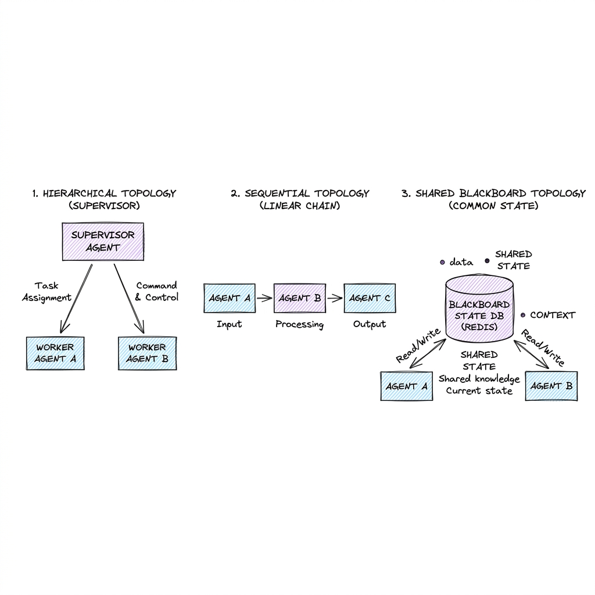

# Multi-Agent Systems

## Overview

A Multi-Agent System is an architectural pattern that divides a complex task among multiple, specialized LLM agents. Instead of relying on a single monolithic agent to handle diverse requirements, the workload is distributed to sub-agents with dedicated tools, specialized system prompts, and scoped scopes of authority. These agents coordinate, communicate, and solve problems collectively using defined routing and consensus topologies.

---

## Problem Statement

While single agents work well for constrained tasks, scaling them to execute large, multi-step enterprise workflows introduces structural flaws:
1. **Context Window Saturation**: Binding too many tools and instruction schemas to a single LLM increases context bloat, leading to tool confusion, logic degradation, and high token costs.
2. **Specialization Conflict**: A system prompt optimized for creative writing (e.g., drafting marketing emails) performs poorly at strict code validation or data querying.
3. **Cascading Failures**: If a monolithic agent fails at step 2 of a 15-step task, the entire thread fails. Debugging a long agentic execution trace is extremely difficult.
4. **Concurrency Bottlenecks**: A single agent executes its steps sequentially. In complex jobs (e.g., scanning a codebase for security vulnerabilities), tasks should be run in parallel.

---

## Architecture & Topologies

Multi-agent designs categorize agent interaction into distinct topologies based on control flow and state management:

### 1. Control Flow Topologies

- **Hierarchical (Supervisor-Worker)**: A central **Supervisor Agent** (Manager) receives the goal, splits it into tasks, and routes them to specialized **Worker Agents** (e.g., Writer Agent, Coder Agent). Workers report findings back to the Supervisor, which makes the final decision or routes follow-up tasks.
- **Sequential Pipeline**: Agents execute tasks in a linear pipeline (e.g., Researcher Agent -> Writer Agent -> Proofreader Agent). Each agent receives the output of the preceding agent, processes it, and passes it forward.
- **Collaborative (Peer-to-Peer / Choreography)**: Agents communicate directly with each other via a shared chat room or message bus without a centralized manager. They self-assign tasks based on their specialized skills and collaborate dynamically to resolve conflicts.

### 2. State Management Paradigms

- **Shared Blackboard Pattern**: A centralized, global state object (the "Blackboard") stores the overall goal, active task lists, intermediate results, and history. All agents have read/write access to the Blackboard.
- **Message Passing Pattern**: Agents maintain private isolated states. They coordinate strictly by sending JSON messages or payloads to one another over a message broker (e.g., RabbitMQ, Kafka), preventing direct memory cross-contamination.

---

## Components

1. **Orchestration Engine**: Coordinates agent execution, manages active queues, and enforces control flows (e.g., LangGraph, AutoGen, CrewAI).
2. **Agent Router**: A classification layer that maps input states to the next eligible agent handler.
3. **Message Broker / Event Bus**: Coordinates async communication between distributed agent containers.
4. **Shared State Store**: A low-latency database (e.g., Redis) storing the active blackboard object.

---

## Design Decisions & Trade-offs

### Centralized Supervisor vs. Peer-to-Peer Orchestration

- **Centralized Supervisor**:
  * *Pros*: Easy to monitor, deterministic task routing, high control over execution paths.
  * *Cons*: The supervisor agent becomes a single point of failure and bottleneck; if it misinterprets a worker's output, it routes tasks incorrectly.
- **Peer-to-Peer Orchestration**:
  * *Pros*: Highly flexible, models complex human collaboration dynamics.
  * *Cons*: High token consumption, risk of agents getting into infinite conversational debate loops, non-deterministic execution.

---

## Scaling & Distributed Infrastructure

Scaling multi-agent systems to enterprise workloads requires moving away from local Python threads:
- **Event-Driven Micro-Agents**: Run each agent as an isolated microservice inside a Docker container. Use a message queue (RabbitMQ or Kafka) to route jobs.
- **Durable Orchestration (Temporal)**: Agents can take hours or days to complete tasks (e.g., running automated tests). Use durable task execution frameworks like **Temporal** to write stateful workflows that survive server restarts, network failures, and timeout limits.

---

## Failure Handling

- **Conversation Deadlocks**: Two agents get into an infinite loop of passing feedback back and forth (e.g., Coder Agent fixes code, Auditor Agent rejects it with a minor critique, repeatedly).
  * *Mitigation*: Impose a strict routing counter. If Agent A calls Agent B more than 3 times without making progress, route the thread to a human supervisor (Human-in-the-loop) or abort.
- **Worker Timeout**: If a worker agent container fails or times out, the Supervisor agent should catch the error and either re-assign the task to a replica worker container or try a fallback strategy.

---

## Security

- **Privilege Escalation**: A compromised sub-agent should not be able to execute administrative tools.
  * *Mitigation*: Enforce the **Principle of Least Privilege**. Only the specialized "DB Writer Agent" container should be granted database write credentials. A "Research Agent" must have zero database access.
- **Message Poisoning**: An agent must validate input schemas from peer agents, treating inputs from other agents with the same distrust as raw user input.

---

## Cost Optimization

- **State Pruning**: Do not pass the entire blackboard history to every sub-agent. When routing a sub-task to the "Data Visualizer Agent", prune the history to include only the database schema and raw data array, stripping out irrelevant chat history.
- **Consensus Early Halting**: In multi-agent voting loops (e.g., consensus validation), halt the loop as soon as a simple majority is reached rather than waiting for all agents to complete their execution runs.

---

## Interview Questions

### Q1: Design a distributed multi-agent software-development pipeline.
**Answer**:
1. **Topology**: Use a sequential pipeline backed by a hierarchical supervisor for verification:
   - **Product Manager Agent** writes specs.
   - **Architect Agent** designs class interfaces.
   - **Developer Agent** writes code.
   - **QA Agent** writes and executes unit tests.
2. **Infrastructure**:
   - Use **Temporal** to orchestrate the workflow state machine.
   - Each agent is a Docker container triggered via SQS queues.
   - Use a **shared git repository** (mocked or real) as the shared blackboard.
3. **Self-Correction Loop**: If the QA Agent's unit tests fail, it routes a bug-report payload back to the Developer Agent, restarting the developer loop. Limit this retry loop to 3 iterations before escalating to a human developer.

### Q2: How do you prevent state bloat (context window overflow) in collaborative multi-agent chats?
**Answer**:
To manage state size in multi-agent environments:
1. **Isolated Message Histories**: Each agent maintains its own private conversation history, containing only messages relevant to its tasks.
2. **Summarization summaries**: When an agent finishes its task, it writes a concise summary of its findings back to the global blackboard, rather than dumping its entire thought/tool loop execution trace.
3. **Structured Context Compilation**: Before invoking any sub-agent, the orchestrator compiles a customized prompt context by extracting only the required blackboard parameters, omitting the chat transcripts of other agents.

---

## References

1. **AutoGen**: Wu, Q., et al. (2023). *AutoGen: Enabling Next-Gen LLM Applications via Multi-Agent Conversation*. arXiv:2308.08155.
2. **LangGraph**: *Orchestrating Multi-Agent Workflows*. https://github.com/langchain-ai/langgraph.
3. **Temporal**: *Durable Execution Platform*. https://temporal.io.
