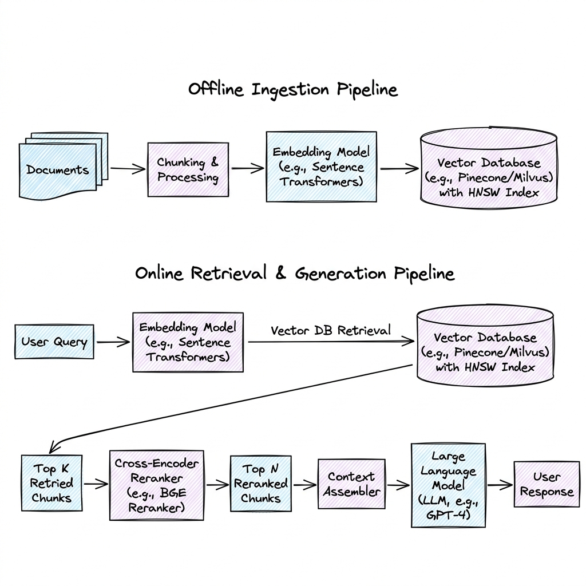

# RAG System (Retrieval-Augmented Generation)

## Overview

Retrieval-Augmented Generation (RAG) is a system design pattern that extends the capabilities of Large Language Models (LLMs) by dynamic integration of external knowledge bases. Rather than relying solely on the static, frozen parameters of the pre-trained model, a RAG system retrieves relevant documents from an external source at runtime and prepends them to the model's context window, enabling accurate, factually grounded answers.

---

## Problem Statement

Deploying pre-trained LLMs in enterprise production environments faces several limitations:
1. **Knowledge Cutoff**: LLMs cannot answer queries regarding events, publications, or data changes that occurred after their training cutoff date.
2. **Hallucination**: Autoregressive models optimize for syntactic flow and next-token probability, making them prone to generating plausible-sounding but completely fabricated statements.
3. **Private Data Exclusion**: Proprietary databases, internal company wikis, and user-specific documents are not accessible to public foundation models due to security constraints.
4. **Fine-Tuning Cost**: Continuously fine-tuning models on incoming corporate documents is computationally expensive, slow, and prone to catastrophic forgetting of older core skills.

---

## Architecture

A production-scale RAG architecture consists of two distinct pipelines: the **Offline Ingestion Pipeline** and the **Online Retrieval & Generation Pipeline**.



### 1. Offline Ingestion Pipeline

This process parses documents and loads them into a queryable spatial index:
1. **Document Parsing**: Ingests files (PDFs, HTML, Markdown, Word) and extracts clean text, stripping out non-semantic noise (formatting tags, page headers).
2. **Chunking**: Splits long documents into smaller, manageable text segments (chunks) to fit within embedding model limits and improve search resolution.
3. **Embedding Generation**: Passes each chunk through a Bi-Encoder embedding model (e.g., `text-embedding-3-small`) to generate a high-dimensional dense vector representing the chunk's semantic content.
4. **Indexing & Storage**: Writes the vector embeddings along with their raw text metadata (such as parent document source, page number, and access controls) to a **Vector Database** (e.g., Pinecone, Milvus, Qdrant).

### 2. Online Retrieval & Generation Pipeline

This runtime process answers user queries:
1. **Query Reformulation**: The user's conversational query is rewritten (using a lightweight LLM step) to resolve coreferences and formulate a search-optimized query.
2. **Vector Retrieval**: The optimized query is embedded into a vector, and a $K$-Nearest Neighbors ($K$-NN) search is run against the Vector Database using similarity metrics (Cosine Similarity, L2 Distance, or Dot Product) to retrieve the top $K$ semantic candidates.
3. **Hybrid Search Integration**: To catch exact matches (serial numbers, codes, names), the semantic vector scores are combined with classic keyword matches (BM25) using **Reciprocal Rank Fusion (RRF)**:
   $$RRF\_Score(d) = \sum_{m \in M} \frac{1}{k + r_m(d)}$$
   where $r_m(d)$ is the rank of document $d$ in retrieval method $m$, and $k$ is a constant (typically 60).
4. **Cross-Encoder Reranking**: The retrieved candidate chunks are run through a computationally expensive **Cross-Encoder Reranker** model (which evaluates the prompt and document chunk simultaneously). The chunks are re-ordered, and only the top $N$ (where $N \le K$) are kept.
5. **Prompt Synthesis & Generation**: The top $N$ chunks are formatted into a system template ("Use the context below to answer..."), which is sent to the generator LLM to stream the final answer back to the user.

---

## Components

1. **Embedding Model**: Maps text chunks into a vector space (e.g., 1536 dimensions).
2. **Vector Index**: Organizes vectors to enable sub-millisecond search (typically using HNSW - Hierarchical Navigable Small World, or IVF - Inverted File indexes).
3. **Cross-Encoder Reranker**: Performs deep, bidirectional evaluation of query-document pairs (e.g., Cohere Rerank).
4. **LLM Orchestrator**: Directs the flow (built using custom code or libraries like LangChain/LlamaIndex).

---

## Design Decisions & Trade-offs

### Chunking Strategies

- **Fixed-Size Chunking**: e.g., 512 tokens with a 10% overlap. Easy to compute, but can split sentences or paragraphs in half, destroying local semantic context.
- **Parent-Child Chunking**: Store small chunks (e.g., 128 tokens) in the vector index for high-precision retrieval, but when a chunk is selected, pass its larger "parent" chunk (e.g., 1024 tokens) to the LLM to provide richer context.
- **Semantic Chunking**: Computes embedding differences between consecutive sentences and splits the document only when a semantic boundary threshold is crossed. Highly coherent, but requires multiple embedding model computations during ingestion.

### Bi-Encoder (Retrieval) vs. Cross-Encoder (Reranking)

- **Bi-Encoder**: Encodes queries and documents independently. Vectors can be precomputed. Extremely fast ($O(1)$ at query time using vector databases), but does not capture fine-grained interaction between query and document.
- **Cross-Encoder**: Feeds the query and document *together* into a BERT-like attention model. Offers much higher accuracy, but is too computationally slow to run across millions of documents. It is used as a second-stage filter on the top 20-50 candidates returned by the Bi-Encoder.

---

## Scaling

For enterprise workloads scaling to millions of documents:
- **Index Selection**: Use HNSW for lowest latency, but expect high RAM costs. Use IVF-PQ (Inverted File with Product Quantization) to compress vector dimensions, reducing RAM consumption by up to $95\%$ at the cost of slightly lower recall accuracy.
- **Partitioning / Namespaces**: Divide the vector database into namespaces or tenant boundaries to optimize search performance, limiting index scans strictly to active tenant buckets.

---

## Evaluation: The RAG Triad

RAG evaluation evaluates the pipeline performance across three axes without relying on manual ground-truth labels (using frameworks like Ragas or TruLens):

```
       [Prompt/Query]
        /          \
       /            \
  (Context           (Answer
 Relevance)        Relevance)
     /                \
    v                  v
[Context] <─────── [Answer]
       (Groundedness)
```

1. **Context Relevance**: Are the retrieved context chunks highly relevant to the user query? (Verifies the Retrieval stage).
2. **Groundedness (Faithfulness)**: Is the generated answer derived *only* from the retrieved context? (Ensures no hallucinations).
3. **Answer Relevance**: Does the generated answer directly resolve the user's initial query? (Ensures the model didn't dodge the question).

---

## Failure Handling

- **Empty Retrieval**: If similarity scores fall below a minimum threshold, do not inject context; instead, instruct the LLM to output a generic fallback response (e.g., "I could not find relevant documentation in the knowledge base").
- **Redundant / Contradictory Chunks**: Rerankers help prune duplicated information. In case of contradictory context files, instruct the generator LLM to state the discrepancy in its answer (e.g., "Source A states X, while Source B states Y").

---

## Security

- **Access Control Lists (ACLs)**: Documents in the vector store must contain metadata representing read permissions (e.g., `groups: ["hr-admin", "finance"]`). The query payload sent to the vector database must inject a metadata filter matching the user's validated groups (e.g., `Filter: {groups: {$in: user.groups}}`).
- **Vector Database Isolation**: Tenant-specific data should be partitioned into separate namespaces or database indices to guarantee strict isolation.

---

## Cost Optimization

1. **Query De-duplication**: Use a Semantic Cache (see [Memory_System.md](Memory_System.md)) in front of the retrieval pipeline to avoid executing vector index scans and LLM generations for common query patterns.
2. **Low-Dimensional Embeddings**: Utilize models that allow dimensionality reduction (e.g., Matryoshka embeddings) to store smaller vector lengths, dramatically reducing memory costs.

---

## Interview Questions

### Q1: Explain the difference between HNSW and IVF-PQ vector indexing.
**Answer**:
- **HNSW (Hierarchical Navigable Small World)**: Creates a multi-layer graph structures where top layers have longer distances (fast navigation) and bottom layers have short distances (fine-grained clustering). It yields high search recall accuracy and low latency, but requires holding the entire graph structure in RAM, making it very expensive for large datasets.
- **IVF-PQ (Inverted File with Product Quantization)**: 
  - **IVF**: Clusters the vector space into $C$ centroids. At query time, only the closest centroid buckets are searched.
  - **PQ (Product Quantization)**: Compresses vectors by splitting them into sub-vectors and quantizing them against a codebook.
  - **Trade-off**: IVF-PQ operates on disk or highly compressed RAM (saving up to $95\%$ RAM costs) but has slightly higher retrieval latency and lower search recall than HNSW.

### Q2: How do you implement document-level security (Access Control) in a RAG system?
**Answer**:
Document-level security must be enforced at the database retrieval level, not filter-post-retrieval:
1. **Ingestion**: For every document chunk, attach metadata tags representing user or group IDs allowed to read the parent document (e.g., `{"allowed_users": ["user_abc"], "allowed_groups": ["dev_team"]}`).
2. **Retrieval**: When User A runs a query, verify their identity, extract their user ID and groups list.
3. **Query Filtering**: Pass these verified IDs as metadata filters to the vector query (e.g., in Pinecone: `filter={"$or": [{"allowed_users": {"$in": ["UserA"]}}, {"allowed_groups": {"$in": ["dev_team"]}}]}`).
4. **Why post-filtering fails**: If you retrieve the top 10 chunks first and then filter out unauthorized chunks, you might end up with only 1 or 2 chunks (or zero), leading to poor context coverage. Enforcing filters during index traversal avoids this problem.

---

## References

1. **RAG**: Lewis, P., et al. (2020). *Retrieval-Augmented Generation for Knowledge-Intensive NLP Tasks*. NeurIPS 2020.
2. **RRF**: Cormack, G. V., et al. (2009). *Reciprocal Rank Fusion Outperforms Other Rank Aggregation Methods for Information Retrieval*. SIGIR 2009.
3. **Ragas**: Es, S., et al. (2023). *Ragas: Automated Evaluation of Retrieval Augmented Generation*. arXiv:2309.15217.
