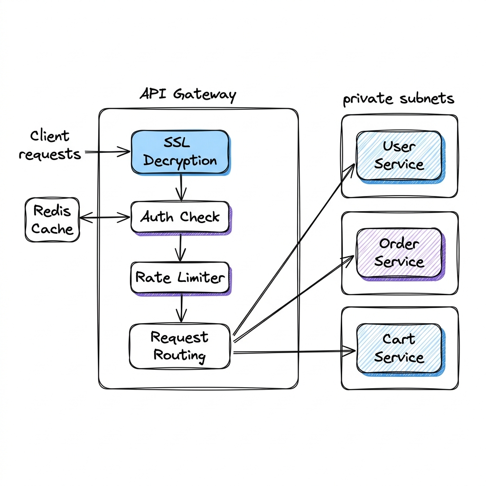

# API Gateway

## Overview

An API Gateway is a server that acts as the single entry point (ingress) for all external clients (web, mobile, third-party APIs) accessing internal microservices. It intercepts incoming client requests, executes cross-cutting system logic (such as SSL termination, request routing, authentication, rate limiting, and request transformation), and forwards the request to downstream services.

---

## Problem Statement

When deploying microservices in production, clients face several challenges when interacting with services directly:
1. **Network Complexity**: A single web page might require data from 10 different microservices (e.g., User Service, Catalog Service, Order Service). Forcing the client to make 10 separate HTTP requests increases network traffic, latency, and client battery consumption.
2. **Security Exposure**: Exposing every microservice database and endpoint directly to the public internet increases the application's attack surface, requiring security rules (such as IP whitelists and CORS configurations) on every service.
3. **Protocol Incompatibilities**: Clients typically communicate via public-friendly protocols (HTTP REST, WebSockets). Internal microservices often use high-performance, developer-friendly protocols (like gRPC, Apache Thrift, or AMQP) that web browsers cannot easily parse or initiate.
4. **Cross-Cutting Concerns Duplication**: Implementing rate limiting, authentication verification, and SSL decryption on every microservice leads to code redundancy and architectural inconsistency.

---

## Architecture & Patterns

The API Gateway acts as a reverse proxy, insulating clients from the internal network topology.



### 1. Reverse Proxy Routing
- The gateway parses the incoming URL path and forwards it to the corresponding internal microservice service IP.
  - `/api/v1/users/*` $\rightarrow$ `User Service`
  - `/api/v1/orders/*` $\rightarrow$ `Order Service`

### 2. Backend-for-Frontend (BFF) Pattern
Rather than exposing a single generic API gateway, the architecture deploys specialized gateway instances customized for specific client form factors:
- **Mobile Gateway**: Compresses payloads, filters out fields not shown in mobile UIs, and translates protocols to accommodate low-bandwidth mobile networks.
- **Web Gateway**: Optimized for high-throughput browser-based JSON payloads.
- **Third-Party API Gateway**: Enforces strict rate limits, client-key authentication, and developer-friendly documentation endpoints.

### 3. Cross-Cutting Middlewares
The gateway hosts a middleware pipeline:
```
[Client Request] ──> [SSL Termination] ──> [Auth Verification] ──> [Rate Limiter] ──> [Request Router] ──> [Microservice]
```

---

## Components

1. **Reverse Proxy / Router Engine**: The core packet router (e.g., Envoy, NGINX, Kong, APISIX).
2. **Auth Validator Middleware**: Inspects JWT tokens or queries session caches.
3. **Rate Limiting Middleware**: Connects to memory databases (like Redis) to count client quotas.
4. **Load Balancer**: Distributes incoming requests across gateway instances.

---

## Design Decisions & Trade-offs

### Edge SSL Termination vs. End-to-End Encryption

- **Edge SSL Termination**: The TLS connection is decrypted at the API Gateway. Internal traffic (gateway to microservices) flows over unencrypted HTTP (within a private VPC subnet).
  * *Pros*: Offloads CPU-intensive cryptographic decryption from microservices; simplifies SSL certificate management (only one certificate needed at the gateway).
  * *Cons*: Internal traffic is sent in cleartext. If an attacker breaches the VPC, they can sniff internal packets.
- **End-to-End Encryption**: The gateway decrypts SSL but establishes a new TLS connection to the target microservice, encrypting internal traffic.
  * *Pros*: Maximum security (Zero-Trust).
  * *Cons*: Higher latency due to double encryption/decryption handshakes; higher CPU cost on microservices.

### Gateway Aggregation vs. Direct Routing

- **Gateway Aggregation**: The gateway accepts a single client request (e.g., `/dashboard`), queries 5 downstream services internally, merges the JSON payloads, and returns a single unified JSON object to the client.
  * *Pros*: Lowest network latency for the client.
  * *Cons*: The gateway becomes stateful and contains custom domain logic, violating microservices separation of concerns.

---

## Scaling

- **Stateless Gateways**: To scale the ingress tier, run a cluster of stateless gateway nodes behind a Layer 4 Load Balancer (like AWS Network Load Balancer). Since gateways do not persist session state, new nodes can be added dynamically based on network bandwidth or CPU usage.
- **Event-Driven Non-blocking I/O**: Production gateways use event-driven, non-blocking I/O models (e.g., Envoy's event loop, NGINX worker processes) to handle tens of thousands of concurrent connections using a minimal thread count, preventing thread-exhaustion bottlenecks under load.

---

## Failure Handling

- **Circuit Breaking at Ingress**: If a microservice (e.g., Recommendation Service) is failing, the API Gateway immediately returns a cached or empty response to the client (`503 Service Unavailable` or mock data), preventing requests from blocking thread queues.
- **Gateway Failover**: Deploy gateway nodes across multiple availability zones. If Zone A gateway fails, the Layer 4 load balancer redirects DNS traffic to Zone B gateways.

---

## Security

- **WAF Integration**: Integrate Web Application Firewalls (e.g., AWS WAF) at the gateway to filter out SQL injection, Cross-Site Scripting (XSS), and bad bot traffic before it reaches backend networks.
- **Token Sanitization (Credential Stripping)**: The gateway accepts public credentials (such as session cookies), translates them into internal headers (such as `X-User-ID: 999`), and strips the public credentials before forwarding the request, preventing internal services from accessing sensitive tokens.

---

## Cost Optimization

- **API Caching**: Cache idempotent API responses (such as `/catalog/categories`) at the gateway level using Redis or local gateway cache tables. This skips backend processing entirely for high-traffic read endpoints.

---

## Interview Questions

### Q1: Design an API Gateway for a mobile application. What optimization techniques would you implement to improve user experience?
**Answer**:
1. **Protocol Translation**: Accept HTTP/2 or gRPC-web from the mobile client and translate to internal gRPC or HTTP/1.1 backend requests.
2. **Payload Compression & Field Filtering (BFF Pattern)**: Mobile screens require fewer data fields than desktop pages. Strip out unnecessary JSON keys to minimize payload byte size. Apply Brotli/Gzip compression.
3. **Request Aggregation**: Provide composite endpoints (e.g., `/mobile/dashboard` aggregates data from User, Cart, and Notification services) to reduce the client's radio power usage and round-trip connection overheads.
4. **Offline Resilience / Retry Policies**: Configure the gateway to handle automatic short retries with exponential backoffs for mobile connections that suffer brief dropouts.

### Q2: Why is placing business logic (like writing database tables) inside the API Gateway considered a system design anti-pattern?
**Answer**:
Placing business logic inside the API gateway leads to several issues:
1. **Tight Coupling**: The gateway is meant to be a thin, high-performance infrastructure router. Injecting domain logic forces the gateway team to coordinate and redeploy with multiple domain teams, breaking the independent deployment goal of microservices.
2. **Scaling Misalignment**: The gateway handles all system traffic. If it executes heavy database operations, it will consume CPU and memory, dragging down the routing throughput of unrelated endpoints.
3. **Single Point of Failure**: Custom business logic increases the risk of code errors (null pointers, database timeouts) which can crash the gateway process, taking down the entire system's ingress path.

---

## References

1. **Envoy Proxy Architecture**: *Envoy Proxy Documentation & Design Goals*. https://www.envoyproxy.io.
2. **Backend-for-Frontend Pattern**: Newman, S. (2015). *Building Microservices: Designing Fine-Grained Systems*.
3. **NGINX Reverse Proxy Guide**: *High-Performance Ingress Routing*. (F5/NGINX whitepapers).
