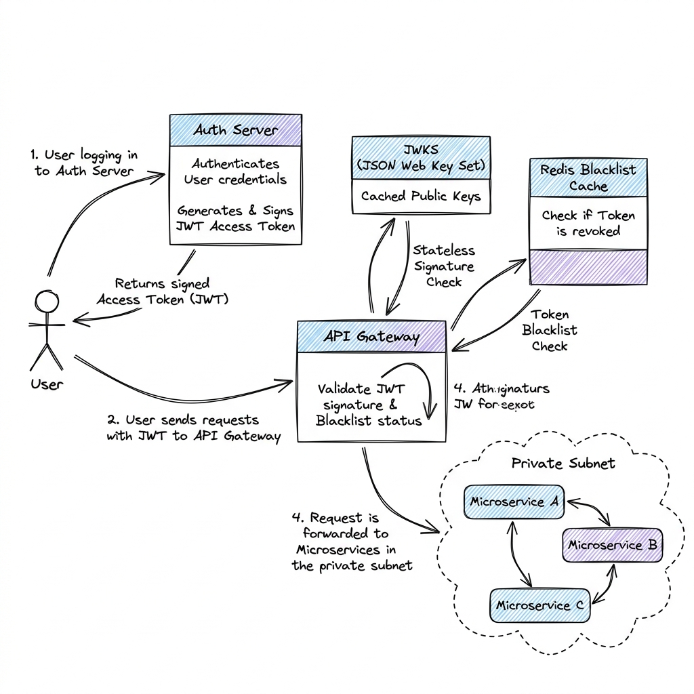

# Authentication & Authorization at Scale

## Overview

Authentication (verifying user identity) and Authorization (verifying user permissions) are core safety foundations of system architecture. In a distributed microservices environment, authentication must scale to handle millions of requests without introducing database lookup bottlenecks or single points failure, utilizing standardized protocols like OAuth2, OpenID Connect (OIDC), and JSON Web Tokens (JWT).

---

## Problem Statement

Monolithic systems manage authentication easily by keeping a user session in the application memory or a single shared database. In a distributed microservices architecture, this model triggers major challenges:
1. **The Database Bottleneck**: If every microservice must query a central "User Database" or "Session Database" on every incoming request to check if a user is logged in, that central database quickly becomes a performance bottleneck and a single point of failure.
2. **Session Replication Overhead**: Storing sessions in server RAM requires session stickiness or complex multi-server session replication mechanisms, preventing horizontal scaling.
3. **Stateless vs. Stateful Token Revocation**: Stateless tokens (like JWTs) cannot be easily revoked before their expiration time, creating a security window if a user's token is stolen.
4. **Service-to-Service Identity Propagation**: Downstream services (e.g., Payment Service) need to know which user initiated the action without re-running the entire authentication flow.

---

## Architecture: Stateless vs. Stateful Auth

Production systems balance security and performance using one of two primary architectural patterns:

### 1. Stateless Authentication (JWT Model)
- **Token Issue**: The user logs in via the Identity Provider (IdP) / Auth Server. The Auth Server generates a signed **JSON Web Token (JWT)** containing the user's ID, roles, and expiration time.
- **Verification**: When the user calls a microservice, the API Gateway or the microservice itself validates the token's cryptographic signature using the Auth Server's public key (fetched from a **JWKS - JSON Web Key Set** endpoint).
- **Zero Database Query**: Because the token is signed and self-contained, services can trust the payload (user identity and roles) without querying any database.

### 2. Stateful Authentication (Session ID Model)
- **Token Issue**: The user logs in, and the system generates a random UUID (Session ID) and writes a session record to a high-speed database (Redis or DynamoDB).
- **Verification**: The Session ID is sent back to the client as a secure HTTP-only cookie. For every request, the API Gateway queries the Redis cache to retrieve the user's session record.
- **Instant Revocation**: To log a user out or invalidate a session immediately, the system deletes the session key from Redis.

---

## Components

1. **Identity Provider (IdP) / Auth Server**: Authenticates credentials and issues tokens (e.g., Keycloak, Auth0, Okta).
2. **API Gateway (Auth Filter)**: The front-line validator that intercepts incoming public tokens.
3. **JSON Web Key Set (JWKS) Cache**: An in-memory cache at the service or gateway level storing the public keys used to verify token signatures.
4. **Token Blacklist (Redis)**: Stores temporarily revoked stateless tokens.

---

## Design Decisions & Trade-offs

### Stateless JWT vs. Stateful Sessions

| Metric | Stateless JWT | Stateful Session (Redis) |
| :--- | :--- | :--- |
| **Validation Latency** | Low ($<1$ms). Pure cryptographic computation in memory. | Medium ($1-5$ms). Requires a network query to Redis. |
| **Revocation Capability** | Poor. Token is valid until its expiration time unless blacklist checks are run. | Perfect. Deleting the session key immediately terminates access. |
| **Database Cost** | Zero database lookups for verification. | Requires scaling a highly available Redis cluster to handle session read throughput. |

### JWT Expiration & Refresh Token Rotation

To minimize the security window of stolen tokens:
- **Access Token**: Short-lived (e.g., 15 minutes), stateless JWT used for active request authorization.
- **Refresh Token**: Long-lived (e.g., 30 days), stateful token stored securely in the database. Used strictly to obtain a new access token when it expires.
- **Rotation**: Every time a user uses their refresh token, the Auth Server invalidates it and issues a new one. If an attacker steals a refresh token and tries to use it, the server detects the duplicate use, invalidates the entire session chain, and forces a re-login.

---

## Scaling

- **JWKS Caching**: Microservices must cache the public keys retrieved from the `/jwks.json` endpoint. Downloading keys on every request defeats the purpose of stateless authentication. Configure a cache TTL of 24 hours.
- **Edge Token Validation**: Run token validation logic at the Edge (CDN / Anycast router level) using edge computing nodes, blocking invalid requests before they even reach the cloud data center.

---

## Failure Handling

- **Auth Server Outage**: If the Auth Server is down, microservices can continue validating JWTs because signature verification relies entirely on the cached JWKS public keys. Cache keys should survive Auth Server downtime.
- **Key Rotation Fallback**: During Auth Server public key rotation, the server signs tokens with a new key ID (`kid`). Microservices that encounter an unknown `kid` in a token must temporarily bypass the cache and fetch the latest JWKS JSON from the Auth Server to obtain the new public key.

---

## Security

- **Cross-Site Scripting (XSS) Protection**: Never store sensitive tokens (Session IDs, Access Tokens) in HTML `localStorage` or `sessionStorage` because Javascript can read them. Store tokens in secure `HttpOnly`, `Secure`, `SameSite=Strict` cookies.
- **Cross-Site Request Forgery (CSRF) Mitigation**: When using cookies, protect write routes by enforcing CSRF tokens or verifying `Origin` and `Referer` headers at the API Gateway.

---

## Cost Optimization

- **Minifying JWT Claims**: Keep the payload size of JWTs small. A large JWT containing extensive user metadata increases the byte size of every HTTP request, leading to higher egress bandwidth costs at scale.

---

## Interview Questions

### Q1: How would you implement instant token revocation in a stateless JWT authentication system?
**Answer**:
Instant token revocation in a stateless system is implemented using a **Hybrid Blacklist Pattern**:
1. **Short-Lived Access Tokens**: Keep access token lifetimes very short (e.g., 5-10 minutes).
2. **Redis Blacklist**: When a user logs out, signs out of all devices, or is banned, write the JWT signature hash (or a unique token ID `jti`) to a centralized Redis cluster with a TTL equal to the token's remaining lifespan.
3. **Validation Path**:
   - The API Gateway validates the cryptographic signature of the JWT locally (stateless check).
   - If the signature is valid, it does a fast lookup in the Redis cache: `EXISTS blacklist:jti`.
   - If the key exists, block the request (`401 Unauthorized`). If not, allow it.
4. **Trade-off**: This introduces a low-latency cache query but guarantees immediate revocation, combining the speed of stateless checks with the security of stateful sessions.

### Q2: Design a Single Sign-On (SSO) authentication flow across multiple domains (e.g., app.com and helper.com).
**Answer**:
SSO is implemented using OIDC (OpenID Connect) Authorization Code Flow with PKCE:
1. **Redirect to IdP**: User visits `app.com`. If not authenticated, the app redirects the browser to the centralized Identity Provider: `sso.auth.com/authorize?client_id=app&redirect_uri=app.com/callback`.
2. **Login at Central Domain**: The user enters credentials directly on the secure `sso.auth.com` domain. The IdP verifies credentials and writes a session cookie on `sso.auth.com`.
3. **Issue Authorization Code**: The IdP redirects the browser back to `app.com/callback` with a temporary `code`.
4. **Exchange Code for Tokens**: The backend of `app.com` calls the IdP token endpoint to exchange the `code` for an ID Token, Access Token (JWT), and Refresh Token.
5. **SSO Access for Domain 2**: When the user subsequently visits `helper.com`, the app redirects the browser to `sso.auth.com/authorize`. The IdP detects the active session cookie on `sso.auth.com` (user is already logged in) and immediately redirects back to `helper.com/callback` with an authorization code, bypassing the login form.

---

## References

1. **OAuth 2.0 Security Best Current Practice**: RFC 6749 & RFC 8252 (PKCE).
2. **JSON Web Token (JWT)**: RFC 7519.
3. **OpenID Connect Core**: *OpenID Connect Core 1.0 Specification*.
