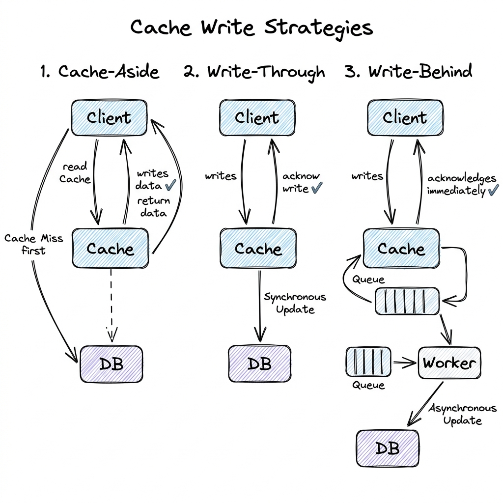

# Caching

## Overview

Caching is a system design pattern used to store frequently accessed data in a high-speed, low-latency memory layer (typically RAM) rather than querying slower, persistent storage tiers (such as magnetic disks or relational databases). By bypassing disk read/write cycles and network query overheads, caches dramatically reduce latency (often down to sub-milliseconds) and shield backend databases from execution exhaustion.

---

## Problem Statement

As user traffic scales, relational and document databases encounter several performance bottlenecks:
1. **Disk I/O Latency**: Fetching records from persistent storage involves disk seek operations, which are orders of magnitude slower than RAM operations.
2. **CPU-Intensive Queries**: Executing complex SQL joins, aggregations, and sorting repeatedly for the same static data (e.g., product catalogs or user profiles) exhausts database CPU capacity.
3. **Database Connection Limits**: Databases support a limited count of concurrent open TCP connections. Exhausting connection pools leads to request timeouts and site outages.
4. **Data Race Inconsistencies**: When multiple servers read and update database values concurrently, locking rows slows down writes and reads.

---

## Architecture: Cache Write Strategies

Choosing how data is written and read from the cache determines the system's consistency guarantees and write latency:

### 1. Cache-Aside (Lazy Loading)
- **Read Path**: The application queries the cache first. If a **Cache Hit** occurs, data is returned. If a **Cache Miss** occurs, the application queries the database, writes the retrieved value to the cache, and returns it.
- **Write Path**: The application writes updates directly to the database first, and then deletes (invalidates) the corresponding cache key.
- *Pros*: Simple, memory-efficient (only stores data that is actively requested).
- *Cons*: High latency on cache miss (requires dual hops); risk of stale data if cache deletion fails.

### 2. Write-Through
- **Write Path**: The application writes data to the cache. The cache layer synchronously writes that same data to the database. Once both writes succeed, the operation completes.
- *Pros*: Zero stale data; cache is always in sync with the database.
- *Cons*: High write latency (requires synchronous write to the slow database).

### 3. Write-Behind (Write-Back)
- **Write Path**: The application writes updates to the cache, which immediately returns success. An asynchronous background process (or queue worker) periodically batches and writes the dirty cache keys back to the database.
- *Pros*: Extremely low write latency; highly efficient for write-heavy workloads.
- *Cons*: Data loss risk. If the cache server crashes before flushing changes to the database, updates are lost forever.

---

## Redis vs. Memcached

Production systems typically select either Memcached or Redis as their cache engine:

| Metric | Memcached | Redis |
| :--- | :--- | :--- |
| **Execution Model** | Multi-threaded. Scales easily across multiple CPU cores. | Single-threaded event loop. Avoids locks but is bound to a single CPU core. |
| **Data Types** | Simple Key-Value strings only. | Rich data structures: Strings, Lists, Hashes, Sets, Sorted Sets, HyperLogLogs. |
| **Persistence** | None (purely in-memory; data is lost on restart). | Optional persistence models (RDB snapshots, AOF transaction logs). |
| **High Availability** | None built-in (relies on client-side sharding). | Master-Replica replication, Sentinel failover, Redis Cluster sharding. |

---

## Scaling Cache Clusters

- **Sentinel vs. Cluster**:
  - **Redis Sentinel**: Provides high availability. If the master node fails, Sentinel promotes a replica node to master. All nodes hold the entire dataset.
  - **Redis Cluster**: Provides sharding. Automatically splits data across multiple master nodes using consistent hashing over 16,384 hash slots (`CRC16(key) % 16384`), scaling cache memory capacity horizontally.
- **Hot Key Mitigation**: A single popular key (e.g., a trending celebrity profile) queried by millions of users concurrently can saturate a single Redis shard's network interface card (NIC).
  - *Mitigation A (Local Cache)*: Cache the hot key in the local memory (L1 Cache) of each application server instance with a short TTL (e.g., 5 seconds).
  - *Mitigation B (Key Replication)*: Replicate the hot key by appending a random suffix (e.g., `hot_key_1`, `hot_key_2`) and querying them randomly.

---

## Failure Scenarios & Mitigations

Production caches suffer from four critical failure patterns:

### 1. Cache Penetration
Users request keys that exist in *neither* the cache *nor* the database (e.g., malicious requests looking for `user_id = -999`). Every request bypasses the cache, hitting the database directly.
- **Mitigation A (Cache Nulls)**: Cache the null value with a short TTL (e.g., 5 minutes) so subsequent requests hit the cache.
- **Mitigation B (Bloom Filter)**: Place a Bloom Filter (a space-efficient probabilistic data structure) in front of the cache. The Bloom filter tracks existing keys. If it says a key does not exist, reject the request immediately without hitting cache or database.

### 2. Cache Avalanche
Multiple keys expire in the cache at the exact same time, or the cache server goes down. A wave of concurrent requests hits the database, causing it to crash.
- **Mitigation A (Jitter)**: Add a random offset (jitter) to the expiration time (e.g., instead of 1 hour, set TTL to `1 hour + random(0-5 minutes)`) to spread out expiration windows.
- **Mitigation B (Hot Standby)**: Deploy Redis replica clusters across multiple availability zones.

### 3. Cache Stampede (Thundering Herd)
A high-traffic hot key expires. Hundreds of application threads detect the miss concurrently and write the identical query to the database in parallel, slowing down database performance.
- **Mitigation (Mutex Lock / SingleFlight)**: Use distributed mutex locks. Only the first thread that gets the lock is allowed to query the database and rebuild the cache. Other threads wait or sleep briefly, then query the cache again.

---

## Security

- **Cache Encryption**: Encrypt sensitive cached objects (such as session tokens or user profiles) before writing them to the cache to prevent data leakage in case of server unauthorized memory dumps.
- **Access Authentication**: Enforce auth credentials on cache nodes and isolate the cache port (e.g., default `6379`) inside a private security group.

---

## Cost Optimization

- **Setting MaxMemory Eviction**: Always configure a maximum memory cap (`maxmemory`) in Redis along with an eviction policy (typically `allkeys-lru` - Least Recently Used) to prevent the cache from consuming all system RAM and crashing.

---

## Interview Questions

### Q1: Explain how you would solve the Cache Stampede (Thundering Herd) problem in a high-traffic app.
**Answer**:
1. **Mutex Locking (SingleFlight Pattern)**:
   - When a cache miss occurs, the application node attempts to acquire a local or distributed lock for that key: `SET lock:key_id "1" EX 5 NX`.
   - Only the single thread that acquires the lock queries the database and updates the cache.
   - Other threads fail to acquire the lock. They wait (e.g., sleep 100ms) and retry reading from the cache.
2. **XFetch / Probabilistic Early Expiration**:
   - Instead of waiting for the key to fully expire, the application runs a probabilistic algorithm during reads: as the key approaches its expiration time, the system calculates a probability of early background refresh based on request frequency and database query latency.
   - A single background thread refreshes the cache before it actually expires, ensuring users always experience a $100\%$ cache hit rate.

### Q2: What are the trade-offs of Cache-Aside key invalidation? Why delete the cache instead of updating it?
**Answer**:
When database values are updated, the application must decide whether to update the cache value or delete the key.
1. **Updating Cache (Write-Through/Active Update)**:
   - *Issue (Race Condition)*: If two concurrent writes (Write 1 and Write 2) occur:
     - Write 1 updates database, then Write 2 updates database.
     - Due to network scheduling, Write 2 updates the cache first, then Write 1 updates the cache.
     - **Result**: The database has Write 2's value, but the cache has Write 1's value (Cache Inconsistency).
2. **Deleting Cache (Cache-Aside Invalidation - Recommended)**:
   - *Mechanism*: Delete the key on write. The next read naturally triggers a cache miss, pulls the latest correct value from the database, and writes it to the cache.
   - **Result**: Deleting the key avoids write race conditions and keeps cache logic simple, at the cost of one cache miss on the next read.

---

## References

1. **Memcached Architecture**: Fitzpatrick, B. (2004). *Distributed Caching with Memcached*. Linux Journal.
2. **Redis Design**: Sanfilippo, S. (2020). *Redis Source Code Architecture & Event Loop*.
3. **Bloom Filters**: Bloom, B. H. (1970). *Space/time trade-offs in hash coding with allowable errors*. Communications of the ACM.
