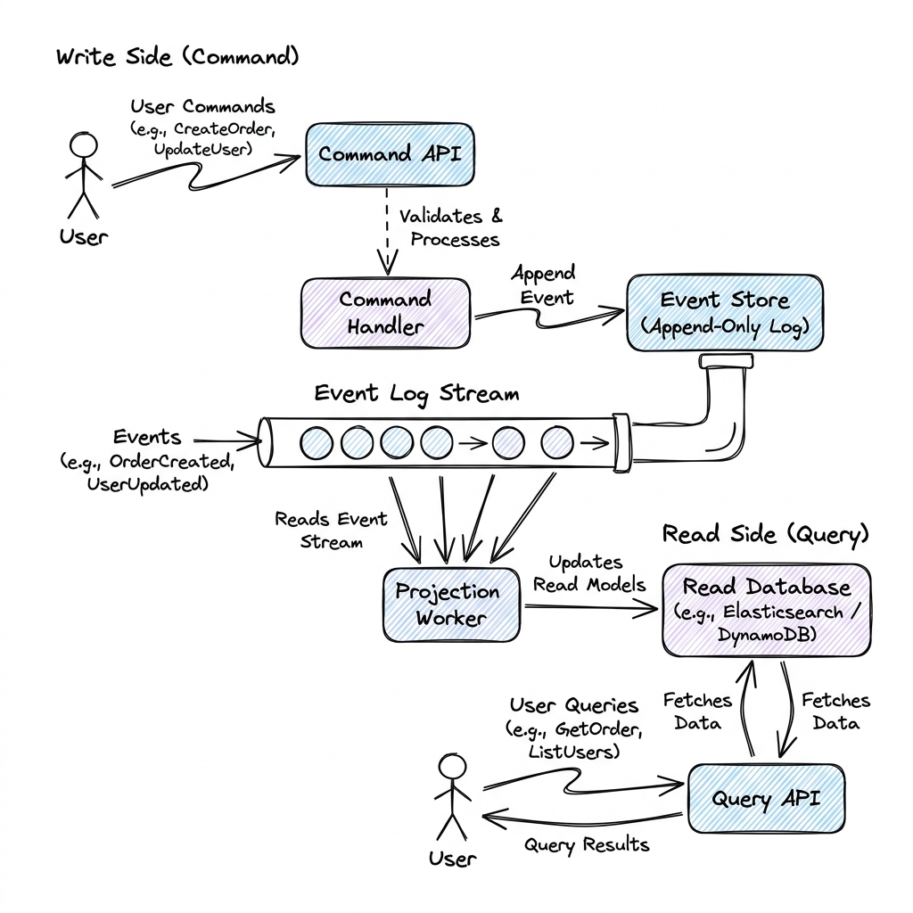

# Event-Driven Architecture

## Overview

An Event-Driven Architecture (EDA) is a software design pattern where decoupled services interact asynchronously by publishing and consuming **events**. An event represents a significant fact or state change within the system (e.g., `OrderPlaced`, `UserRegistered`). Instead of services directly querying or invoking one another synchronously, they emit events to a central event bus, allowing subscribing services to react dynamically.

---

## Problem Statement

Traditional synchronous request-response (REST/gRPC) architectures exhibit several limitations at scale:
1. **Temporal Coupling**: Service A must be online and active at the exact moment Service B wants to communicate. If Service B is slow or experiencing an outage, Service A's thread blocks, leading to cascading failures.
2. **Hardcoded Dependencies**: The emitting service must know the API endpoint and signature of every receiving service. Adding new downstream consumers (e.g., adding an Analytics service that needs order data) requires code modifications and redeployment of the source service.
3. **Write/Read Path Contention**: Databases optimized for writing complex transaction states (normalized relational DBs) are often poor at handling massive, highly varied read queries (e.g., search indexing, dashboard analytics), leading to query slow-downs.

---

## Architecture: Event Sourcing & CQRS

To build fully decoupled, highly auditable systems, production EDAs often combine **Event Sourcing** with **Command Query Responsibility Segregation (CQRS)**:

### 1. Event Sourcing
Instead of storing only the *current* state of an entity in a database table (e.g., updating a balance column from $\$100$ to $\$120$), Event Sourcing saves the entire history of state changes as an immutable sequence of events in an **Event Store**:
- `Event 1: AccountOpened (Balance=$0)`
- `Event 2: Deposited (Amount=$100)`
- `Event 3: Deposited (Amount=$20)`
- **Current State**: Computed by "replaying" the event log from the beginning.
- *Pros*: Perfect audit trail, historical time-travel debugging, zero data loss.

### 2. CQRS (Command Query Responsibility Segregation)
CQRS splits the application into two separate pathways:
- **Write Side (Commands)**: Validates commands (e.g., `CreateOrder`), performs business logic, and writes immutable events to the Event Store. It does not handle complex queries.
- **Projection Worker**: Subscribes to the Event Store event stream, maps the event payloads, and asynchronously writes them to the Read Database.
- **Read Side (Queries)**: Handles search and read queries directly against the Read Database (e.g., Elasticsearch or DynamoDB), which is highly denormalized and optimized strictly for quick retrieval.

---

## Components

1. **Event Store**: A specialized append-only database (e.g., Event Store DB, Apache Kafka) designed to store event streams.
2. **Projection Engine**: Background workers that listen to the event log and materialize views in the read store.
3. **Read Store**: A denormalized database optimized for queries (e.g., Redis, Elasticsearch, MongoDB).
4. **Command Handler**: Validates inputs and writes new events.

---

## Design Decisions & Trade-offs

### Eventual Consistency vs. Strong Consistency

- **Strong Consistency**: In synchronous systems, reads are guaranteed to show the latest write immediately.
- **Eventual Consistency**: In CQRS/EDA, there is a delay (replication lag) between writing an event to the Event Store and the Projection Worker updating the Read Store. Reads may temporarily return stale data.
- *Trade-off*: Eventual consistency allows massive read-write scaling (CAP Theorem: prioritizing Availability and Partition Tolerance) but requires application-level handling of race conditions.

### Event Collaboration vs. Event Carried State Transfer

- **Event Collaboration**: The event contains only the identifier (e.g., `OrderPlaced (OrderID=123)`). The consumer must query the Order Service API to fetch order details.
  * *Pros*: Small event payloads, zero schema redundancy.
  * *Cons*: High network traffic; downstream services must still call APIs, reducing temporal decoupling.
- **Event Carried State Transfer**: The event contains all data needed by consumers (e.g., `OrderPlaced (OrderID=123, Items=[...], Total=$50, UserEmail=...)`).
  * *Pros*: Downstream services do not need to query the source API; complete decoupling.
  * *Cons*: Massive event payloads, complex schema evolution management.

---

## Scaling

- **Partition Key Design**: To scale event processing, events are distributed across message partitions (e.g., Kafka partitions). Events with the same partition key (e.g., `user_id`) are routed to the same partition, guaranteeing they are processed in chronological order.
- **Snapshotting**: Replaying millions of events to compute current state is slow. The system periodically writes a "Snapshot" (e.g., every 100 events). To calculate state, load the latest snapshot and replay only the events that occurred after the snapshot timestamp.

---

## Failure Handling

- **Idempotent Consumers**: Networks can deliver the same event multiple times (at-least-once delivery). Consumers must be **Idempotent** (processing the event twice must have the same effect as processing it once).
  * *Mitigation*: Store processed `event_ids` in a database index. When an event arrives, check if its `event_id` exists in the database; if yes, discard it.
- **Out-of-Order Events**: Network latency can cause events to arrive out of order (e.g., `OrderShipped` arriving before `OrderPaid`).
  * *Mitigation*: Include a sequential version number or timestamp in the event payload. Consumers discard or buffer events that arrive with a version number higher than the expected sequential index.

---

## Security

- **Event Payload Encryption**: If events contain PII (e.g., user addresses), encrypt the fields using envelope encryption before writing to the public event bus, ensuring only authorized subscribing services have the decryption keys.
- **Event Log Immutability**: Ensure read-only permissions on historical event logs to prevent attackers from altering transaction histories.

---

## Cost Optimization

- **Log Compaction**: Configure message brokers (like Kafka) to run log compaction, which retains only the latest update event for each key (e.g., keeping only the latest status for `OrderID=123`), reclaiming disk space.

---

## Interview Questions

### Q1: Design a real-time banking ledger using Event Sourcing. How do you guarantee account balances are never overdrawn?
**Answer**:
1. **The Ingestion Path**:
   - The user requests a withdrawal: `WithdrawCommand(AccountID=1, Amount=$50)`.
   - The **Command Handler** loads the latest balance by fetching the account's latest Snapshot (e.g., Balance=$\$100$) plus replaying any unapplied `Deposited`/`Withdrawn` events from the Event Store.
2. **Validation**:
   - The Handler verifies: `Balance - WithdrawalAmount >= 0` ($\$100 - \$50 = \$50 \ge 0$).
3. **Execution**:
   - If valid, the Handler writes an event: `WithdrawnEvent(AccountID=1, Amount=$50, Version=X+1)` to the Event Store.
   - Use **Optimistic Concurrency Control (OCC)**: Write only succeeds if the event version is exactly `current_version + 1`. If another transaction updated the balance concurrently, the version check fails, and the command is retried.
4. **Consistency**:
   - Balance calculations are validated on the Write side (Command Handler) before writing the event. The Read side is updated eventually.

### Q2: What is Reciprocal Rank Fusion (RRF), and how does it combine different search types?
*(Note: Refer to RAG_System.md for details, as RRF is primarily a search rank aggregation algorithm).*

---

## References

1. **Enterprise Integration Patterns**: Hohpe, G., et al. (2003). *Enterprise Integration Patterns: Designing, Building, and Deploying Messaging Solutions*.
2. **CQRS Pattern**: Young, G. (2010). *CQRS, Documents, and Event Sourcing*.
3. **Designing Data-Intensive Applications**: Kleppmann, M. (2017). *Designing Data-Intensive Applications: The Big Ideas Behind Reliable, Scalable, and Maintainable Systems*.
