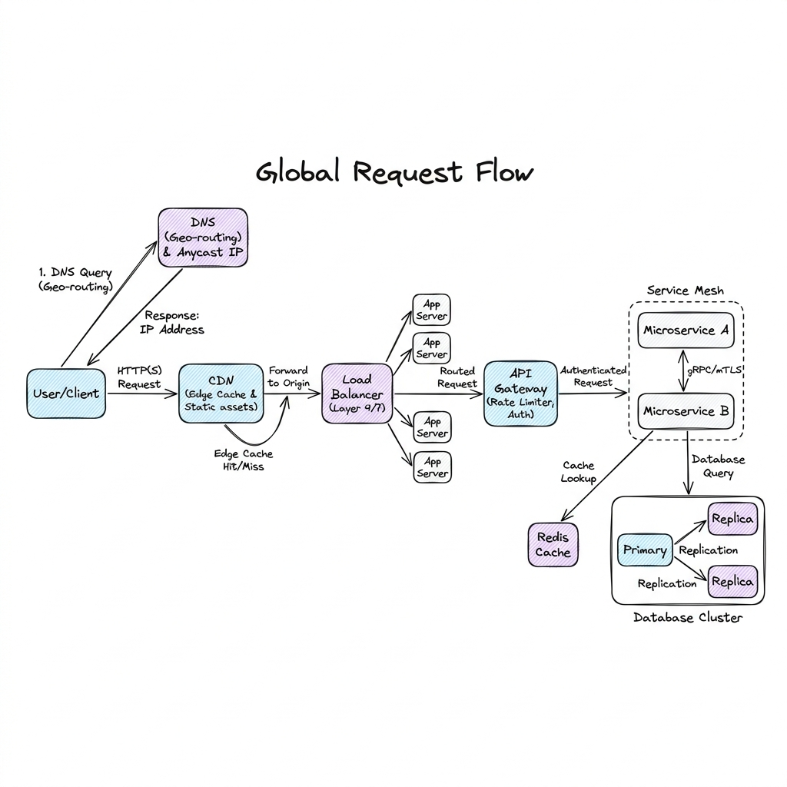

# High-Level Architecture

## Overview

High-Level Architecture represents the macro-blueprint of a distributed, internet-scale system. It maps the journey of a user's request from their browser, across global network boundaries, through edge-caching and traffic-routing nodes, into microservice runtimes, and down to persistent storage. Designing a high-level architecture requires orchestrating multiple independent infrastructure layers to satisfy strict uptime, performance, and durability goals.

---

## Problem Statement

At scale, system architects must design systems capable of handling millions of concurrent requests while mitigating physical, network, and hardware constraints:
1. **Network Latency (The speed of light)**: Round-trip times (RTT) between a client in Tokyo and a database in Virginia take approximately 150-200ms. Without edge routing and regional replication, applications feel sluggish.
2. **Availability Bottlenecks**: Single points of failure (SPOFs) at any tier (e.g., a single primary database or DNS server) can lead to catastrophic outages. Uptime targets of $99.999\%$ (less than 5.26 minutes of downtime per year) require redundant, self-healing topologies.
3. **Data Inconsistency**: Distributing application instances globally requires copying data across regions, which triggers trade-offs between consistency and availability (CAP Theorem).
4. **Traffic Spikes**: Sudden flash crowds (e.g., Black Friday shopping or product launches) can overwhelm servers, calling for rapid horizontal autoscaling and gatekeeping tiers.

---

## The Request Journey (Architecture)

A production global system organizes infrastructure into logical tiers to isolate concerns and handle traffic progressively:

### 1. The Global Routing & Edge Tier
- **GeoDNS**: When a client requests `api.example.com`, the DNS provider (e.g., Route53, Cloudflare) uses geo-location routing to resolve the domain name to the closest regional Anycast IP address.
- **Content Delivery Network (CDN)**: Serves static assets (HTML, CSS, media) from local edge caches (Point of Presence / PoPs). CDNs also execute lightweight edge scripts (e.g., Cloudflare Workers) to handle request redirects, header validation, and geo-customizations before hitting backend servers.
- **Anycast Routing**: Directs client TCP packets to the nearest Point of Presence on the provider's private network backbone, minimizing routing hops over the public internet.

### 2. The Traffic & Security Tier
- **Layer 4 & Layer 7 Load Balancers**:
  - **L4 (TCP/UDP)**: Uses IP and port routing (e.g., AWS NLB, Maglev) to distribute incoming TCP connections at wire speed across web server clusters.
  - **L7 (HTTP/HTTPS)**: Decrypts SSL/TLS traffic, inspects headers, cookies, and URLs (e.g., AWS ALB, NGINX) to route requests to specific service pools.
- **API Gateway**: Acts as the system's single ingress point. It executes centralized concerns: rate limiting, request validation, authentication token inspection, metrics collection, and routing.

### 3. The Application Tier
- **Service Mesh (e.g., Istio, Linkerd)**: Manages internal service-to-service communication (East-West traffic) inside Kubernetes clusters using lightweight sidecar proxies (Envoy) to handle service discovery, mutual TLS (mTLS), and circuit breaking.
- **Microservices**: Decoupled, stateless application containers (running on ECS or EKS clusters) executing isolated domain logic (e.g., Payment Service, Inventory Service).

### 4. The Data Tier
- **Distributed Cache (Redis / Memcached)**: Caches high-read, low-write database results (using cache-aside patterns) to shield databases from traffic stress.
- **Relational Databases (PostgreSQL / MySQL)**:
  - Structured data is stored using a Primary-Replica setup.
  - Write queries are directed to a single Primary database instance, while read queries are load-balanced across multiple read replicas.
  - Multi-region systems replicate data asynchronously across regions.

---

## Components

1. **Global Load Balancer (GSLB)**: Directs users to the healthiest, lowest-latency data center region.
2. **Reverse Proxy (ALB/NGINX)**: Manages SSL termination and routes requests inside a virtual private cloud (VPC).
3. **Container Orchestrator (Kubernetes)**: Schedules and autoscales microservice workloads.
4. **Relational/Non-Relational Databases**: Persistent storage (PostgreSQL, DynamoDB, Cassandra).

---

## Design Decisions & Trade-offs

### Multi-Region Active-Active vs. Active-Passive

| Metric | Active-Active (Multi-Region) | Active-Passive (Failover) |
| :--- | :--- | :--- |
| **Availability** | Maximum. If Region A fails, Region B absorbs traffic instantly. | High. Requires detecting Region A failure and updating DNS records (RTO $\approx$ minutes). |
| **Data Consistency** | Low/Eventual. Writing to Region A and Region B concurrently requires resolving write conflicts (using CRDTs or last-write-wins). | High/Strong. Writes only hit the active primary region, avoiding replication conflicts. |
| **Cost** | Extremely High. Requires running duplicate compute and storage infrastructure in multiple locations. | Medium. Passive region can run at minimum capacity until a failover occurs. |

---

## Scaling

- **Horizontal Scaling (Out)**: Adding more machine nodes (VMs/containers) behind a load balancer, as opposed to vertical scaling (scaling up - adding more CPU/RAM to a single machine). Compute nodes must be kept stateless to enable seamless scale-up and scale-down.
- **Database Sharding**: Splitting a massive database table across multiple independent physical database servers using a partition key (sharding key).
  - *Example*: Partitioning user accounts by `user_id % 4` across four separate databases.
  - *Trade-off*: Joins across shards are extremely complex, requiring application-side query joins.

---

## Failure Handling & Resilience

- **Disaster Recovery Targets**:
  - **RTO (Recovery Time Objective)**: The maximum acceptable time the system can be offline before restoration (e.g., target: under 1 minute).
  - **RPO (Recovery Point Objective)**: The maximum acceptable data loss measured in time (e.g., target: under 5 seconds of transaction logs).
- **Circuit Breakers**: Prevents cascading failures. If service A calls service B, and service B starts failing/timing out, the circuit breaker "trips" (opens). Service A immediately returns a default fallback response without invoking service B, allowing service B time to recover.
- **Database Replication Lag**: In a Primary-Replica architecture, replication is asynchronous. If a user writes data (Primary) and immediately reads it (Replica), they might not see the update due to replication lag (Read-Your-Own-Writes inconsistency).
  - *Mitigation*: Direct all reads that occur immediately after a write (e.g., first 5 seconds) to the Primary database, or use session tokens to track write states.

---

## Security

- **DDoS Mitigation**: Use edge shielding services (e.g., AWS Shield, Cloudflare Magic Transit) to filter out malicious volumetric attacks (SYN floods, UDP reflection) before they reach the VPC load balancers.
- **VPC Isolation (DMZ)**: Publicly accessible load balancers reside in Public Subnets. Microservices, databases, and caches must be locked down in Private Subnets, accessible only through security groups.

---

## Cost Optimization

1. **Auto-scaling Policies**: Set dynamic auto-scaling rules based on CPU utilization and request count metrics. Scale down instances during off-peak hours (e.g., at night).
2. **Edge Offloading**: Aggressively cache static assets and common API responses at the CDN edge. Every request served by the CDN edge is a request that does not consume costly EC2 compute or database queries.

---

## Interview Questions

### Q1: Detail the complete request path of a user typing 'https://shopping.com/checkout' into their browser.
**Answer**:
1. **DNS Resolution**: The browser checks its local cache for `shopping.com`. If not found, it queries the local DNS resolver, which traverses root, TLD, and authoritative nameservers. The GeoDNS returns the IP of the closest Load Balancer.
2. **TCP & TLS Handshake**: The browser establishes a TCP connection with the load balancer (Anycast IP). A TLS handshake is negotiated (HTTPS) to exchange encryption keys.
3. **CDN Ingress**: Static assets (images, styles) are fetched from the edge CDN. The `/checkout` route is classified as dynamic and forwarded to the load balancer.
4. **Load Balancer**: The Layer 7 load balancer receives the HTTP request, terminates TLS, inspects headers, and forwards it to the API Gateway cluster.
5. **API Gateway**: The gateway authenticates the user's JWT, validates the rate-limit token bucket in Redis, and routes the request to the internal `Checkout Service` microservice.
6. **Application Logic**: The `Checkout Service` processes the payment (calls external stripe API), reads user cart data from Redis Cache (fallback to database), writes transaction records to the Primary Database, and triggers an asynchronous event via Kafka (e.g., to notify Inventory/Notification services).
7. **HTTP Response**: The service returns a `200 OK` JSON response, which travels back through the API gateway and load balancer to the browser over the open TLS connection.

### Q2: How do you handle write conflicts in an Active-Active multi-region database deployment?
**Answer**:
1. **Avoid Multi-Region Write Patterns**: The safest path is routing all writes for a specific user to a designated primary region (e.g., pinning European users to the EU region database).
2. **Conflict-Free Replicated Data Types (CRDTs)**: Use CRDT data structures (like Grow-Only Counters or LWW-Element-Set) which mathematically resolve divergent states across regions without requiring centralized coordination.
3. **Last-Write-Wins (LWW)**: Databases (like Cassandra) use high-resolution timestamps to resolve conflicts. The database write with the latest timestamp overwrite older values. This requires synchronizing system clocks across regions using NTP (Network Time Protocol) or TrueTime hardware (GPS + atomic clocks used in Google Spanner).

---

## References

1. **Google Spanner TrueTime**: Corbett, J. C., et al. (2012). *Spanner: Google’s Globally-Distributed Database*. OSDI 2012.
2. **CAP Theorem**: Brewer, E. A. (2000). *Towards Robust Distributed Systems*. PODC 2000.
3. **Netflix Disaster Recovery**: *Active-Active Multi-Regional Architecture at Netflix*. (Netflix Tech Blog).
