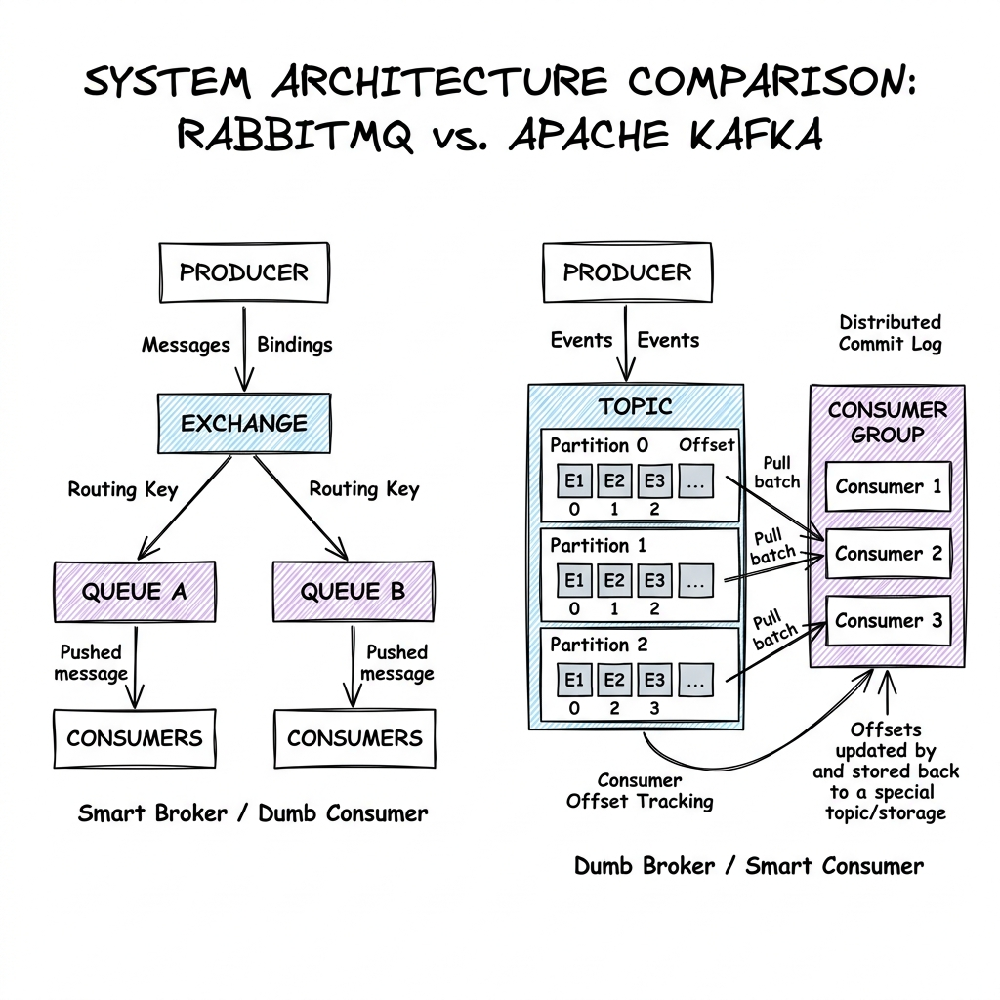

# Message Queues & Brokers

## Overview

Message Queues and Event Brokers are the plumbing of distributed systems. They act as asynchronous communication channels that buffer, route, and deliver messages between decoupled microservices. By decoupling producers (which publish data) from consumers (which process data), message queues allow applications to handle traffic spikes, run long background computations, and maintain system resilience during temporary database outages.

---

## Problem Statement

Without a message broker, systems face several constraints:
1. **Synchronous Bottlenecks**: If a web server must wait for a payment confirmation, profile updates, and confirmation emails to execute before returning `200 OK`, response times degrade.
2. **Loss of Messages (Buffer Overflow)**: A sudden surge in user signups can exhaust web server threads or database connections, causing incoming requests to drop.
3. **Consumer Coupling**: If Service A sends tasks directly to Service B, and Service B experiences an outage, those tasks are lost forever.

---

## Architecture: RabbitMQ vs. Apache Kafka

Production architectures generally choose between two primary paradigms of message design: **Smart Broker / Dumb Consumer** (e.g., RabbitMQ) or **Dumb Broker / Smart Consumer** (e.g., Apache Kafka).

### 1. RabbitMQ (AMQP Push Model)
RabbitMQ is a queue-centric message broker based on the AMQP protocol:
- **Topology**: Producers send messages to an **Exchange**. The Exchange routes messages to specific **Queues** using binding keys (Direct, Fanout, Topic exchanges).
- **Push Model**: RabbitMQ maintains active connections to consumers and **pushes** messages to them.
- **State Management**: The *broker* keeps track of message states. Once a consumer acknowledges a message, the broker immediately deletes it from the queue.
- *Best For*: Complex routing requirements, task queues, and transactional work distribution where messages must be consumed once and deleted.

### 2. Apache Kafka (Pull Log Model)
Kafka is an append-only distributed commit log:
- **Topology**: Producers write events to a **Topic**. Topics are split into multiple **Partitions** distributed across a broker cluster.
- **Pull Model**: Consumers actively **pull** batches of events from specific partitions at their own pace.
- **State Management**: The broker is stateless. It does not track which consumer has read which message. Instead, each consumer tracks its own read position using an **Offset** (an index integer) stored in a metadata log.
- **Replayability**: Messages are not deleted upon consumption; they remain on disk for a configured retention period (e.g., 7 days), allowing consumers to replay the event log from any offset index.
- *Best For*: High-throughput event streaming, log aggregation, real-time analytics, and Event Sourcing architectures.

---

## Delivery Guarantees

Distributed messaging systems operate under three execution models:
- **At-Most-Once**: Messages are sent once. If a consumer crashes during processing, the message is lost. (No retries, highest performance).
- **At-Least-Once**: Message delivery is retried until a consumer acknowledges it. If a consumer crashes mid-process, the broker redelivers it, potentially causing duplicates. (Default production standard; requires **Idempotent** consumers).
- **Exactly-Once**: The message is processed exactly once, and its side effects are committed exactly once, even in the event of consumer or broker crashes. (Requires complex transactional coordination across producer, broker, and consumer).

---

## Scaling

- **Kafka Partitions**: To scale Kafka topics, write queries are distributed across multiple partitions. Each partition can be assigned to only one consumer within a **Consumer Group**. To increase consumer scale, increase the number of partitions.
- **Consumer Rebalancing**: When a consumer node joins or leaves a group, Kafka triggers a rebalance, pausing consumption temporarily to reassign partition ownership. Minimizing rebalances is critical to preventing latency spikes.
- **Backpressure**: In RabbitMQ, if consumers are slower than producers, queues bloat, consuming RAM and crashing the broker. Implement **Consumer Prefetch Limits** (limits how many unacknowledged messages the broker pushes to a consumer) to slow down the push rate, forcing producers to block or rate limit at the source.

---

## Failure Handling

- **Dead-Letter Queue (DLQ)**: If a consumer receives a message it cannot process (e.g., malformed JSON payload that fails validation), rather than crashing or infinitely retrying, the consumer rejects the message. The broker routes it to a designated DLQ for isolation and manual debugging.
- **Retry Queue and Exponential Backoff**: For transient failures (e.g., database timeout), route the message to a series of retry queues with ascending Time-to-Live (TTL) limits (e.g., Retry-1s, Retry-10s, Retry-1m). Once the TTL expires, the broker routes the message back to the primary input queue.

---

## Security

- **Authentication**: Secure broker access using SASL/SCRAM or mutual TLS (mTLS) to prevent unauthorized producers from spoofing events.
- **Topic-Level Access Control Lists (ACLs)**: Configure permissions on the broker so that only the `Order Service` has write access to the `orders` topic, while the `Analytics Service` has read-only access.

---

## Cost Optimization

- **Log Retention policies**: In Kafka, tune retention configurations. Set aggressive log cleanup policies (e.g., delete logs after 48 hours instead of 7 days) on non-critical topics to save disk storage costs.
- **Message Batching**: Configure producers to buffer and compress messages (using Gzip or Snappy compression) before transmitting them to the broker, drastically reducing network I/O charges in cloud environments.

---

## Interview Questions

### Q1: Compare Kafka and RabbitMQ. When would you choose one over the other?
**Answer**:
- **Choose RabbitMQ** when the system requires:
  1. Complex routing logic (e.g., routing messages dynamically to different queues using wildcard topics like `eu.orders.electronics`).
  2. Individual message acknowledgments and deletion (task distribution queues).
  3. Low setup complexity for standard worker queues.
- **Choose Kafka** when the system requires:
  1. Massive scale (handling terabytes of log streams per hour).
  2. Message replayability (e.g., needing to re-run historical calculations by resetting consumer offsets to zero).
  3. Order preservation (events for user ID `123` must execute chronologically across the system, achieved via partition routing keys).
  4. Real-time event streaming pipelines (integrating with Spark or Flink).

### Q2: How does Kafka guarantee exactly-once semantics (EOS)?
**Answer**:
Exactly-Once Semantics in Kafka is achieved by combining three features:
1. **Idempotent Producer**: The producer appends a unique sequence number to every batch of messages. If a network retry occurs, the broker detects the duplicate sequence number and discards it before writing to the partition log.
2. **Transactional Coordinator**: Transactions are tracked across multiple partitions using a centralized coordinator. The producer starts a transaction, writes messages to multiple partition logs, and sends a commit token.
3. **Transactional Consumption**: Consumers read messages and write their offset coordinates back to Kafka within the *same* atomic transaction. If the consumer crashes before offsets are committed, the transaction is aborted, the offset rollback occurs, and no duplicate state is committed downstream.

---

## References

1. **Kafka Guide**: Kreps, J., et al. (2011). *Kafka: a Distributed Messaging System for Log Processing*. NetDB 2011.
2. **AMQP Specification**: *OASIS Advanced Message Queuing Protocol (AMQP) Version 1.0*.
3. **Designing Data-Intensive Applications**: Kleppmann, M. (2017). *Designing Data-Intensive Applications: The Big Ideas Behind Reliable, Scalable, and Maintainable Systems*.
