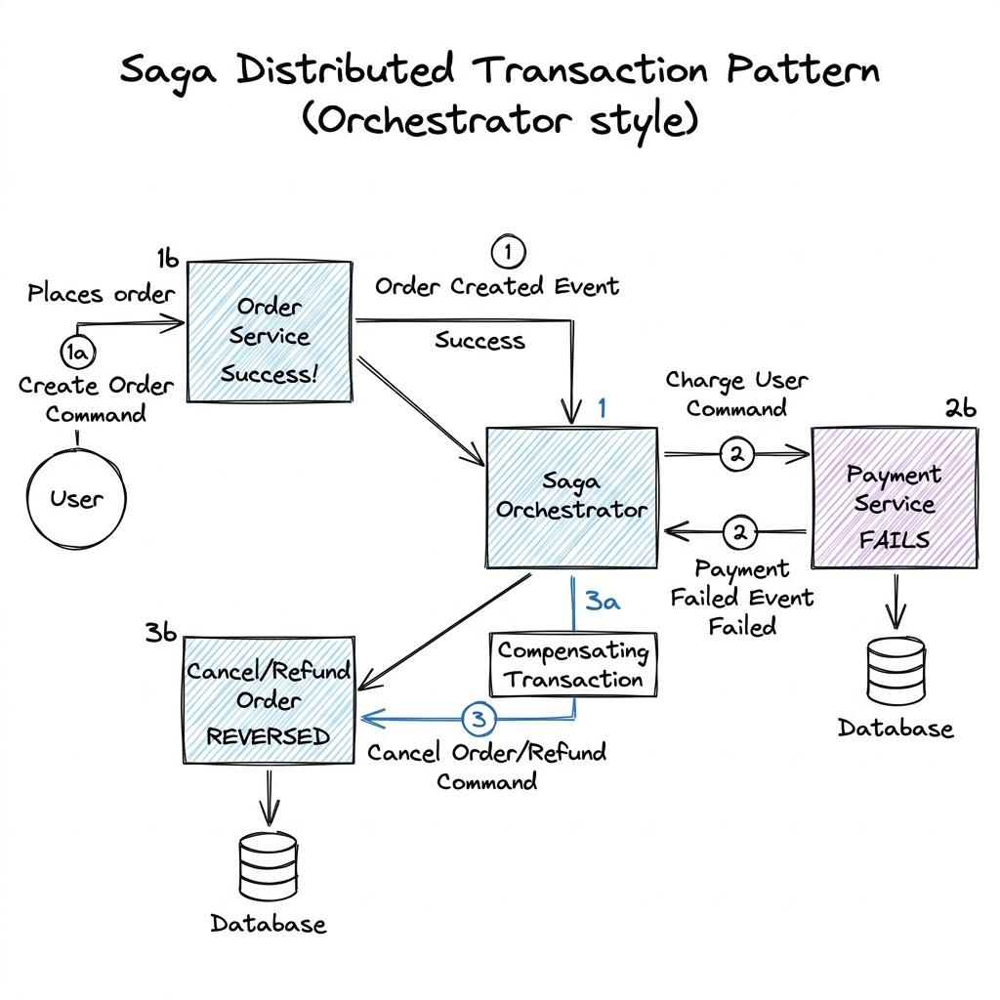

# Microservices

## Overview

A Microservices architecture is an organizational and software design pattern where an application is decomposed into a collection of loosely coupled, independently deployable, and specialized services. Each service represents a specific business domain (or bounded context), maintains its own data store, and communicates with other services using lightweight network protocols (e.g., HTTP REST, gRPC, or asynchronous event brokers).

---

## Problem Statement

While monolithic architectures are simple to deploy, scaling them in enterprise production environments triggers major constraints:
1. **Deployment Coupling**: A small bug or line change in one module requires rebuilding, testing, and redeploying the entire monolith, slowing down release cycles.
2. **Scaling Bottlenecks**: Monoliths scale vertically or duplicate the entire stack. If only the image-processing module is CPU-intensive, the entire application server pool must be scaled out, wasting RAM and compute resources.
3. **Database Contention**: Multiple developer teams writing to a shared, monolithic database leads to schema locking, index conflicts, and single-database performance degradation.
4. **Technology Lock-in**: The entire application is forced to use the same programming language, framework, and database engine, even if specialized tasks (e.g., machine learning, graph search) would benefit from other technology stacks.

---

## Architecture

A microservices system operates on the principle of isolation. It decomposes applications by business capabilities (Domain-Driven Design).

### 1. Bounded Contexts & Database-per-Service
- **Database-per-Service**: To prevent database coupling, each microservice owns its private database. Other services cannot access this database directly. Instead, they must query the owner service's public APIs.
- **Service Discovery (Registry)**: In a dynamic cloud environment, service container instances scale up and down, changing IP addresses. A Service Registry (e.g., Consul, Eureka) acts as a directory mapping service names to their active IP addresses.

### 2. Distributed Transactions: The Saga Pattern

Since databases are isolated, maintaining transactional data consistency across multiple microservices (e.g., Order Service, Payment Service, Inventory Service) cannot rely on ACID database locks. Instead, systems use the **Saga Pattern**:

A Saga is a sequence of local transactions. Each local transaction updates data within a single service and triggers the next step. If a step fails, the Saga executes **Compensating Transactions** in reverse order to undo the changes.

- **Choreography (Event-Based)**: Services listen to events and execute local transactions independently without a central coordinator.
  - *Example*: Order Service creates order -> publishes `OrderCreated` -> Payment Service processes payment -> publishes `PaymentProcessed` -> Inventory Service reserves items.
- **Orchestration (Centralized)**: A dedicated service (the **Saga Orchestrator**) acts as a state machine, explicitly instructing each service to execute their local transaction or compensation step.

---

## Components

1. **API Gateway**: Route requests from external clients to internal microservices.
2. **Service Mesh (Envoy/Istio)**: Handles internal cluster network proxying (mTLS, retries, discovery).
3. **Saga Orchestrator**: Manages state and coordinate complex workflows (e.g., temporal workflows).
4. **Event Broker**: Communicates events asynchronously between decoupled services.

---

## Design Decisions & Trade-offs

### Synchronous (gRPC/REST) vs. Asynchronous (Events)

- **Synchronous (gRPC/HTTP)**: Service A calls Service B and blocks waiting for a response.
  * *Pros*: Simple to code, matches standard programming flows.
  * *Cons*: Tight temporal coupling. If Service B is slow or down, Service A fails. Cascading failures can bring down the entire system.
- **Asynchronous (Event/Queue)**: Service A publishes an event and immediately returns. Service B processes it asynchronously.
  * *Pros*: High decoupling. If Service B is offline, the message queue buffers the task, and Service A continues unaffected.
  * *Cons*: Eventual consistency. The system state is temporarily out of sync, making real-time validation difficult (e.g., double spend protection).

### Shared Database vs. Database-per-Service

- **Shared Database**: Multiple services query the same relational database.
  * *Pros*: Simple joins, strong ACID consistency across domains.
  * *Cons*: Schema changes break multiple services; database scaling limit is hit quickly; lack of service isolation.
- **Database-per-Service**:
  * *Pros*: High agility, services deploy independently, database matches domain needs (e.g., Neo4j for graphs, PostgreSQL for transactions).
  * *Cons*: Data joins require querying multiple APIs; distributed transactions require Saga patterns.

---

## Scaling

- **Horizontal Pod Autoscaling (HPA)**: Kubernetes automatically scales service replicas based on custom metrics (CPU, memory, HTTP request count).
- **Read-Heavy Query Aggregation (CQRS)**: To avoid joining data across multiple microservice APIs at query time, implement a separate CQRS projection worker that listens to events from all services and syncs data to a consolidated Read Database optimized for search queries (see [Event_Driven.md](Event_Driven.md)).

---

## Failure Handling & Fault Tolerance

- **Bulkhead Pattern**: Isolates resources. Allocate separate thread pools, memory limits, and database connection pools for different microservices. A failure in the "Recommendation Service" pool should not consume threads needed for the "Payment Service".
- **Circuit Breaker**: Detects downstream failure and opens the circuit, immediately failing fast and returning a fallback response rather than letting threads pile up waiting for slow timeouts.
- **Exponential Backoff & Jitter**: When retrying failed network calls, increase the wait time exponentially ($2^t + \text{jitter}$) to prevent hammering a struggling service (thundering herd problem).

---

## Security

- **Zero-Trust Network Architecture**: Internally within the cluster, do not trust network origins. Use mutual TLS (mTLS) to authenticate and encrypt all service-to-service communication.
- **JWT Propagation**: The API Gateway validates user credentials and generates a signed JWT. This JWT is passed down the request chain, allowing microservices to verify user identity and enforce Role-Based Access Control (RBAC) locally.

---

## Cost Optimization

- **Container Density**: Optimize CPU and memory request/limit specifications on Kubernetes pods to maximize resource density per physical VM node.
- **Serverless Scaling**: Run non-critical microservices on serverless container platforms (e.g., AWS Fargate, Knative) that scale to 0 instances during periods of inactivity.

---

## Interview Questions

### Q1: Detail how you would implement a Saga transaction for a ride-sharing booking flow (Ride Service, Payment Service, Driver Service).
**Answer**:
We choose an Orchestrated Saga:
1. **Initialize**: A `Booking Orchestrator` state machine is created in Postgres or Temporal.
2. **Step 1 (Payment Service)**: Orchestrator calls Payment Service: `AuthorizeCharge(user_id, amount)`. 
   - *Success*: Status updated to `PaymentAuthorized`.
3. **Step 2 (Driver Service)**: Orchestrator calls Driver Service: `AssignDriver(ride_id)`.
   - *Failure (No drivers available)*: Driver Service returns `NoDriversFound`.
4. **Compensation Step (Payment Service)**: The orchestrator catches the failure, transitions to the compensation state, and calls the Payment Service API: `RefundCharge(user_id, amount)`.
5. **Final State**: Orchestrator updates order status to `BookingFailed` and alerts the user. This guarantees that if a driver cannot be assigned, the customer is never charged.

### Q2: What is the Bulkhead pattern, and how does it prevent cascading failures in a microservices system?
**Answer**:
The Bulkhead pattern partitions service resources (like partition walls in a ship's hull). In monolithic or poorly designed microservices, all incoming API requests might share a single, global thread pool on the gateway or service router. If a downstream service (e.g., PDF Generator) slows down, incoming requests for PDF generation will block. Soon, all global execution threads will be exhausted waiting for the PDF generator, blocking unrelated requests (e.g., login or catalog browsing) from executing, causing a cascading system outage.
By implementing bulkheads (allocating a capped, isolated thread pool of say 10 threads strictly for PDF generation), a failure or slowdown in PDF generation can only exhaust those 10 threads. The remaining thread pools continue serving login and catalog requests, isolating the failure.

---

## References

1. **Domain-Driven Design**: Evans, E. (2003). *Domain-Driven Design: Tackling Complexity in the Heart of Software*.
2. **Saga Pattern**: Richardson, C. (2018). *Microservices Patterns: With examples in Java*.
3. **Circuit Breakers**: Nygard, M. T. (2007). *Release It!: Design and Deploy Production-Ready Software*.
