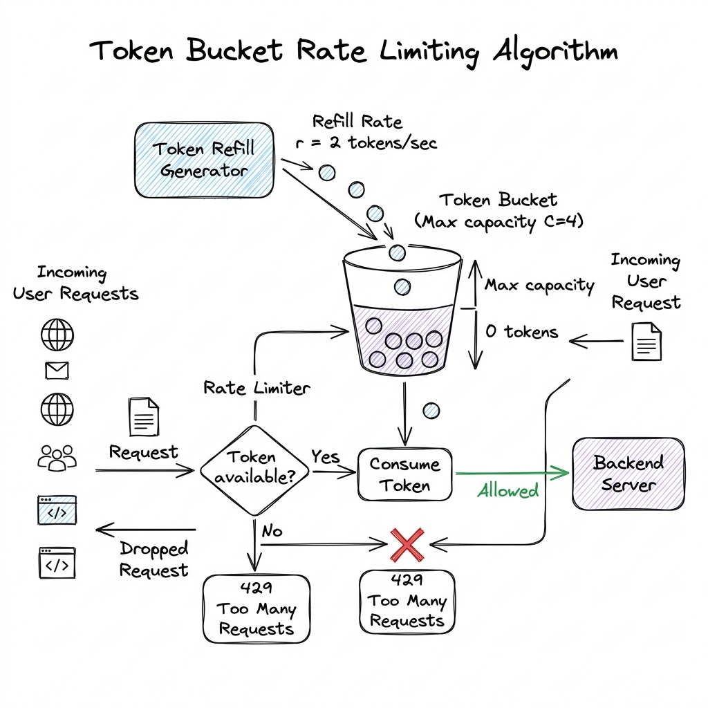

# Rate Limiting

## Overview

Rate Limiting is a system design pattern used to control the rate of traffic sent by a client or user to an API endpoint. By enforcing thresholds on the number of requests allowed within a specific time window, rate limiters protect downstream application servers and databases from denial-of-service (DoS) attacks, brute-force security threats, web scrapers, and resource exhaustion.

---

## Problem Statement

Exposing APIs to the public without rate limiting introduces several production vulnerabilities:
1. **Resource Exhaustion (Noisy Neighbors)**: A single rogue client or script executing infinite loops of heavy API queries (e.g., generating PDFs) can consume all server threads and database connections, starving other users.
2. **Brute Force & Credential Stuffing**: Attackers can hammer sign-in endpoints with millions of password combinations.
3. **Operational Cost**: In cloud environments, handling queries consumes database cycles, bandwidth, and API credits. Uncontrolled bot traffic raises operating costs.
4. **Distributed Synchronization (Race Conditions)**: In a high-traffic distributed system with multiple API Gateway instances, tracking request counts globally requires synchronizing counters without introducing major database locks.

---

## Architecture: Rate Limiting Algorithms

Systems enforce rate limits using specialized mathematical algorithms depending on the required precision:



### 1. Token Bucket Algorithm
- **Mechanism**: A bucket is configured with a maximum token capacity $C$. Tokens are added to the bucket at a constant fill rate $r$ (e.g., 10 tokens per second). When a request arrives, it tries to consume 1 token. If tokens are present, the request goes through; if not, it is dropped (`429 Too Many Requests`).
- **Burst Capability**: Allows sudden bursts of traffic up to the bucket capacity $C$.
- **Production Standard**: Widely used in API gateways (e.g., Kong, Envoy) due to its memory efficiency and simplicity.

### 2. Leaky Bucket Algorithm
- **Mechanism**: Requests are placed in a queue (the "bucket"). The bucket leaks requests at a constant, smooth rate $r$. If a request arrives and the queue is full, it overflows and is dropped.
- **Traffic Shaping**: Smooths out traffic bursts, producing a stable, continuous downstream flow. Suitable for queues feeding databases.

### 3. Sliding Window Counter
- **Mechanism**: Instead of dividing time into rigid blocks (Fixed Window), it calculates requests relative to a sliding scale. It estimates request rates by taking the weighted sum of requests in the current window and the previous window:
  $$\text{Requests} = \text{Count}_{\text{prev}} \times \left(1 - \frac{\text{time}_{\text{elapsed}}}{\text{window\_size}}\right) + \text{Count}_{\text{current}}$$
- **Accuracy**: Prevents double-limit traffic bursts at window boundaries while maintaining low memory usage.

---

## Distributed Rate Limiting (The Redis Lua Pattern)

To enforce rate limits across a cluster of API Gateway nodes, counters must be stored in a shared database:

```
[API Gateway 1] ──┐
                  ├─(Atomic Lua Script)─> [Redis Cluster]
[API Gateway 2] ──┘
```

Using simple Redis key increments (`INCR` + `EXPIRE`) leads to race conditions (the check-then-set bug). To solve this, production systems execute **Lua Scripts** in Redis:
- Redis runs Lua scripts atomically. No other commands can execute while the script runs, preventing race conditions.
- **Example Lua script for Token Bucket**:
  ```lua
  local key = KEYS[1]
  local limit = tonumber(ARGV[1])
  local current = tonumber(redis.call('get', key) or "0")
  if current + 1 > limit then
      return 0
  else
      redis.call("INCRBY", key, 1)
      if current == 0 then
          redis.call("EXPIRE", key, ARGV[2]) -- set window TTL
      end
      return 1
  end
  ```

---

## Components

1. **API Gateway Rate Limiter Filter**: The gateway module that evaluates the client token.
2. **Redis Metadata Cache**: Stores active IP/User ID request counters with TTL expirations.
3. **Lua Engine**: Executes atomic counter evaluations inside Redis.
4. **Header Injector**: Adds standardized HTTP headers back to the client:
  - `X-RateLimit-Limit`: Maximum requests allowed in the period.
  - `X-RateLimit-Remaining`: Remaining requests quota in the current window.
  - `X-RateLimit-Reset`: Unix timestamp when the counter resets.

---

## Design Decisions & Trade-offs

### Fixed Window vs. Sliding Window vs. Token Bucket

- **Fixed Window**: (e.g., max 100 requests per hour, resetting at 12:00, 1:00). Simple to implement, but allows up to $2\times$ the limit if a user executes 100 requests at 11:59 and another 100 requests at 12:01.
- **Sliding Window Log**: Stores a sorted set of exact request timestamps in Redis. Offers absolute precision, but consumes massive memory because every request timestamp is saved on disk.
- **Token Bucket**: Ideal balance. Memory footprint is tiny (only stores two variables per user: token count and last timestamp), handles bursts gracefully.

---

## Scaling

- **Local Thread Cache**: Querying a central Redis on every request at 500,000 RPS can saturate Redis network connections. Implement **Local Cache Throttling**: gateway instances track request counts in their local memory first, and write/sync back to Redis in batches or only query Redis on a fraction of requests.
- **Edge Throttling**: Enforce rate limits at the edge (CDN level). CDNs can rate-limit simple volumetric attacks by IP address before they ever route to the cloud backend, saving egress and compute costs.

---

## Failure Handling

- **Fail-Open vs. Fail-Closed**:
  - **Fail-Open (Recommended for User UX)**: If the Redis rate limiter cluster goes down, the API Gateway catches the error, logs it, and allows the user requests to pass through. Protecting user experience is prioritized over limiting.
  - **Fail-Closed (Recommended for Critical Billing APIs)**: If the rate limiter is unavailable, block requests immediately.

---

## Security

- **IP Spoofing Protection**: When rate limiting by IP address, attackers can spoof headers like `X-Forwarded-For`. Ensure the API Gateway is configured to read the IP address *only* from the last trusted proxy in the network chain.
- **Dynamic Throttling**: During active DDoS attacks, dynamically lower rate limits for unauthenticated endpoints.

---

## Cost Optimization

- **Memory Expiration (TTL)**: Always attach a Time-to-Live (TTL) expiration to every Redis rate limit key. Failing to expire keys will result in Redis VRAM bloating with inactive IP addresses, eventually crashing the cache server.

---

## Interview Questions

### Q1: Design a rate limiter that handles 1,000,000 requests per second.
**Answer**:
1. **Multi-Tier Architecture**:
   - **Tier 1 (Edge CDN)**: Apply broad, IP-based rate limiting using CDN Edge functions (e.g., Cloudflare Workers) to block massive bot networks and volumetric DDoS attacks.
   - **Tier 2 (API Gateway Local Cache)**: Enforce a Token Bucket check locally in the memory of each API Gateway instance to handle high-frequency requests without hitting Redis.
   - **Tier 3 (Redis Cluster)**: For authenticated API accounts, coordinate global quotas using a sharded Redis cluster, running atomic Lua scripts.
2. **Redis Sharding**: Shard the rate limit keys across multiple Redis master nodes using hashing (`HashSlot = CRC16(client_id) % 16384`) to balance the write and read network I/O.
3. **Fail-Open Fallback**: If Redis latency spikes, the API Gateway bypasses Redis checks and falls back to local memory thresholds.

### Q2: Detail the Sliding Window Counter algorithm implementation in Redis.
**Answer**:
The Sliding Window Counter uses two Redis keys representing the current window and the previous window:
1. When User A makes a request at minute 24 (window size = 1 minute):
   - Get the count of the previous window (minute 23): `GET userA:23` (returns e.g., 80 requests).
   - Get the count of the current window (minute 24): `GET userA:24` (returns e.g., 30 requests).
2. Calculate time progress: If we are at 36 seconds past minute 24, progress is $60\%$ ($0.60$).
3. Calculate current rate estimate:
   $$\text{Rate} = 80 \times (1 - 0.60) + 30 = 32 + 30 = 62 \text{ requests}$$
4. Compare `Rate` against the limit (e.g., 100). If $62 \le 100$, allow request and increment current window counter: `INCR userA:24`.

---

## References

1. **Token Bucket Algorithm**: *Standard Traffic Shaping and Policing Specifications*. (IETF RFCs).
2. **Redis Lua Scripting**: *Atomic Operations and Transactions*. https://redis.io/docs/manual/programmability/eval-intro/.
3. **Stripe API Design**: *Stripe Engineering Blog: Scaling Rate Limiters*.
