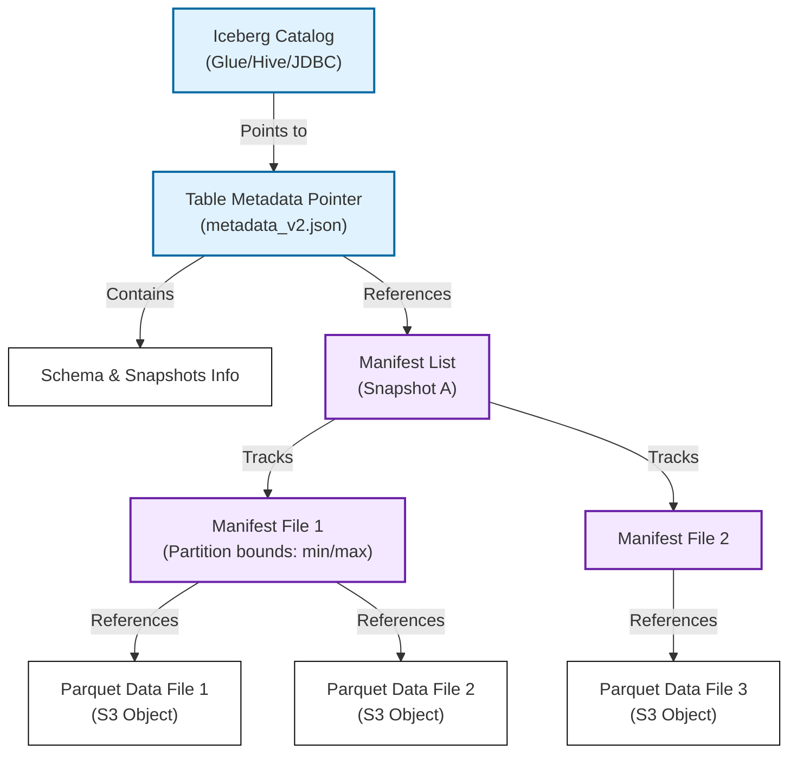

# Data Lake (Object Table Formats)

## Overview

A Data Lake is a centralized storage repository designed to store raw, unstructured, semi-structured, and structured data at any scale. While traditional data lakes (using raw object storage like AWS S3 or HDFS) suffered from lack of transactional control and slow directory scans, modern data lakes utilize **Open Table Formats** (such as Apache Iceberg and Delta Lake) to enforce ACID transactions, schema evolution, and time-travel querying directly on top of cheap object storage.

---

## Problem Statement

Storing large datasets directly as raw files (e.g., CSV, JSON, or Parquet) in cloud object storage introduces severe data management constraints:
1. **No ACID Guarantees**: If a write job crashes halfway through writing a partition folder, the data lake is left in a corrupted, partially written state. Multiple processes cannot safely write to the same table concurrently.
2. **The "Small File Problem"**: Ingesting real-time streaming data generates millions of tiny files (e.g., kilobytes in size) in S3. Cloud storage performance degrades because listing and opening millions of objects incurs high HTTP latency overhead.
3. **Slow Directory Scans**: Traditional query engines (like Hive) discover data by scanning the entire physical directory structure of S3, which takes minutes for large tables.
4. **Lack of Schema Evolution**: Adding or renaming columns in a raw dataset requires rewriting the entire historical dataset on disk to prevent schema mismatch errors during reading.

---

## Architecture: Table Formats (Delta Lake & Apache Iceberg)

Modern data lakes solve these problems by introducing a **Metadata Layer** between the raw storage files and the query engine:

- **Metadata File**: Stores table schema information, partition specifications, and a list of **Manifest Lists** representing snapshots of the table over time.
- **Manifest List**: Tracks a list of **Manifest Files** for a specific snapshot version, along with statistical boundaries (min/max column values) for partition pruning.
- **Manifest File**: Lists the actual physical **Data Files** (parquet files containing the rows), their locations, row counts, and statistics.
- **Why this works**: Instead of running S3 directory lists, query engines load the metadata hierarchy. The engine knows the exact file paths needed before querying S3, converting file discovery from a slow directory scan to an $O(1)$ file read.

### 2. ACID Transactions & Time-Travel

- **Copy-On-Write (COW) / Merge-On-Read (MOR)**:
  - **COW**: When updating a row, the engine rewrites the entire parquet file containing that row with the updated value. (Optimized for reads).
  - **MOR**: The engine writes updates to a separate "delete file" or "delta file". During reads, the query engine merges the base parquet file with the delete file on the fly. (Optimized for fast writes).
- **Snapshot Isolation**: When a transaction begins, it reads the current metadata snapshot pointer. Concurrent writers write new data files and generate a new metadata file. Once committed, the Catalog Pointer updates atomically. Readers are isolated from uncommitted writes.
- **Time Travel**: Because older metadata files are preserved, users can query historical data states by specifying a past snapshot ID or timestamp (e.g., `SELECT * FROM sales FOR SYSTEM_TIME AS OF '2026-07-08'`).

---

## Components

1. **Object Storage**: Persistent physical storage layer (AWS S3, Google Cloud Storage).
2. **Table Format Layer**: Translates logical SQL queries to physical file paths (Delta Lake, Apache Iceberg, Apache Hudi).
3. **Data File Format**: Columnar file formats with embedded metadata (Apache Parquet, Apache ORC).
4. **Metastore Catalog**: Coordinates atomic updates to the table pointer (AWS Glue, Hive Metastore).

---

## Design Decisions & Trade-offs

### Data Lake vs. Data Warehouse

- **Data Warehouse (OLAP)**:
  * *Pros*: Proprietary optimizations, lowest query latency, managed compute-storage.
  * *Cons*: Highly expensive, vendor lock-in, data must be loaded into the warehouse format.
- **Data Lake (Iceberg/Delta)**:
  * *Pros*: Zero vendor lock-in (any query engine like Spark, Trino, Flink, or Snowflake can query the same Iceberg files), very cheap storage costs.
  * *Cons*: Higher setup complexity, requires tuning file compactions.

### Delta Lake vs. Apache Iceberg

- **Delta Lake**: Deeply integrated with the Databricks/Spark ecosystem. Uses JSON transaction logs (`_delta_log/`) in the same directory as data files.
- **Apache Iceberg**: Engine-agnostic (designed by Netflix to support Spark, Trino, and Flink equally). Uses a catalog-driven metadata structure. Highly efficient for multi-engine architectures.

---

## Scaling

- **Compaction (Optimizing File Size)**: To solve the small file problem, run a background compaction job (using Spark or Trino) that reads thousands of tiny parquet files and merges them into optimal, larger files (typically 128MB to 512MB).
- **Hidden Partitioning**: Iceberg abstracts partitioning. Instead of users writing partition-specific query code, Iceberg automatically handles date transforms (e.g., mapping timestamp column values to days, hours, or years) and prunes files transparently.

---

## Failure Handling

- **Concurrent Write Conflict**: If two jobs write to the same table concurrently, the catalog uses **Optimistic Concurrency Control (OCC)**. The first job to write updates the metadata pointer successfully. The second job detects the update, checks if its writes overlap with the first job's writes; if they overlap, the second job aborts and retries.
- **Orphan File Cleanup**: Failed write jobs leave abandoned parquet files in S3 that are not referenced by any metadata snapshot. Run `expire_snapshots` and `remove_orphan_files` utilities regularly to delete these files and reclaim storage.

---

## Security

- **Granular Table Access Control (Lake Formation)**: Enforce column-level and row-level permissions on Iceberg tables using centralized catalogs like AWS Lake Formation, parsing permission boundaries before query execution.
- **IAM Role delegation**: Enforce fine-grained IAM roles on Spark/Trino workers so they only possess write access to their designated S3 bucket prefixes.

---

## Cost Optimization

- **S3 Intelligent-Tiering**: Enable intelligent tiering on S3 data buckets. Unused historical parquet files are automatically transitioned to cheaper archival storage classes (Infrequent Access, Glacier) without breaking metadata references.

---

## Interview Questions

### Q1: How does Apache Iceberg guarantee ACID transactions without a centralized relational database?
**Answer**:
ACID transactions in Iceberg are guaranteed through atomic updates at the **Catalog** level:
1. **Write Isolation**: A writer generates new parquet data files and compiles a new metadata JSON file pointing to the new state. This write is purely additive; it does not overwrite active data.
2. **Atomic Swap**: The writer attempts to update the Catalog (e.g., AWS Glue, which uses DynamoDB or RDS internally, or a Postgres database) to swap the current table pointer from `metadata_v1.json` to `metadata_v2.json`.
3. **Linearizability**: The catalog acts as the single source of truth. If the catalog update succeeds, the transaction is committed. If a concurrent writer swapped the pointer first, the atomic swap fails, and the aborted writer must retry by reloading the new metadata state.

### Q2: What is the "Small File Problem" in S3-based data lakes, and how do you resolve it?
**Answer**:
- **The Problem**: Streaming ingestion (e.g., Kafka writing to S3 every 10 seconds) generates millions of tiny parquet files. S3 is designed for high-throughput reads of large objects. Fetching a file requires an HTTP GET request (which has a 5-10ms connection overhead). Scanning 10,000 files of 10KB takes significantly longer than scanning one consolidated 100MB file.
- **Resolution**:
  1. **In-Memory Buffering**: Configure stream writers to buffer records in RAM and write to S3 only when size limits (e.g., 128MB) or time limits (e.g., 15 minutes) are met.
  2. **Asynchronous Compaction**: Run a background compaction workflow (e.g., using Spark's `OPTIMIZE` command). The job reads the tiny data files, merges them into consolidated 256MB Parquet files, writes them to S3, and commits a new metadata snapshot referencing the compacted files, safely deleting references to the tiny files.

---

## References

1. **Apache Iceberg Design**: Blue, R. (2018). *Iceberg: High-performance Table Format for Large Datasets*. (Netflix Tech Blog).
2. **Delta Lake Transactions**: Armbrust, M., et al. (2020). *Delta Lake: High-Performance ACID Table Storage over Cloud Object Stores*. VLDB 2020.
3. **S3 Storage Optimization**: *AWS Best Practices for Optimizing Amazon S3 Performance*.
