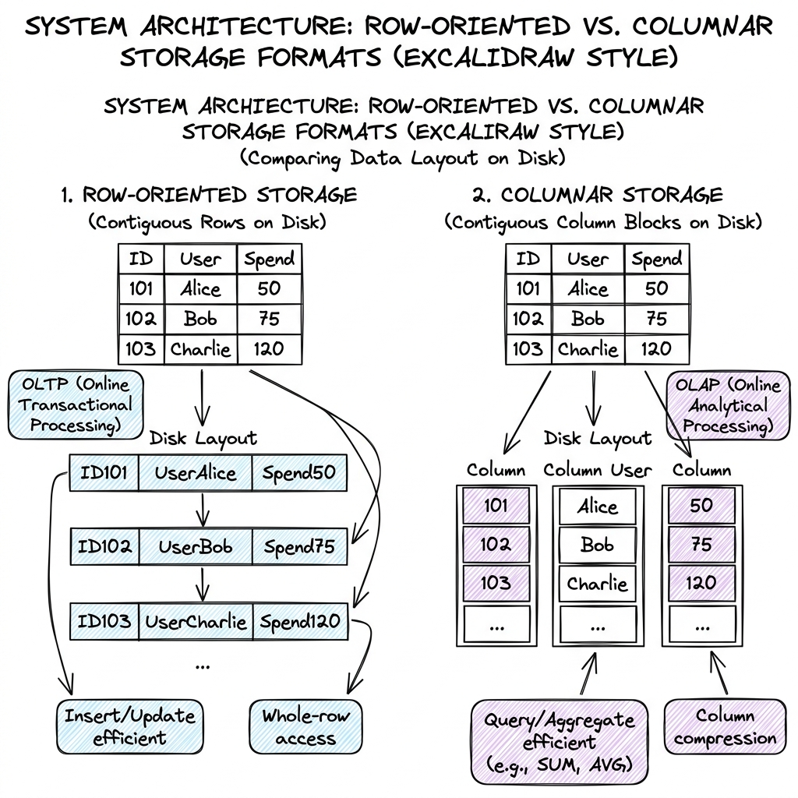

# Data Warehouse (OLAP query engines)

## Overview

A Data Warehouse is a centralized repository designed for analytical query processing (OLAP - Online Analytical Processing). Unlike transactional databases (OLTP) which optimize for row-level writes, a data warehouse is engineered to run complex aggregate queries (e.g., calculating annual sales trends or scanning billions of log files) using columnar storage, massively parallel processing (MPP) engines, and decoupled compute-and-storage scaling architectures.

---

## Problem Statement

Running analytics directly on transactional (OLTP) databases triggers several system constraints:
1. **Performance Contention**: Running a heavy report query that scans millions of rows can exhaust database CPU and disk I/O, slowing down active user checkout transactions.
2. **Row-Based Storage Overhead**: OLTP databases store data row-by-row on disk. To calculate average user spend, the query engine must load *all* columns of *all* rows from disk into memory, wasting massive disk read I/O bandwidth.
3. **Data Silos**: Business data is scattered across multiple databases (Postgres, MongoDB, Salesforce). Analytics requires a consolidated, cleaned data structure.
4. **Compute-Storage Coupling**: In traditional architectures, scaling storage capacity requires purchasing more compute hardware, even if the query workload remains low.

---

## Architecture: Columnar Storage & Compute Decoupling

Production data warehouses achieve high query speeds by redesigning how data is stored on disk and processed in memory.

### 1. Row vs. Columnar Storage Layout

Traditional databases store rows sequentially on disk. Columnar data warehouses store columns sequentially:

- **Row-Oriented Layout (OLTP)**: `[ID, User, Age, Spend], [ID, User, Age, Spend]`
  - *Best For*: Inserting or updating a single user record ($O(1)$ disk write).
- **Column-Oriented Layout (OLAP)**: `[ID1, ID2, ID3], [User1, User2, User3], [Age1, Age2, Age3], [Spend1, Spend2, Spend3]`
  - *Best For*: Aggregate queries (e.g., `SUM(Spend)`). The engine only reads the `Spend` block from disk, skipping all other columns, reducing disk read I/O by up to $90\%$.
  - **Compression Efficiency**: Since columns store identical data types (e.g., integers in the `Age` column), databases apply highly efficient compression algorithms like **Run-Length Encoding (RLE)** or **Dictionary Encoding**, reducing storage footprints by up to $10\times$.

---

### 2. Compute-Storage Decoupling

Modern cloud warehouses (e.g., Snowflake, Google BigQuery) separate computing nodes from storage nodes:
- **Storage Layer**: Data is stored as compressed, read-only files in highly durable cloud object storage (e.g., AWS S3, Google Cloud Storage).
- **Compute Layer**: Temporary virtual compute clusters (MPP warehouses) are spun up on-demand to execute queries. They load data from the storage layer, process it in parallel, and shut down when finished.
- **Why it matters**: You can store petabytes of data for low cost, and only pay for expensive CPU nodes when executing queries, scaling compute and storage independently.

---

## Components

1. **Query Coordinator (Optimizer)**: Receives the client query, parses it into an execution tree, and distributes tasks across compute nodes.
2. **MPP Compute Nodes**: Distributed virtual workers that perform local scanning, filtering, and aggregation.
3. **Metadata Service**: A centralized catalog tracking database schemas, file names, transaction logs, and statistical data for query planning.
4. **Cloud Object Store**: Persistent data storage layer.

---

## Design Decisions & Trade-offs

### OLTP vs. OLAP

- **OLTP (Online Transaction Processing)**:
  * *Focus*: Fast, concurrent writes and updates; row-level access.
  * *Schema*: Highly normalized (reduces redundancy).
- **OLAP (Online Analytical Processing)**:
  * *Focus*: Fast read scans; massive data aggregates.
  * *Schema*: Denormalized (Star/Snowflake schema) to minimize query join overheads.

### Decoupled Compute-Storage vs. Local NVMe Storage

- **Decoupled (Snowflake/BigQuery)**:
  * *Pros*: Infinite storage scale, independent scaling of compute, pay-as-you-use pricing.
  * *Cons*: Higher latency due to loading data over the network from S3 to compute nodes. (Mitigated by local SSD caching on compute nodes).
- **Coupled MPP (Traditional Redshift/ClickHouse)**:
  * *Pros*: Sub-millisecond queries because data resides locally on NVMe disks attached directly to compute nodes.
  * *Cons*: Complex scaling; adding storage requires adding nodes, triggers data redistribution (resharding) across nodes.

---

## Scaling

- **MPP (Massively Parallel Processing)**: Queries are divided into sub-queries. Compute nodes execute their sub-queries concurrently on separate segments of the dataset. They shuffle (exchange) intermediate data over a high-speed network before returning the consolidated result.
- **Partition Pruning**: The query optimizer reads metadata files first to identify which storage files contain the target data range (e.g., filtering by `WHERE order_date = '2026-07-10'`). It only reads those specific files, ignoring the remaining petabytes of data.

---

## Failure Handling

- **Compute Node Failure**: If a compute node crashes during a query, the Coordinator detects it via heartbeat checks and assigns the failed node's sub-task to a backup compute node.
- **Ingestion Failures**: If an ETL pipe fails to sync, analytical queries will execute on stale data. The Metadata Service tracks transaction commit markers to ensure queries run against a consistent snapshot of the data.

---

## Security

- **Row & Column Masking**: Dynamic policies mask sensitive columns (e.g., hashing credit card columns: `XXXX-XXXX-XXXX-1234`) based on the user's IAM role.
- **Data Encryption**: All data stored in object files is encrypted using envelope encryption keys managed via KMS.

---

## Cost Optimization

- **Auto-Suspending Warehouses**: Configure compute warehouses to automatically shut down after 5 minutes of query inactivity, stopping idle charges.
- **Clustering Keys Tuning**: Define clustering keys on tables to sort data physically on disk, optimizing partition pruning efficiency.

---

## Interview Questions

### Q1: Compare BigQuery and Snowflake. How do they handle compute scaling?
**Answer**:
- **Snowflake**:
  - Uses virtual compute warehouses (clusters of VMs). Users explicitly select the size of the warehouse (e.g., Small, Medium, Large) which dictates the CPU node count.
  - Compute is stateful *during* execution; nodes cache hot data on local SSDs to speed up subsequent queries.
  - Scales by adding more server instances to a virtual warehouse or spawning multiple warehouses.
- **Google BigQuery**:
  - Fully serverless query engine. Users do not manage virtual warehouses. Instead, BigQuery dynamically allocates "slots" (units of CPU/RAM) per query based on query complexity.
  - Storage and compute are connected over Google's ultra-high-speed Jupiter network, making local SSD caches less critical.
  - Pricing can be per-query (based on bytes scanned) or flat-rate (based on purchased slots).

### Q2: Explain the difference between Row-oriented and Column-oriented databases. When is each used?
**Answer**:
- **Row-Oriented (OLTP, e.g., PostgreSQL)**:
  - Stores all columns of a single row contiguously on disk.
  - *Best For*: Individual CRUD transactions (e.g., creating an order, updating a password).
  - *Why*: Reading/writing a single row requires only a single disk seek block I/O.
- **Column-Oriented (OLAP, e.g., Snowflake, ClickHouse)**:
  - Stores all values of a single column contiguously on disk.
  - *Best For*: Aggregate analytical queries (e.g., `SELECT AVG(price) FROM products`).
  - *Why*: The engine only reads the `price` column file from disk, avoiding loading unrelated fields (like product descriptions or images) into memory, dramatically reducing disk I/O.

---

## References

1. **Snowflake Architecture**: Dageville, B., et al. (2016). *The Snowflake Elastic Data Warehouse*. SIGMOD 2016.
2. **Google BigQuery (Dremel)**: Melnik, S., et al. (2010). *Dremel: Interactive Analysis of Web-Scale Datasets*. VLDB 2010.
3. **Column-Oriented Databases**: Stonebraker, M., et al. (2005). *C-Store: A Column-oriented DBMS*. VLDB 2005.
