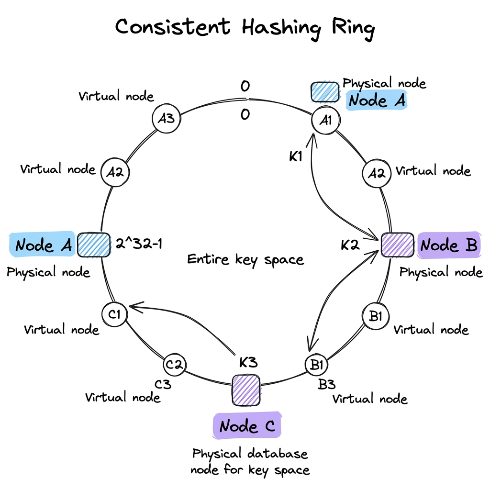

# NoSQL (Non-Relational Storage)

## Overview

NoSQL (Not Only SQL) databases are non-relational storage systems engineered to scale horizontally, handle unstructured or semi-structured data, and deliver high-throughput, low-latency performance. Unlike relational databases, NoSQL stores relax strict ACID guarantees in favor of the **BASE** model (Basically Available, Soft State, Eventual Consistency), allowing data partitions across distributed server nodes.

---

## Problem Statement

When operating global-scale applications, engineers encounter challenges that SQL systems struggle to solve:
1. **The Single-Node Bottleneck**: Relational databases enforce foreign keys and relational schemas, making it difficult to split tables across multiple physical servers without incurring network overhead.
2. **Dynamic / Unstructured Schemas**: Storing logs, social media feeds, or metadata files requires a database that adapts to changing JSON payloads without requiring table alters.
3. **Availability Under Network Partitions**: In a multi-region deployment, network cuts between data centers are inevitable. Traditional database locks block updates, taking the system offline.
4. **High Write Throughput**: Write-heavy pipelines (e.g., IoT sensor telemetry or clickstream tracking) require sub-millisecond writes that exceed relational table locking limits.

---

## Architecture: NoSQL Types & CAP Theorem

NoSQL architectures partition data across a cluster of nodes, choosing specific trade-offs according to application needs.

### 1. The CAP Theorem

In any distributed system, you can guarantee at most two of the following properties (defined by Eric Brewer):
- **Consistency (C)**: Every read query returns the most recent write or an error.
- **Availability (A)**: Every non-failing node returns a non-error response (but not guaranteed to contain the latest write).
- **Partition Tolerance (P)**: The system continues to operate despite network packet loss or link cuts between nodes.

**The Crucial Decision**: Since physical network partitions are unavoidable in distributed systems, a database *must* choose between **CP** (Consistency + Partition Tolerance) or **AP** (Availability + Partition Tolerance) when a partition occurs:
- **CP Systems (e.g., MongoDB, HBase)**: If a partition cuts communication, the database rejects write queries on isolated partitions to prevent data divergence, prioritizing data accuracy over availability.
- **AP Systems (e.g., Cassandra, DynamoDB)**: The database accepts writes on both sides of the partition. Data will diverge temporarily, resolving eventually (Eventual Consistency), prioritizing system availability.

---

### 2. Consistent Hashing

To distribute (shard) data keys across $N$ database nodes without rehashing all keys when nodes are added or removed, NoSQL databases use **Consistent Hashing**:

- **The Hash Ring**: The output range of a hash function (e.g., $0$ to $2^{32}-1$) is treated as a logical circle (ring).
- **Node Mapping**: Database nodes are hashed and placed onto the ring.
- **Key Routing**: When writing a key $K$, the database hashes the key and travels clockwise on the ring until it hits the first node. Key $K$ is stored on that node.
- **Virtual Nodes**: To prevent uneven key distribution (hot spots), databases assign multiple "Virtual Nodes" (vnodes) on the ring for each physical machine, balancing the storage load.

---

### 3. NoSQL Database Families

- **Key-Value Stores (e.g., Redis, Riak)**: Stores data as simple key-value pairs. Extremely fast, used for caching and sessions.
- **Document Databases (e.g., MongoDB, CouchDB)**: Stores data as JSON/BSON documents. Supports nested structures and rich secondary indexing.
- **Wide-Column Stores (e.g., Apache Cassandra, ScyllaDB)**: Uses a tabular format, but row structures are dynamic. Columns are grouped into column families. Scaled using masterless peer-to-peer rings.
- **Graph Databases (e.g., Neo4j, Amazon Neptune)**: Stores data as Nodes (Entities) and Edges (Relationships). Optimized for traversing complex relations (e.g., social networks, recommendation graphs).

---

## Components

1. **Partition Coordinator**: The node that receives a client query, hashes the partition key, and routes the request to target replica nodes.
2. **Gossip Agent**: Runs in the background of peer-to-peer databases, exchanging node status messages to maintain cluster maps.
3. **Commit Log (WAL)**: Append-only disk log written before memory tables (MemTable) to guarantee durability.
4. **SSTable / Compaction Engine**: Manages writing sorted tables to disk and merging them in the background.

---

## Design Decisions & Trade-offs

### SQL vs. NoSQL

- **SQL**: Best for transactional integrity, complex joins, strict schemas, and financial bookkeeping.
- **NoSQL**: Best for write-heavy logging, unstructured metadata, horizontal scalability, and high-availability global systems.

### Eventual Consistency Parameters ($W$, $R$, $N$)

In wide-column stores like Cassandra, you can tune consistency per query:
- $N$: Replication Factor (total nodes storing a copy of the key).
- $W$: Write Quorum (number of replica nodes that must acknowledge a write before success is returned to the client).
- $R$: Read Quorum (number of replica nodes that must respond to a read query before returning data).
- **Strong Consistency**: Achieved if $W + R > N$. The read set and write set are guaranteed to overlap on at least one replica node.
- **Eventual Consistency**: Achieved if $W + R \le N$. Writes and reads are faster, but reads might return stale data.

---

## Scaling

- **Masterless Replication**: Systems like Cassandra use a peer-to-peer architecture. Any node can receive reads and writes. This eliminates the master-node bottleneck, allowing linear write throughput scaling as nodes are added.
- **Auto-partitioning**: Document stores like MongoDB automatically split data collections into chunks and distribute them across shards based on a shard key.

---

## Failure Handling

- **Gossip Protocol**: Masterless nodes ping neighbors periodically. If Node A fails to respond, neighbor nodes spread the "Node A Down" status across the cluster in $O(\log N)$ time.
- **Hinted Handoff**: If Node A is temporarily offline, Coordinator Node B stores updates intended for Node A as local "hints". Once Node A comes back online, Node B pushes the stored hints to Node A, restoring data consistency.
- **Read Repair**: During a read query, if replicas return mismatched values, the coordinator fetches the latest value (based on timestamp), returns it to the client, and asynchronously writes the updated value to the stale replica.

---

## Security

- **Encryption in Transit**: Always enforce TLS for node-to-node communication in distributed rings to prevent packet sniffing of data synced during gossip or read repairs.
- **Dynamic Access Filters**: Apply database firewalls restricting client connections strictly to API Gateway or app-tier server subnets.

---

## Cost Optimization

- **DynamoDB Auto-Scaling**: Configure DynamoDB to run in On-Demand mode for highly volatile traffic, or use Provisioned Mode with auto-scaling rules if traffic is steady and predictable, preventing expensive over-provisioning.
- **Partition Key Selection**: Select partition keys with high cardinality (e.g., `user_id` instead of `country`) to prevent "Hot Partitions" where a single database node is overloaded while others remain idle.

---

## Interview Questions

### Q1: Design a distributed Key-Value store (like DynamoDB). Explain how it handles scale and availability.
**Answer**:
1. **Partitioning**: Use a **Consistent Hashing Ring** with virtual nodes to distribute keys across a cluster, ensuring balanced storage.
2. **Replication**: For each key, write to the coordinator node and copy asynchronously to the next $N-1$ clockwise physical nodes on the ring.
3. **Availability under partition**: Use a **Sloppy Quorum** and **Hinted Handoff**. If primary replica nodes are unreachable, write to healthy temporary neighbor nodes, which hand off data once primary replicas recover.
4. **Conflict Resolution**: If concurrent writes occur during a partition, use **Vector Clocks** (logical clocks tracking causal history) or Last-Write-Wins (LWW) timestamps to detect and resolve divergent values.
5. **Anti-Entropy**: Use **Merkle Trees** (cryptographic hash trees) in the background to compare partition contents between replicas rapidly without transferring the entire dataset over the network.

### Q2: What is the Gossip Protocol, and why is it preferred over a centralized manager in distributed databases?
**Answer**:
The Gossip Protocol is a decentralized peer-to-peer communication model where nodes periodically exchange membership and status metadata with a few randomly selected neighbors (similar to a rumor spreading in a crowd).
**Why it is preferred**:
1. **No Single Point of Failure**: There is no centralized manager node (like a ZooKeeper master). If any node dies, the cluster continues to function normally.
2. **Scale**: The time required to propagate a state change (like node death) across a cluster of size $N$ is logarithmic ($O(\log N)$), making it highly scalable for clusters with thousands of nodes.
3. **Simplicity**: Nodes do not need to maintain global cluster connections; they only need to know a few active neighbors.

---

## References

1. **Dynamo paper**: DeCandia, G., et al. (2007). *Dynamo: Amazon’s Highly Available Key-value Store*. SOSP 2007.
2. **CAP Theorem Proof**: Gilbert, S., & Lynch, N. (2002). *Brewer's Conjecture and the Feasibility of Consistent, Available, Partition-tolerant Web Services*. ACM SIGACT News.
3. **Consistent Hashing**: Karger, D., et al. (1997). *Consistent Hashing and Random Trees: Distributed Caching Protocols for Relieving Hot Spots on the World Wide Web*. STOC 1997.
