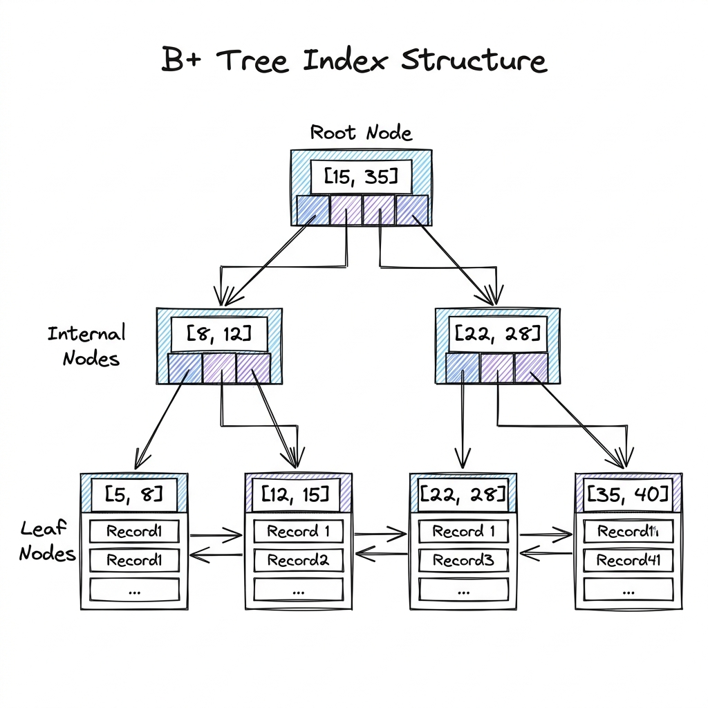

# SQL (Relational Database Systems)

## Overview

Relational Database Management Systems (RDBMS, such as PostgreSQL and MySQL) store data in structured tables with strict schemas and predefined relationships. SQL engines enforce transaction guarantees (ACID) and leverage complex tree-based indexing to enable fast query lookups, making them the industry-standard choice for transactional workloads (OLTP) like banking systems, user accounts, and billing records.

---

## Problem Statement

At scale, relational databases face several limitations:
1. **Scalability Limits**: SQL databases are historically designed to scale vertically (adding more CPU/RAM). Scaling horizontally (sharding across servers) requires sacrificing joins and transactional guarantees across nodes.
2. **Write Performance Bottlenecks**: Enforcing ACID transactions, updating indices, and writing to the Write-Ahead Log (WAL) synchronously slows down write throughput compared to NoSQL architectures.
3. **Strict Schema Constraints**: Changing a table schema (e.g., adding a column to a table with 100M rows) can lock the table, causing write blockage and service outages.
4. **Isolation Conflicts**: Multiple concurrent sessions reading and writing the same records trigger race conditions, requiring complex lock mechanics.

---

## Architecture: B+ Tree Indexing & Transaction Isolation

SQL engines achieve performance and transactional control through specialized internal algorithms:

### 1. B+ Tree Indexing

To find a record without scanning the entire table (an $O(N)$ table scan), SQL databases use **B+ Trees** for indexes:

- **Root & Internal Nodes**: Contain routing keys and child pointers to direct search queries downward.
- **Leaf Nodes**: Contain the actual data pointers (or clustered row values). Leaf nodes are linked sequentially as a **Doubly Linked List**, enabling rapid range query scans ($O(\log N)$ search followed by sequential list traversal).
- **Comparison to B-Trees**: Unlike B-Trees (which store key-value data inside internal nodes), B+ Trees store data *only* in leaf nodes. This allows internal nodes to fit more routing keys per memory page, increasing the branching factor (fan-out) and reducing the tree depth to 3 or 4 layers, even for millions of records.

---

### 2. ACID Transactions & Isolation Levels

SQL engines guarantee **ACID** properties:
- **Atomicity**: Either all SQL statements in a transaction succeed, or the entire transaction is rolled back.
- **Consistency**: Transactions transition the database from one valid state to another, enforcing foreign keys and unique constraints.
- **Isolation**: Concurrent transactions do not interfere with one another.
- **Durability**: Once committed, changes survive system crashes (ensured by writing to the **Write-Ahead Log (WAL)** before updating database pages).

To balance execution speed with data accuracy, databases support four **Isolation Levels** (defined by SQL-92):

| Isolation Level | Dirty Reads | Non-Repeatable Reads | Phantom Reads | Mechanism |
| :--- | :--- | :--- | :--- | :--- |
| **Read Uncommitted** | Yes | Yes | Yes | Lowest locks. |
| **Read Committed** | No | Yes | Yes | Uses short-lived Read locks. (PostgreSQL/MySQL default). |
| **Repeatable Read** | No | No | Yes | Uses snapshot isolation (MVCC). |
| **Serializable** | No | No | No | Two-Phase Locking (2PL) or Serializable Snapshot Isolation. |

- *Dirty Read*: Transaction A reads data modified by Transaction B before Transaction B commits. If Transaction B rolls back, Transaction A's read is invalid.
- *Non-Repeatable Read*: Transaction A reads a row. Transaction B updates the row and commits. Transaction A reads the row again and sees different values.
- *Phantom Read*: Transaction A queries a range of rows. Transaction B inserts a new row in that range and commits. Transaction A queries again and sees the new "phantom" row.

---

## Components

1. **Query Parser & Optimizer**: Evaluates SQL queries, compiles execution plans, and selects indices.
2. **Buffer Pool Manager**: Caches database disk pages in RAM to reduce slow disk I/O.
3. **Transaction Manager**: Controls transaction life cycles and locks.
4. **WAL Writer**: Performs sequential append writes of transaction changes to disk before writing to the database table files.

---

## Design Decisions & Trade-offs

### B+ Tree vs. LSM Tree

- **B+ Tree**: Updates data in-place on disk. 
  * *Pros*: Fast reads ($O(\log N)$), ideal for read-heavy workloads (OLTP).
  * *Cons*: Random write I/O slows down write-heavy workloads; index fragmentation.
- **LSM Tree (Log-Structured Merge-Tree)**: Appends updates sequentially to memory tables (MemTable) first, flushing them to disk as immutable SSTables.
  * *Pros*: Extremely high write throughput, zero random write I/O.
  * *Cons*: Slower read paths (must check multiple files); requires background Compaction threads which consume I/O.

---

## Scaling

- **Replication**:
  - **Asynchronous Replication**: Primary writes, returns success, and asynchronously copies logs to replicas. (Pros: low write latency; Cons: replica lag, potential data loss on failover).
  - **Synchronous Replication**: Primary writes, waits for confirmation from at least one replica, then returns success. (Pros: zero data loss; Cons: write latency equals replica write speed).
- **Connection Pooling**: Database connection setup is expensive. Use a connection pooler (e.g., PgBouncer) to cache and share database connections across application threads.

---

## Failure Handling

- **Primary Failover (Split-Brain)**: If the Primary database drops connection, sentinel nodes must promote a replica. If two nodes claim to be the Primary concurrently (split-brain), network partitions will corrupt data. Enforce **Quorum Consensus** (majority vote) before promoting a replica.
- **Replication Lag Catch-up**: Replicas that fall behind read logs sequentially from the primary server WAL buffer.

---

## Security

- **Row-Level Security (RLS)**: Restricts which rows a user can select based on security context (e.g., `CREATE POLICY user_policy ON transactions USING (user_id = current_setting('app.current_user_id'))`).
- **SQL Injection Prevention**: Never construct SQL queries by string concatenation: `SELECT * FROM users WHERE name = '` + input + `'`. Always use **Parameterized Queries (Prepared Statements)** where inputs are treated strictly as parameters, not executable code.

---

## Cost Optimization

- **Index Pruning**: Run index utilization audits. Unused indexes consume disk space and slow down write operations because the database must update the B+ Tree on every write.
- **WAL Auto-vacuuming**: Regularly clean dead tuples (rows deleted or updated in PostgreSQL MVCC) using background VACUUM tasks to reclaim disk storage.

---

## Interview Questions

### Q1: What is the difference between B-Trees and B+ Trees? Why do relational databases prefer B+ Trees?
**Answer**:
1. **Data Placement**: 
   - **B-Trees** store keys and their associated values/data pointers in all nodes (root, internal, and leaf).
   - **B+ Trees** store keys and child pointers in internal nodes, but store *all* actual data values/records strictly in the leaf nodes.
2. **Branching Factor (Fan-out)**: Because B+ Tree internal nodes do not store actual data rows, they are much smaller. More keys fit onto a single disk page, increasing the fan-out. A high fan-out reduces the height of the tree (typically only 3-4 levels), keeping query read IO steps low.
3. **Range Queries**: B+ Tree leaf nodes are linked together sequentially as a doubly linked list. In a B-Tree, range queries require traversing up and down nodes (in-order tree traversal). In a B+ Tree, the query finds the start key and then traverses the linked leaf nodes sequentially ($O(1)$ node transitions), which is extremely fast.

### Q2: Explain Multi-Version Concurrency Control (MVCC).
**Answer**:
MVCC is an optimization to ensure that **readers do not block writers, and writers do not block readers**:
1. Instead of using locks to block access to a row during updates, the database keeps multiple versions of the same row on disk.
2. Every row contains hidden metadata fields: `xmin` (the transaction ID that inserted the row) and `xmax` (the transaction ID that deleted/superseded it).
3. When Transaction A updates a row, the database does not overwrite it; it marks `xmax` on the old row and inserts a new row version with `xmin`.
4. When Transaction B reads the row, the database checks Transaction B's snapshot timestamp and returns the row version that was committed prior to Transaction B's start time, ignoring uncommitted updates.

---

## References

1. **B+ Tree Index Analysis**: Comer, D. (1979). *The Ubiquitous B-Tree*. ACM Computing Surveys.
2. **MVCC in Postgres**: *PostgreSQL Internals: Concurrency Control*. (PostgreSQL Documentation).
3. **SQL Isolation Levels**: Berenson, H., et al. (1995). *A Critique of ANSI SQL Isolation Levels*. SIGMOD 1995.
