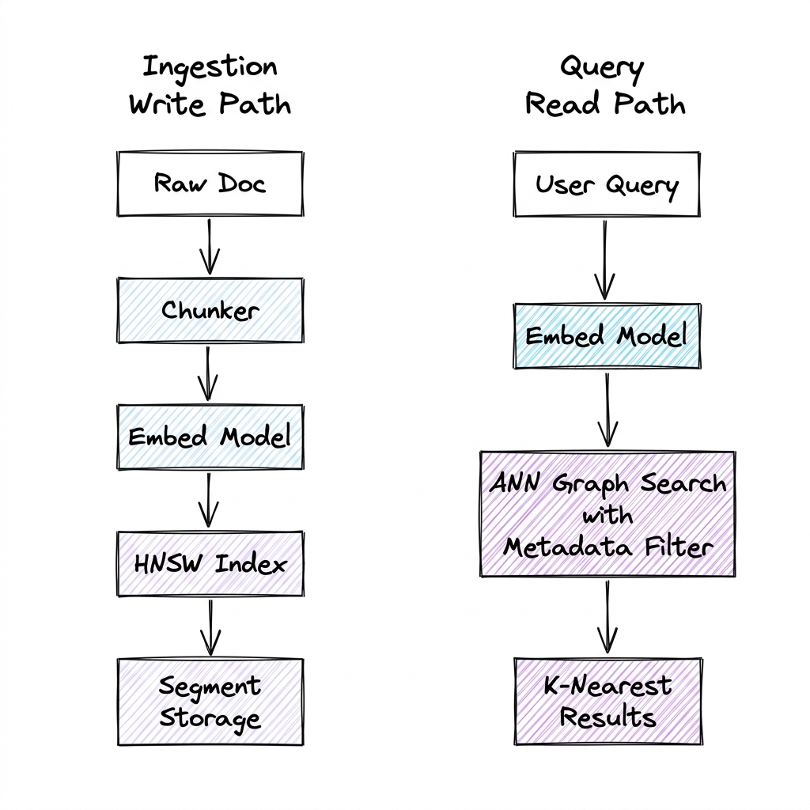

# FAISS (Facebook AI Similarity Search)

## Overview

**FAISS (Facebook AI Similarity Search)** is an open-source, highly optimized library written in C++ (with Python wrappers) developed by Meta. It is designed for efficient similarity search and clustering of dense vectors. Unlike fully-featured databases, FAISS is a low-level library that operates entirely in memory or on GPUs, providing the mathematical and algorithmic building blocks for modern vector search systems.

---

## Problem Statement

When querying millions or billions of high-dimensional vectors (e.g., 768 or 1536 dimensions):
1. **Curse of Dimensionality**: Exact nearest neighbor search (Flat L2) requires scanning every vector in the dataset ($O(D \cdot N)$), which is computationally prohibitive for real-time requests.
2. **Extreme RAM Overhead**: Keeping raw vectors in memory requires massive RAM. For instance, 100 million 1536-dimensional vectors in 32-bit float format consume $100,000,000 \times 1536 \times 4 \text{ bytes} \approx 614 \text{ GB}$ of RAM.
3. **Hardware Underutilization**: Naive search implementations fail to exploit SIMD registers, multi-threading, and GPU parallel processing.

---

## Internal Indexing Mechanics & Algorithms

FAISS solves these problems by providing various **Approximate Nearest Neighbors (ANN)** indexing strategies:

### 1. Inverted File Index (IndexIVF)
IndexIVF is a clustering-based acceleration technique that partitions the vector space:
- **Training Phase**: FAISS runs $K$-means clustering on a representative sample of vectors to determine $K$ centroids (Voronoi cells).
- **Indexing Phase**: Every vector in the dataset is assigned to its nearest centroid. An inverted list (posting list) maps each centroid ID to the IDs and raw coordinates of its assigned vectors.
- **Search Phase**: The query vector is compared against all $K$ centroids to find the closest $N_{\text{probe}}$ centroids. FAISS then performs an exact search *only* within the posting lists of those $N_{\text{probe}}$ cells.
  * **Trade-off**: Higher $N_{\text{probe}}$ increases search accuracy (recall) but increases query latency.

---

### 2. Product Quantization (IndexPQ)
Product Quantization (PQ) is a lossy compression technique that dramatically reduces memory footprint:
- **Sub-space Split**: Each high-dimensional vector of dimension $D$ is split into $M$ smaller sub-vectors of dimension $d = D/M$.
- **Centroid Quantification**: For each sub-space, $K$-means clustering is performed (typically with $k^* = 256$ centroids). Each sub-centroid can be represented by an 8-bit integer (since $2^8 = 256$).
- **Encoding**: Each sub-vector is replaced by the 8-bit index of its nearest sub-centroid. The original $D$-dimensional vector is now represented by an array of $M$ bytes (e.g., a 1024-dimension float vector is compressed to 64 bytes, a $64\times$ reduction).
- **Asymmetric Distance Computation (ADC)**: During search, the query vector is *not* compressed. The query's sub-vectors are compared to the codebook's sub-centroids to create a lookup table of distances. The distance to any database vector is approximated by summing the lookup table values for its byte-codes. This avoids decompressing the database vectors.

---

### 3. Hierarchical Navigable Small World (IndexHNSW)
HNSW constructs a multi-layer graph index for ultra-fast spatial traversal:
- **Multi-layer Structure**: Similar to a skip-list, the top layers contain sparse graphs with long-range edges for coarse-grained routing. The bottom layer (Layer 0) contains all vectors with short-range edges for fine-grained routing.
- **Search Paths**: A search starts at an entry point in the top layer. The algorithm greedily traverses nodes closer to the query vector. Once it reaches a local minimum, it drops down to the next layer and repeats the search, using the previous minimum as the new entry point.
- **Parameter Control**: 
  * $M$: Maximum number of bi-directional links per node.
  * $efConstruction$: Search depth during index creation (higher means better graph quality but slower build).
  * $efSearch$: Search depth during query execution (higher means better recall but slower search).

---

## FAISS Components

1. **Vector Index**: The container mapping vector IDs to their physical coordinates/compressed forms.
2. **Quantizer (Clustering Engine)**: The algorithm responsible for training centroids and translating vectors to quantized states.
3. **Centroid Codebook**: The lookup matrix containing sub-centroids used during Product Quantization distance calculation.
4. **GPU Runner**: Highly optimized CUDA kernels that offload distance calculations to thousands of GPU cores.

---

## Design Decisions & Trade-offs

| Index Type | Search Speed | Memory Usage | Recall Accuracy | Build Time |
| :--- | :--- | :--- | :--- | :--- |
| **IndexFlatL2** | $O(N)$ (Slow) | High (Raw) | $100\%$ (Exact) | None |
| **IndexIVFFlat** | Medium-Fast | High (Raw) | Medium-High | Medium |
| **IndexIVFPQ** | Fast | Very Low (Compressed) | Medium | Slow (requires training) |
| **IndexHNSW** | Extremely Fast | Very High (Raw + Graph edges) | Extremely High | Very Slow |

---

## Hardware Acceleration & Batching

FAISS leverages GPU compute to execute mass vector distance scans:
- **SIMD Instructions**: On CPU, FAISS utilizes AVX2/AVX-512 instructions to compute multiple vector distance calculations per CPU cycle.
- **GPU In-Memory Copy**: For massive search workloads, indices are placed in GPU VRAM (using `faiss::gpu::StandardGpuResources`).
- **Warp-level Reductions**: Uses CUDA warp shuffle instructions to perform fast partial sorting of nearest distances, bypassing slower global GPU memory access.

---

## Interview Questions

### Q1: How does Product Quantization calculate distances without decompressing the database vectors?
**Answer**:
FAISS uses **Asymmetric Distance Computation (ADC)**. 
1. Given a query vector $q$ and a database vector $x$ compressed into codes $[c_1, c_2, \dots, c_M]$:
2. The query $q$ is split into $M$ sub-vectors: $[q_1, q_2, \dots, q_M]$.
3. Before scanning the database, FAISS computes a **distance lookup table** of size $M \times 256$. For each sub-space $m \in [1, M]$, it calculates the distance from the query sub-vector $q_m$ to all $256$ centroid options in the codebook.
4. To compute the distance from $q$ to the database vector $x$, FAISS simply reads the codes $[c_1, c_2, \dots, c_M]$ of $x$, looks up the pre-computed distances in the table, and sums them:
   $$\text{Dist}(q, x) \approx \sum_{m=1}^{M} \text{LookupTable}[m][c_m]$$
5. This requires only $M$ memory lookups and additions per vector, avoiding floating-point math and decompression overhead during the scan.

### Q2: Why does HNSW consume significantly more memory than a Flat index?
**Answer**:
1. **Graph Adjacency Lists**: Every node (vector) in an HNSW graph maintains a list of bidirectionally connected neighbor IDs at each layer.
2. If $M = 64$ (max connections per node), each node has up to 64 edges. Storing a 32-bit integer (4 bytes) or 64-bit integer (8 bytes) per edge means each node incurs an extra $64 \times 8 \text{ bytes} = 512 \text{ bytes}$ of memory overhead just for graph connections.
3. For a 128-dimensional vector (512 bytes of raw float data), the HNSW graph edges can double the memory requirements. For lower-dimensional vectors, the graph metadata can easily exceed the size of the vectors themselves.

---

## References

1. **FAISS Core Paper**: Johnson, J., Douze, M., & Jégou, H. (2019). *Billion-scale similarity search with GPUs*. IEEE Transactions on Big Data.
2. **Product Quantization**: Jégou, H., Douze, M., & Schmid, C. (2010). *Product Quantization for Nearest Neighbor Search*. IEEE Transactions on Pattern Analysis and Machine Intelligence.
3. **HNSW Paper**: Malkov, Y. A., & Yashunin, D. A. (2018). *Efficient and robust approximate nearest neighbor search using Hierarchical Navigable Small World graphs*. IEEE Transactions on Pattern Analysis and Machine Intelligence.
