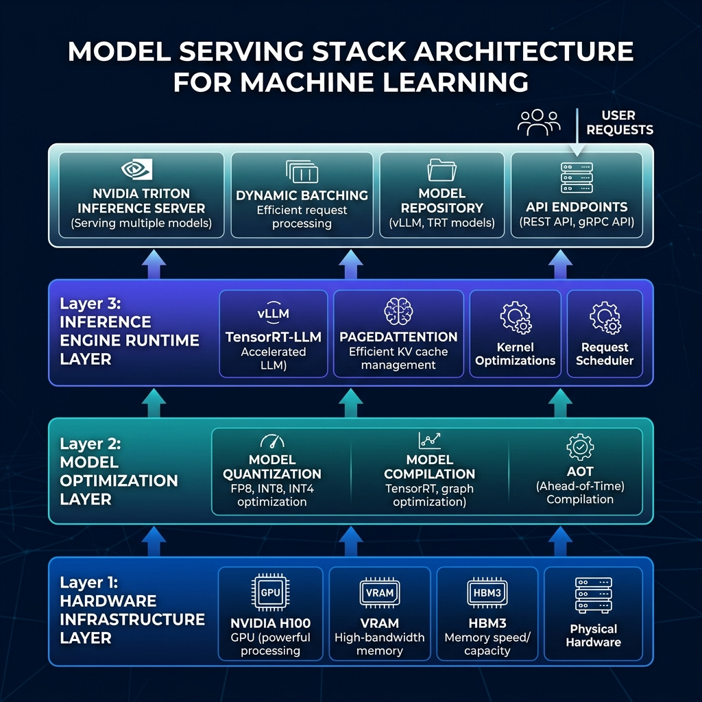

# Model Serving & Inference Optimization

Welcome to the **Model Serving & Inference Optimization** module. This section provides an in-depth, production-focused engineering guide for optimizing, scaling, and deploying Large Language Models (LLMs) and deep learning models to production clusters.

These guides detail hardware-level bottlenecks, quantization math, compilation frameworks, serving engines, and typical system design interview questions.

---

## 🗺️ Module Learning Roadmap

Modern model serving starts at the bare GPU memory level and extends to optimized compiled runtimes, dynamic execution engines, and multi-framework API brokers:

---

## 📂 Topic Breakdown

Click on any topic below to access the deep-dive architectural guide:

| Topic | Primary Focus | Core Engineering Challenges |
| :--- | :--- | :--- |
| 🔌 **[GPU Inference](GPU_Inference.md)** | Hardware Execution & Memory | HBM VRAM bandwidth, Compute vs. Memory Bound operations, KV-cache sizing math, Parallelism. |
| 🗜️ **[Quantization](Quantization.md)** | Precision Reduction & Compression | Uniform quantization math, PTQ vs. QAT, numerical formats (FP8, INT8, INT4, AWQ, GPTQ). |
| ⚡ **[TensorRT](TensorRT.md)** | Graph Compilation | Layer fusion, kernel auto-tuning, precision calibration, TensorRT-LLM extensions. |
| ⛵ **[vLLM](vLLM.md)** | Dynamic Execution Engine | PagedAttention memory allocation, continuous batching (dynamic scheduling), speculative decoding. |
| 🧜‍♂️ **[Triton](Triton.md)** | Enterprise Serving Platform | Multi-framework support, dynamic batching, concurrent model execution, BLS ensembles. |

---

## 📐 Core Serving Principles

Every model serving infrastructure must solve:

1. **TTFT vs. ITL Latency Budget**: Optimize infrastructure for both Time-To-First-Token (TTFT - prefill phase, compute-bound) and Inter-Token Latency (ITL - decode phase, memory-bound).
2. **KV-Cache Memory Fragmentation**: Maximize GPU utilization by replacing traditional pre-allocated static token buffers with dynamic memory pages (PagedAttention).
3. **Compute and Memory Bound Bottlenecks**: Distinguish when execution is waiting on floating-point arithmetic (compute-bound) vs. waiting on memory retrieval from High Bandwidth Memory (HBM) to SRAM (memory-bound).
4. **Dynamic Batching**: Group asynchronous incoming requests into dynamic execution batches at the engine or API layer to maximize tensor core utilization.
