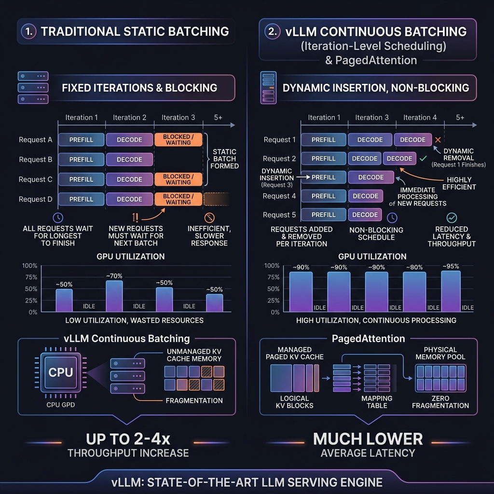

# vLLM: High-Throughput Inference Engine

## Overview

**vLLM** is an open-source, high-throughput, low-latency LLM serving engine. Its core innovation is **PagedAttention**, an algorithm that addresses the memory bottlenecks of LLM serving by applying operating-system-style virtual memory management to the KV cache, reducing VRAM fragmentation to near $0\%$ and enabling significantly larger batch sizes.

---

## Problem Statement

Traditional LLM serving engines suffer from severe memory underutilization:
1. **Contiguous KV Cache Allocation**: Standard engines pre-allocate a contiguous block of VRAM for the maximum possible sequence length (e.g., 2048 tokens) when a request starts.
2. **Three Types of Memory Waste**:
   - **Internal Fragmentation (Reserved)**: Memory allocated for tokens that are never generated because the request terminates early (e.g., generating only 100 out of 2048 tokens).
   - **External Fragmentation**: Free memory segments scattered across VRAM that are too small to host a full contiguous request cache.
   - **Virtual Fragmentation (Over-allocation)**: Allocating memory for future tokens that haven't been generated yet.
3. **Static Batching Headaches**: Grouping requests in standard batches forces the engine to wait for the slowest request (longest output sequence) to finish before releasing GPU memory, stalling throughput.

---

## Architecture: PagedAttention & Continuous Batching

vLLM resolves these memory and scheduling bottlenecks using two key techniques:

### 1. PagedAttention
PagedAttention partitions the KV cache of each sequence into fixed-size physical memory blocks (pages). Each block contains key and value vectors for a fixed number of tokens (typically 16 tokens).

- **Logical vs. Physical Pages**:
  - The engine maintains a **Page Table** that maps a sequence's logical token blocks to non-contiguous physical blocks in VRAM.
  - As new tokens are generated, the engine assigns physical blocks on-demand, similar to how an operating system translates virtual memory to physical RAM.
  - This design allows physical pages to be scattered anywhere in memory, eliminating external fragmentation. It reduces internal memory waste to only the unused tokens in the very last page of a sequence ($<4\%$ overhead), freeing up VRAM to scale serving concurrency ($2\times$ to $4\times$ throughput gains).

- **Distributed KV Cache Sharing**:
  - For parallel decoding schemes (e.g., Beam Search or multi-agent outputs), multiple sequences can share physical pages containing the shared prompt tokens.
  - When one branch diverges, the engine performs a **Copy-on-Write** operation: it duplicates only the diverged page and maps it to the new branch, saving massive amounts of VRAM.

---

### 2. Continuous Batching (Iteration-level Scheduling)
Traditional static batching processes requests at the sequence level. If Request A needs 100 tokens and Request B needs 1000 tokens, the batch is locked for 1000 iterations, leaving Request A's slot idle after its completion.

- **vLLM Iteration-Level Scheduler**:
  - Operates at the token-generation iteration level, not the request level.
  - At each forward pass (iteration), the engine checks VRAM page availability. If there are free pages, it injects new incoming requests into the batch during the decoding step.
  - As soon as a request generates an end-of-sequence (`<EOS>`) token, the engine evicts its pages immediately and reclaims the VRAM for other queries, eliminating GPU idle time.

---

## Speculative Decoding

To further reduce latency, vLLM supports **Speculative Decoding**:
1. **Draft Generation**: A small, fast draft model (e.g., Llama-3-Draft-8B) sequentially generates a block of $K$ candidate tokens (e.g., $K=5$).
2. **Verification step**: The target large model (e.g., Llama-3-70B) processes all $K$ candidate tokens in parallel during a single forward prefill pass (which is compute-bound, meaning the math is performed at almost zero marginal time cost compared to a single token generation).
3. **Accept/Reject**: The target model evaluates the probabilities of the draft tokens. Accepted tokens are appended to the context; rejected tokens are discarded, and the target model generates the correct replacement token.
4. **Benefit**: If the acceptance rate is high, this method can deliver a $2\times$ latency reduction for single-user queries, bypassing the memory bandwidth bottleneck of the large model.

---

## Design Decisions & Trade-offs

### PagedAttention vs. Contiguous Cache

- **PagedAttention (vLLM)**:
  * *Pros*: Zero external fragmentation, copy-on-write sharing, significantly higher batch sizes ($2$-$4\times$ throughput).
  * *Cons*: Page Table lookup introduces minor CPU overhead (latency) to map physical addresses before every forward pass.
- **Contiguous Cache**:
  * *Pros*: Zero indexing overhead, direct memory pointers.
  * *Cons*: High fragmentation, limits batch sizes, causing VRAM-out-of-memory crashes under load.

---

## Interview Questions

### Q1: Explain how PagedAttention solves KV Cache fragmentation. Walk through the role of the Page Table.
**Answer**:
1. **OS Analogy**: PagedAttention behaves like virtual memory paging in operating systems.
2. **Logical Blocks**: The key-value states of a sequence are divided into logical blocks, where each block represents a fixed number of tokens (e.g., 16 tokens).
3. **Physical Memory Pool**: Rather than allocating a contiguous chunk of memory for the maximum sequence length, the GPU VRAM is pre-allocated as a pool of non-contiguous physical blocks.
4. **Page Table**: The engine maintains a Page Table mapping logical block indices of a request to physical blocks.
5. **Dynamic Allocation**: When a request starts, only the first block is allocated. As tokens generate and exceed block boundaries, the engine grabs another physical block from the free list and updates the Page Table.
6. **Benefit**: Physical blocks do not need to be contiguous. This eliminates external fragmentation, and because memory is allocated on-demand, it removes virtual fragmentation, reducing memory overhead to the last block of each request ($<4\%$ waste).

### Q2: What is continuous batching and how does it differ from static batching?
**Answer**:
1. **Static Batching**: Requests are grouped and executed together. The batch size is fixed, and the execution runs until the longest sequence in the batch completes. Finished requests sit idle in memory, wasting GPU cycles.
2. **Continuous Batching (Iteration-level Scheduling)**: The execution boundary is shifted from sequence level to iteration (individual token) level.
3. At the end of each forward pass, the engine evaluates if finished requests can be removed and if new requests can be added from the queue.
4. This ensures that the GPU is always executing math on a full batch of active tokens, reducing queue waiting times and increasing resource utilization.

---

## References

1. **vLLM & PagedAttention Paper**: Kwon, W., et al. (2023). *Efficient Memory Management for Large Language Model Serving with PagedAttention*. SOSP 2023.
2. **Continuous Batching**: Yu, G. Y., et al. (2022). *Orca: A Distributed Serving System for Transformer-Based Generative Models*. OSDI 2022.
