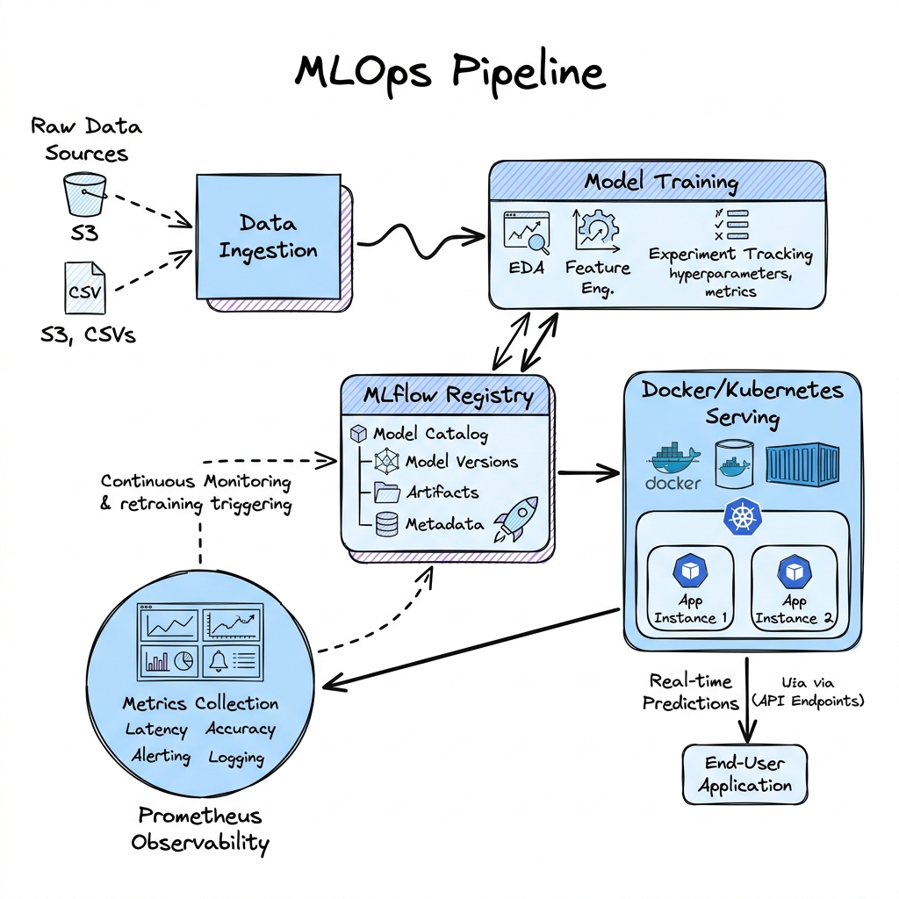

# MLOps: Machine Learning Operations

Welcome to the **MLOps: Machine Learning Operations** module. This section provides an in-depth, production-focused engineering guide for building reproducible, automated, and observable machine learning lifecycles at scale.

These guides detail CI/CD pipelines for ML (Continuous Training), environment containerization, orchestration systems, hyperparameter tuning, model registries, and model observability/drift detection.

---

## 🗺️ Module Learning Roadmap

The MLOps lifecycle integrates data prep, model training orchestration, registry versioning, secure hosting, and observability feedback loops:

---

## 📂 Topic Breakdown

Click on any topic below to access the deep-dive architectural guide:

| Topic | Primary Focus | Core Engineering Challenges |
| :--- | :--- | :--- |
| 📦 **[Docker](Docker.md)** | Reproducible Environments | CUDA container layer optimization, multi-stage builds, GPU drivers matching. |
| 🚀 **[Kubernetes](Kubernetes.md)** | Infrastructure Orchestration | Pod configurations, GPU scheduling, autoscaling (KEDA), node pools, rolling updates. |
| 🔀 **[Kubeflow](Kubeflow.md)** | Pipeline Orchestration | DAG pipeline compilers, distributed training engines, Katib hyperparameter tuning. |
| 🗄️ **[MLflow](MLflow.md)** | Model Tracking & Registry | Run parameter tracking, artifact storage lineage, model stage progression (dev -> prod). |
| 🔄 **[CI/CD](CI_CD.md)** | Continuous Training (CT) | Automated model regression tests, data sanity checks, shadow vs. canary deployments. |
| 📊 **[Monitoring](Monitoring.md)** | Model Drift & Observability | Data drift (KS-test math), Concept drift, system metrics, Prometheus logging, feedback loops. |

---

## 📐 Core MLOps Principles

Every production MLOps architecture must guarantee:

1. **Reproducibility**: Standardize model execution environments using locked Docker images and pinned code/data versions (Git & DVC) so that any training run can be reproduced exactly.
2. **Automated Lineage & Auditability**: Track every model back to the exact code commit, training hyperparameter set, and input data snapshot used to generate it (using registries like MLflow).
3. **Continuous Training (CT)**: Transition from manual model retraining to automated triggers based on time intervals, data schema changes, or performance degradation flags.
4. **Proactive Observability**: Go beyond system health metrics (CPU, RAM) to monitor model-specific health indicators, detecting mathematical shifts in input distributions (data drift) and output predictions (concept drift) before they impact end users.
