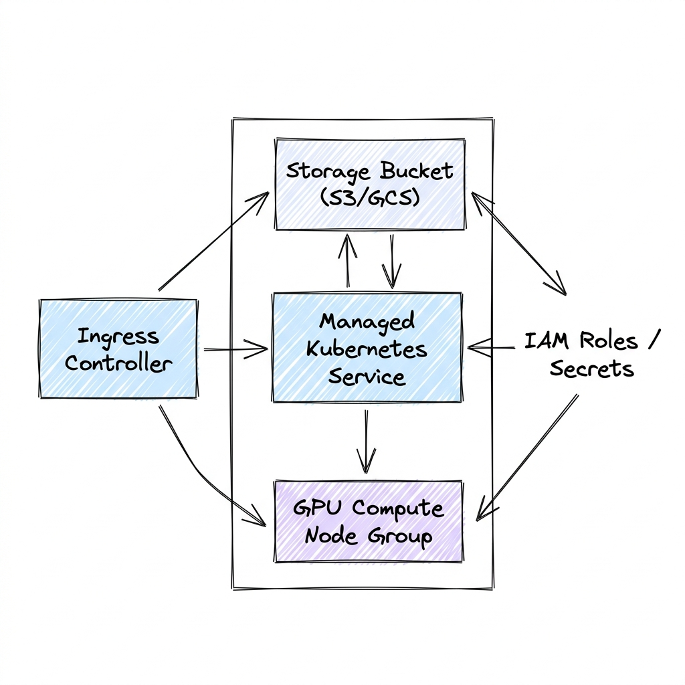

# Cloud Infrastructure for AI Systems

Welcome to the **Cloud Infrastructure for AI Systems** module. This section provides an in-depth, production-focused engineering guide for designing, scaling, and managing cloud infrastructure to support machine learning pipelines, GPU-accelerated computing workloads, and high-performance multi-cloud platforms.

These guides detail virtual networking design (VPCs), IAM policies, Infrastructure as Code (IaC) via Terraform, and deep-dives into the AI/ML services provided by the three major cloud providers (AWS, GCP, and Azure).

---

## 🗺️ Module Learning Roadmap

Modern AI cloud infrastructure scales from core network isolation to managed compute, training resources, and automated deployment architectures:

---

## 📂 Topic Breakdown

Click on any topic below to access the deep-dive architectural guide:

| Topic | Primary Focus | Core Engineering Challenges |
| :--- | :--- | :--- |
| 🌐 **[Infrastructure](Infrastructure.md)** | Core Networking & Compute | VPC topology, transit gateways, private links to SaaS databases, GPU Availability Zones. |
| 🍊 **[AWS](AWS.md)** | Amazon Web Services Stack | SageMaker jobs, EC2 GPU instance profiles (p4/p5), EKS node groups, S3 storage tiers. |
| 🍇 **[GCP](GCP.md)** | Google Cloud Platform Stack | Vertex AI, GKE TPU/GPU nodes, Cloud Storage bucket access, TPU pod fabrics. |
| 🔷 **[Azure](Azure.md)** | Microsoft Azure Stack | Azure ML workspaces, ND-series VMs, AKS GPU configs, Blob storage lifecycle rules. |
| 🛠️ **[Terraform](Terraform.md)** | Infrastructure as Code (IaC) | Declarative GPU node groups, private subnet routes, security group rules, IAM policies. |

---

## 📐 Core Cloud AI Infrastructure Principles

Every enterprise cloud ML design must address:

1. **Compute Sizing & Provisioning latency**: Balance high availability of GPU nodes (using reservations or savings plans) with cost savings (using spot/preemptible instances for fault-tolerant training runs).
2. **Network Data Transfer Costs**: Data egress costs from cloud object storage (e.g., S3) to compute nodes are expensive. Place storage buckets and GPU compute clusters in the same availability zones to eliminate cross-AZ transfer charges.
3. **IAM Least-Privilege Security**: GPU containers must access object storage, databases, and registries. Enforce IAM roles for service accounts (IRSA on AWS, Workload Identity on GCP/Azure) to isolate credential scope.
4. **Data Durability & Lifecycle Rules**: Model checkpoints can consume petabytes of disk space. Implement bucket lifecycle rules to automatically migrate old checkpoints to cheaper cold storage (e.g., Glacier Deep Archive).
