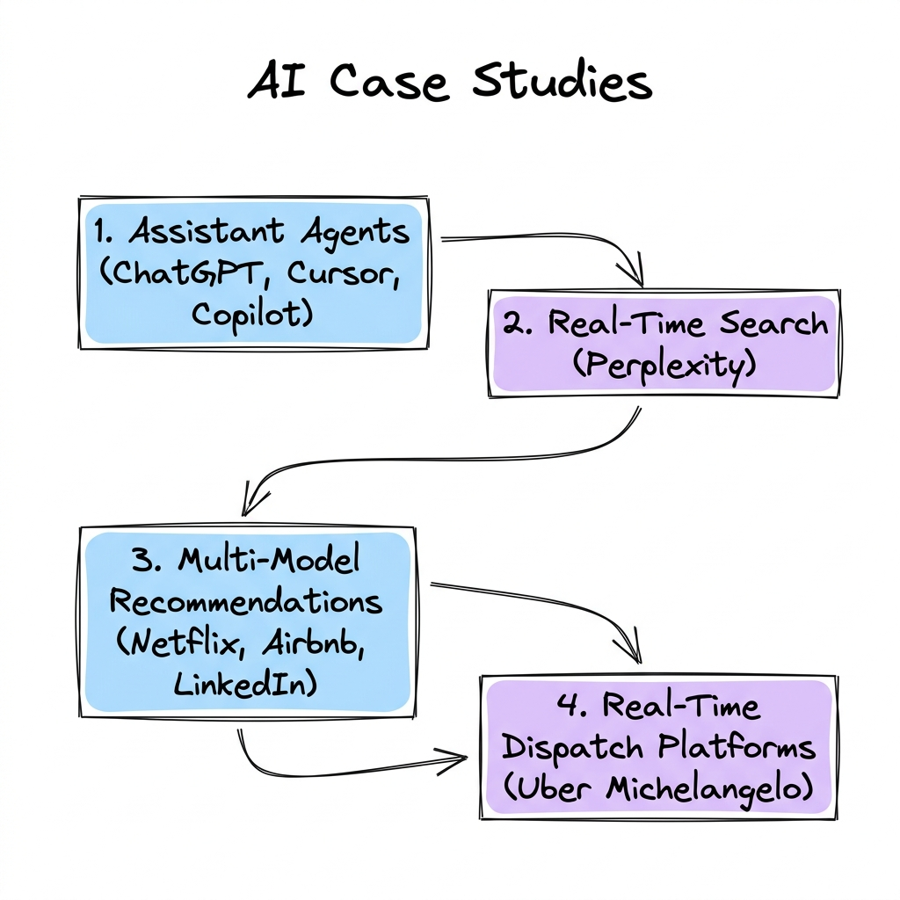

# Production AI Case Studies

Welcome to the **Production AI Case Studies** module. This section provides an in-depth, architectural analysis of how industry-leading technology companies design, scale, and optimize machine learning platforms and LLM-powered applications in production.

Each case study explores the real-world problem statement, high-level system architecture, core engineering decisions, scaling bottlenecks, and failure handling mechanisms.

---

## 🗺️ Case Studies Roadmap

Modern production AI architectures fall into four key patterns: dynamic assistant interfaces, real-time citation-backed search, large-scale recommendations, and real-time dispatch systems:

---

## 📂 Topic Breakdown

Click on any topic below to access the deep-dive architectural case study:

| Topic | Focus Area | Core Architectural Blueprint |
| :--- | :--- | :--- |
| 💬 **[ChatGPT](ChatGPT.md)** | Conversational Agentic AI | Pre-training/RLHF pipelines, KV caching, speculative decoding, SSE session streaming. |
| 🔍 **[Perplexity](Perplexity.md)** | Real-Time Answer Engine | Parallel search, asynchronous scraping, RRF blending, LLM summarization with citations. |
| 💻 **[Cursor](Cursor.md)** | AI-First Code IDE | Local AST codebase indexing, codebase semantic search, agentic editing tools. |
| ✈️ **[GitHub Copilot](GitHub_Copilot.md)** | Autocomplete IDE Agent | IDE tab context aggregation, Fill-in-the-Middle (FIM) prompt formatting, low-latency API serving. |
| 🚗 **[Uber](Uber.md)** | Dynamic Dispatch Platform | Michelangelo ML platform, Spark/Cassandra feature store pipelines, dynamic ETAs. |
| 🍿 **[Netflix](Netflix.md)** | Homepage Personalization | Collaborative filtering, DLRM models, artwork selection, Kafka/Flink real-time features. |
| 🏡 **[Airbnb](Airbnb.md)** | Search & Pricing Engines | Search listing embeddings (Word2Vec click session models), dynamic booking pricing. |
| 👥 **[LinkedIn](LinkedIn.md)** | Professional Social Graph | Graph Neural Networks (GNNs) for connections, feed ranking, dwell-time objective functions. |

---

## 📐 Core Engineering Themes across Case Studies

Reviewing enterprise case studies highlights recurring architectural design constraints:

1. **System Latency vs. Prediction Quality**: Autocomplete systems (GitHub Copilot) target $< 100\text{ ms}$ budgets, forcing the use of smaller models and localized context windows, whereas offline recommendation engines (Netflix) leverage massive deep learning models to optimize long-term metrics.
2. **Online/Offline Feature Consistency**: Real-time dispatch engines (Uber) must guarantee that features calculated offline in batch training pools (e.g., historical route speeds) match features calculated in real-time online pipelines.
3. **Decoupled Data and Serving Paths**: All leading architectures isolate resource-heavy data pipelines (training, feature compilation, vector graph generation) from stateless serving nodes to protect system availability.
4. **Context Engineering**: Success in LLM systems (Cursor) is determined by context construction—retrieving and packing the most relevant $1\%$ of codebase tokens into the context window rather than increasing raw model parameters.
