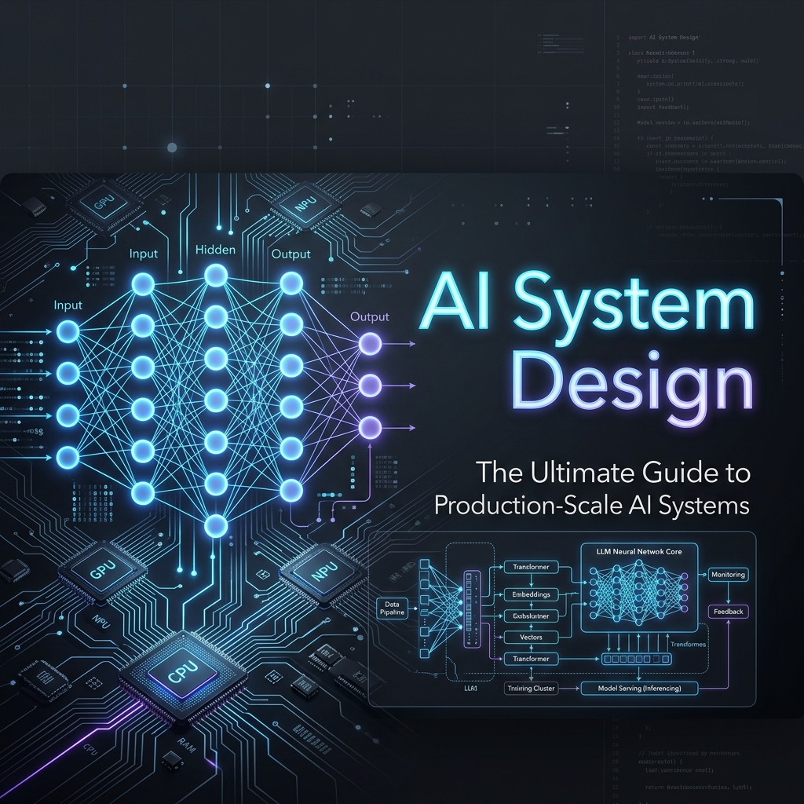
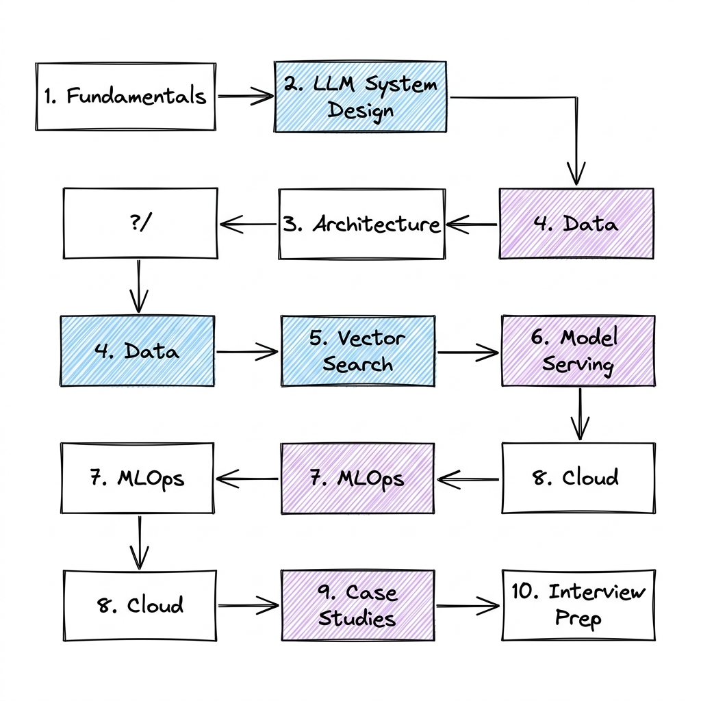

<div align="center">

# AI System Design



### *The Ultimate Guide to Learning, Designing, and Building Production-Scale AI Systems*

[](LICENSE)
[](CONTRIBUTING.md)
[](CONTRIBUTING.md)
[](https://awesome.re)

---

**AI System Design** is a comprehensive, production-grade guide and repository curated for developers, machine learning engineers, and architects looking to design, deploy, and scale AI-native applications. From model fundamentals to complex distributed agent architectures and production-level MLOps, this space has everything you need.

</div>

## 🛠️ Core Technology Stack & Libraries

To build state-of-the-art AI systems, you need a robust ecosystem. This repository covers design patterns and implementations featuring:

| Category | Technologies & Libraries |
| :--- | :--- |
| **LLMs & Foundations** |     |
| **Vector Databases** |    |
| **Model Serving & Inference** |    |
| **MLOps & Infrastructure** |     |
| **Cloud & Deployment** |    |

---

## 🗺️ Learning Roadmap



---

## 📂 Repository Structure

Explore each module to deep-dive into source code, design mockups, and step-by-step walkthroughs:

```directory
AI-System-Design/
├── 01-Fundamentals/              # Core ML, Transformers, Embeddings, Tokenization
├── 02-LLM-System-Design/         # ChatGPT Architecture, RAG Systems, Agents, Context Management
├── 03-Architecture/              # Microservices, API Gateways, Event-Driven Patterns, Caching
├── 04-Data/                      # SQL vs NoSQL, Streaming, Data Lakes, ETL Pipelines
├── 05-Vector-Search/             # FAISS, Pinecone, Weaviate, Milvus, Chroma
├── 06-Model-Serving/             # vLLM, Triton Server, TensorRT, Quantization, GPU optimization
├── 07-MLOps/                     # Kubeflow, MLflow, CI/CD for ML, Kubernetes orchestration
├── 08-Cloud/                     # Infrastructure as Code (Terraform), AWS, GCP, Azure setup
├── 09-Case-Studies/              # Real-world architectures (Netflix, Uber, GitHub Copilot)
└── 10-Interview-Questions/       # FAANG interview guides from Beginner to Principal level
```

---

## 📘 Modules Breakdown

### 🧠 [01. Fundamentals](./AI-System-Design/01-Fundamentals/README.md)
*Core neural network paradigms and architectural foundations.*
* [AI vs ML vs DL](./AI-System-Design/01-Fundamentals/AI_vs_ML_vs_DL.md) — Artificial Intelligence, Machine Learning, and Deep Learning differences.
* [LLM Basics](./AI-System-Design/01-Fundamentals/LLM_Basics.md) — Under the hood of Large Language Models.
* [Transformers](./AI-System-Design/01-Fundamentals/Transformers.md) — Attention mechanism, encoders, decoders, and architecture.
* [Embeddings](./AI-System-Design/01-Fundamentals/Embeddings.md) — How dense representations capture semantic meaning.
* [Vector Databases](./AI-System-Design/01-Fundamentals/Vector_Databases.md) — High-dimensional indexing and search.
* [Tokenization](./AI-System-Design/01-Fundamentals/Tokenization.md) — Byte-Pair Encoding (BPE), WordPiece, and text preparation.

### 🤖 [02. LLM System Design](./AI-System-Design/02-LLM-System-Design/README.md)
*Designing interactive, context-aware AI systems.*
* [ChatGPT Architecture](./AI-System-Design/02-LLM-System-Design/ChatGPT_Architecture.md) — RLHF, instruction tuning, and scaling.
* [RAG System](./AI-System-Design/02-LLM-System-Design/RAG_System.md) — Retrieval-Augmented Generation workflows.
* [AI Search](./AI-System-Design/02-LLM-System-Design/AI_Search.md) — Combining semantic search with keyword retrieval.
* [AI Agent](./AI-System-Design/02-LLM-System-Design/AI_Agent.md) — ReAct, tool use, and loop control structures.
* [Multi-Agent](./AI-System-Design/02-LLM-System-Design/Multi_Agent.md) — Orchestration, routing, and consensus protocols.
* [Prompt Engineering](./AI-System-Design/02-LLM-System-Design/Prompt_Engineering.md) — Few-shot, chain-of-thought, skeleton prompts.
* [Context Management](./AI-System-Design/02-LLM-System-Design/Context_Management.md) — Sliding windows, attention compression, long contexts.
* [Memory System](./AI-System-Design/02-LLM-System-Design/Memory_System.md) — Short-term vs long-term memory for chatbots.

### 🏗️ [03. Architecture](./AI-System-Design/03-Architecture/README.md)
*System design fundamentals for high-availability systems.*
* [High-Level Architecture](./AI-System-Design/03-Architecture/High_Level_Architecture.md) — Global scale request routing.
* [Microservices](./AI-System-Design/03-Architecture/Microservices.md) — Monolith decomposition and service separation.
* [Event-Driven](./AI-System-Design/03-Architecture/Event_Driven.md) — Event sourcing, pub-sub architectures.
* [Message Queues](./AI-System-Design/03-Architecture/Message_Queues.md) — RabbitMQ, Kafka, and background processing.
* [API Gateway](./AI-System-Design/03-Architecture/API_Gateway.md) — Routing, rate limiting, and SSL termination.
* [Authentication](./AI-System-Design/03-Architecture/Authentication.md) — OAuth2, JWT, and session management.
* [Rate Limiting](./AI-System-Design/03-Architecture/Rate_Limiting.md) — Token bucket, leaking bucket, and sliding window logs.
* [Caching](./AI-System-Design/03-Architecture/Caching.md) — Redis, Memcached, eviction policies (LRU/LFU).

### 📊 [04. Data](./AI-System-Design/04-Data/README.md)
*Handling multi-modal, large-scale, streaming datasets.*
* [SQL](./AI-System-Design/04-Data/SQL.md) & [NoSQL](./AI-System-Design/04-Data/NoSQL.md) — Relational databases vs document, wide-column, key-value stores.
* [Data Pipelines](./AI-System-Design/04-Data/Data_Pipelines.md) & [ETL](./AI-System-Design/04-Data/ETL.md) — Batch and real-time data ingestion.
* [Streaming](./AI-System-Design/04-Data/Streaming.md) — Apache Flink, Spark Streaming.
* [Data Lake](./AI-System-Design/04-Data/Data_Lake.md) & [Data Warehouse](./AI-System-Design/04-Data/Data_Warehouse.md) — Delta Lake, Iceberg, Snowflake, BigQuery.

### 🔍 [05. Vector Search](./AI-System-Design/05-Vector-Search/README.md)
*Deep dive into spatial index architectures and matching algorithms.*
* [FAISS](./AI-System-Design/05-Vector-Search/FAISS.md) — Facebook AI Similarity Search algorithms (IVF-PQ).
* [Pinecone](./AI-System-Design/05-Vector-Search/Pinecone.md) — Managed vector database operations.
* [Weaviate](./AI-System-Design/05-Vector-Search/Weaviate.md) — Open-source hybrid vector database.
* [Chroma](./AI-System-Design/05-Vector-Search/Chroma.md) — Lightweight embedding database for local development.
* [Milvus](./AI-System-Design/05-Vector-Search/Milvus.md) — Enterprise-grade cloud-native vector search.

### ⚡ [06. Model Serving](./AI-System-Design/06-Model-Serving/README.md)
*Scaling low-latency, high-throughput model inference.*
* [vLLM](./AI-System-Design/06-Model-Serving/vLLM.md) — PagedAttention and high-concurrency serving.
* [Triton Server](./AI-System-Design/06-Model-Serving/Triton.md) — Multi-framework serving (PyTorch, ONNX, TensorRT).
* [TensorRT](./AI-System-Design/06-Model-Serving/TensorRT.md) — Deep learning inference compilation.
* [Quantization](./AI-System-Design/06-Model-Serving/Quantization.md) — Post-training quantization (FP16, INT8, INT4, AWQ, GPTQ).
* [GPU Inference](./AI-System-Design/06-Model-Serving/GPU_Inference.md) — VRAM budgeting, speculative decoding, KV caching optimization.

### 🔄 [07. MLOps](./AI-System-Design/07-MLOps/README.md)
*Managing lifecycle, automation, and system reliability.*
* [MLflow](./AI-System-Design/07-MLOps/MLflow.md) — Model registry and experiment tracking.
* [Kubeflow](./AI-System-Design/07-MLOps/Kubeflow.md) — Pipeline orchestration on Kubernetes.
* [Docker](./AI-System-Design/07-MLOps/Docker.md) & [Kubernetes](./AI-System-Design/07-MLOps/Kubernetes.md) — Containerization and scaling clusters.
* [CI/CD](./AI-System-Design/07-MLOps/CI_CD.md) — Automated testing and model deployment.
* [Monitoring](./AI-System-Design/07-MLOps/Monitoring.md) — Data drift, model decay, Prometheus & Grafana alerting.

### ☁️ [08. Cloud](./AI-System-Design/08-Cloud/README.md)
*Infrastructure deployment setups.*
* [AWS](./AI-System-Design/08-Cloud/AWS.md), [Azure](./AI-System-Design/08-Cloud/Azure.md), [GCP](./AI-System-Design/08-Cloud/GCP.md) — Cloud architectures for AI workloads.
* [Terraform](./AI-System-Design/08-Cloud/Terraform.md) — Multi-cloud resource provision scripts.
* [Infrastructure](./AI-System-Design/08-Cloud/Infrastructure.md) — GPU instance configuration, Infiniband networking.

### 🏢 [09. Case Studies](./AI-System-Design/09-Case-Studies/README.md)
*System designs of production systems from industry leaders.*
* [ChatGPT](./AI-System-Design/09-Case-Studies/ChatGPT.md), [Netflix](./AI-System-Design/09-Case-Studies/Netflix.md), [Uber](./AI-System-Design/09-Case-Studies/Uber.md), [Airbnb](./AI-System-Design/09-Case-Studies/Airbnb.md), [LinkedIn](./AI-System-Design/09-Case-Studies/LinkedIn.md)
* [GitHub Copilot](./AI-System-Design/09-Case-Studies/GitHub_Copilot.md), [Cursor](./AI-System-Design/09-Case-Studies/Cursor.md), [Perplexity AI](./AI-System-Design/09-Case-Studies/Perplexity.md)

### 🎯 [10. Interview Questions](./AI-System-Design/10-Interview-Questions/README.md)
*Preparation checklists for FAANG-level positions.*
* [Beginner](./AI-System-Design/10-Interview-Questions/Beginner.md), [Intermediate](./AI-System-Design/10-Interview-Questions/Intermediate.md), [Advanced](./AI-System-Design/10-Interview-Questions/Advanced.md), [FAANG](./AI-System-Design/10-Interview-Questions/FAANG.md)

---

## 🤝 Contributing

We welcome contributions to make this guide even more robust!
1. Fork the repo.
2. Create a branch (`git checkout -b feature/AmazingFeature`).
3. Commit your changes (`git commit -m 'Add some AmazingFeature'`).
4. Push to the branch (`git push origin feature/AmazingFeature`).
5. Open a Pull Request.

---

## 📄 License

Distributed under the MIT License. See [LICENSE](LICENSE) for more information.
